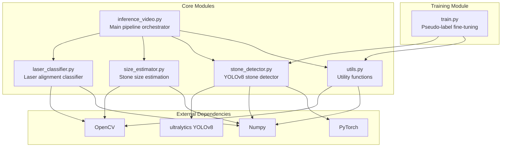
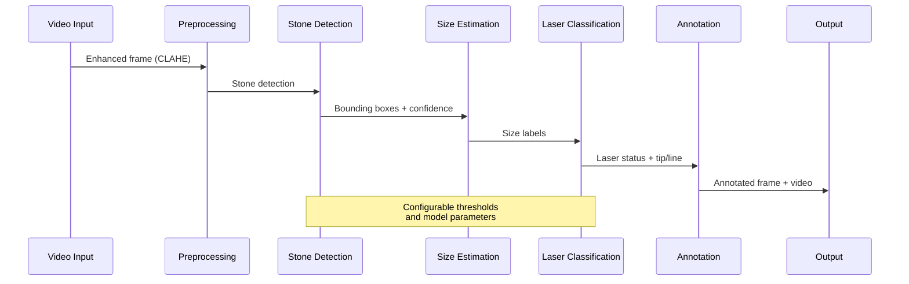
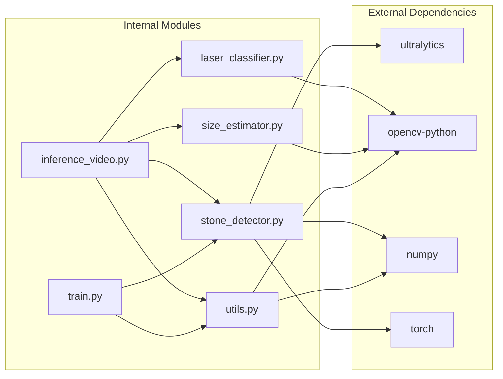

# API Reference

<cite>
**Referenced Files in This Document**
- [inference_video.py](file://src/inference_video.py)
- [laser_classifier.py](file://src/laser_classifier.py)
- [size_estimator.py](file://src/size_estimator.py)
- [stone_detector.py](file://src/stone_detector.py)
- [utils.py](file://src/utils.py)
- [train.py](file://src/train.py)
- [requirements.txt](file://requirements.txt)
</cite>

## Table of Contents
1. [Introduction](#introduction)
2. [Project Structure](#project-structure)
3. [Core Components](#core-components)
4. [Architecture Overview](#architecture-overview)
5. [Detailed Component Analysis](#detailed-component-analysis)
6. [Dependency Analysis](#dependency-analysis)
7. [Performance Considerations](#performance-considerations)
8. [Troubleshooting Guide](#troubleshooting-guide)
9. [Conclusion](#conclusion)

## Introduction

The RIRS (Rigid or Flexible Instrumented Retropubic Surgery) AI pipeline provides automated analysis of kidney stone removal procedures performed under endoscopic visualization. This comprehensive API reference documents all public interfaces, function signatures, parameter specifications, return value formats, and usage patterns for the RIRS modules.

The system processes surgical videos through a multi-stage pipeline that detects kidney stones, estimates their sizes, classifies laser alignment safety, and generates annotated output videos with statistical summaries.

## Project Structure

The RIRS project follows a modular architecture with distinct functional components:

**Diagram sources**
- [inference_video.py:1-250](file://src/inference_video.py#L1-L250)
- [laser_classifier.py:1-224](file://src/laser_classifier.py#L1-L224)
- [size_estimator.py:1-110](file://src/size_estimator.py#L1-L110)
- [stone_detector.py:1-161](file://src/stone_detector.py#L1-L161)
- [utils.py:1-175](file://src/utils.py#L1-L175)
- [train.py:1-225](file://src/train.py#L1-L225)

**Section sources**
- [inference_video.py:1-50](file://src/inference_video.py#L1-L50)
- [requirements.txt:1-9](file://requirements.txt#L1-L9)

## Core Components

The RIRS system consists of five primary components, each serving a specific role in the surgical analysis pipeline:

### Stone Detection Module
The StoneDetector class provides YOLOv8-based kidney stone detection with domain-adaptive filtering. It supports both pre-trained and fine-tuned model weights for optimal performance in endoscopic environments.

### Laser Classification Module  
The LaserClassifier performs real-time laser alignment safety assessment by analyzing bright regions and line segments in CLAHE-enhanced frames. It determines whether the laser fiber is properly aligned with target stones.

### Size Estimation Module
The size estimation system converts pixel measurements to clinical millimeter sizes using calibrated field-of-view assumptions for flexible ureteroscopes.

### Utility Functions Module
A collection of preprocessing, annotation, and video processing utilities that support the main pipeline operations.

### Training Module
Provides pseudo-label fine-tuning capabilities for adapting the detection model to specific surgical environments without manual annotation.

**Section sources**
- [stone_detector.py:77-161](file://src/stone_detector.py#L77-L161)
- [laser_classifier.py:160-224](file://src/laser_classifier.py#L160-L224)
- [size_estimator.py:32-110](file://src/size_estimator.py#L32-L110)
- [utils.py:20-175](file://src/utils.py#L20-L175)
- [train.py:61-225](file://src/train.py#L61-L225)

## Architecture Overview

The RIRS pipeline operates as a sequential processing chain with configurable stages:

**Diagram sources**
- [inference_video.py:119-141](file://src/inference_video.py#L119-L141)
- [utils.py:20-44](file://src/utils.py#L20-L44)
- [stone_detector.py:111-156](file://src/stone_detector.py#L111-L156)
- [size_estimator.py:95-110](file://src/size_estimator.py#L95-L110)
- [laser_classifier.py:181-224](file://src/laser_classifier.py#L181-L224)

The pipeline processes each frame through six distinct stages: preprocessing, detection, sizing, classification, annotation, and output generation.

**Section sources**
- [inference_video.py:59-201](file://src/inference_video.py#L59-L201)

## Detailed Component Analysis

### StoneDetector API

The StoneDetector class provides comprehensive kidney stone detection capabilities with configurable filtering parameters.

#### Constructor Parameters
- `conf_threshold` (float, default: 0.30): Minimum YOLO confidence score to retain detections
- `stone_score_threshold` (float, default: 0.30): Minimum stone likelihood score for heuristic filtering
- `use_finetuned` (bool, default: True): Whether to use fine-tuned weights if available

#### Detection Methods

**detect(frame: np.ndarray) -> List[Dict]**
- **Purpose**: Run stone detection on a single BGR frame
- **Parameters**: 
  - `frame`: CLAHE-preprocessed BGR image as numpy array
- **Returns**: List of detection dictionaries sorted by confidence descending
- **Each detection dictionary contains**:
  - `bbox`: [x1, y1, x2, y2] bounding box coordinates
  - `conf`: float confidence score
  - `class_id`: int class identifier
  - `stone_score`: float likelihood score (0.0-1.0)

**detect_batch(frames: List[np.ndarray]) -> List[List[Dict]]**
- **Purpose**: Process multiple frames in batch mode
- **Parameters**: List of BGR frames
- **Returns**: Parallel list of detection results

#### Stone Likelihood Scoring

The `_stone_likelihood` function evaluates detection quality using three criteria:
- Brightness contrast against background tissue
- Compactness (aspect ratio close to 1.0)
- Surface texture granularity (standard deviation)

**Section sources**
- [stone_detector.py:77-161](file://src/stone_detector.py#L77-L161)
- [stone_detector.py:38-75](file://src/stone_detector.py#L38-L75)

### LaserClassifier API

The LaserClassifier performs real-time laser alignment safety assessment using dual-modality detection.

#### Constructor Parameters
- `proximity_factor` (float, default: 0.4): Distance threshold as fraction of bounding box diagonal
- `min_bright_area` (int, default: 15): Minimum pixel area for bright region detection

#### Classification Method

**classify(frame: np.ndarray, detections: List[Dict]) -> Tuple[str, Optional[Tuple], Optional[Tuple]]**
- **Purpose**: Determine laser alignment safety for a single frame
- **Parameters**:
  - `frame`: CLAHE-enhanced BGR frame
  - `detections`: List of stone detections from StoneDetector
- **Returns**: Tuple containing (status, tip_coordinates, line_segment)
- **Status values**: "safe_to_shoot", "not_safe_to_shoot", "uncertain"
- **Tip coordinates**: (x, y) tuple or None
- **Line segment**: (x1, y1, x2, y2) tuple or None

#### Detection Strategy

The classifier employs two complementary detection methods:
1. **Bright Region Detection**: HSV thresholding to identify laser glow regions
2. **Line Detection**: Hough transform on brightness gradients to locate fiber lines

**Section sources**
- [laser_classifier.py:160-224](file://src/laser_classifier.py#L160-L224)
- [laser_classifier.py:60-134](file://src/laser_classifier.py#L60-L134)

### SizeEstimator API

The size estimation system converts pixel measurements to clinically meaningful millimeter sizes.

#### Core Functions

**estimate_size(bbox: List[int], frame_shape: Tuple[int, int], fov_mm: float = 15.0) -> Dict**
- **Purpose**: Calculate physical size from pixel bounding box
- **Parameters**:
  - `bbox`: [x1, y1, x2, y2] coordinates in pixels
  - `frame_shape`: (height, width) of the frame
  - `fov_mm`: Field-of-view diameter in millimeters (default: 15.0)
- **Returns**: Dictionary with calculated metrics
- **Return keys**:
  - `diameter_mm`: Estimated diameter in millimeters
  - `area_mm2`: Estimated cross-sectional area
  - `category`: Size category string
  - `label`: Human-readable formatted label
  - `mm_per_pixel`: Calibration factor used

**estimate_sizes_for_detections(detections: List[Dict], frame_shape: Tuple[int, int], fov_mm: float = 15.0) -> List[str]**
- **Purpose**: Convenience wrapper for batch size estimation
- **Parameters**: Same as estimate_size but accepts detection list
- **Returns**: List of formatted size labels

#### Size Categories
- `< 5 mm`: Small stones (typically treatable in single session)
- `5-10 mm`: Medium stones (require fragmentation)
- `> 10 mm`: Large stones (may need multiple sessions)

**Section sources**
- [size_estimator.py:32-110](file://src/size_estimator.py#L32-L110)

### Utility Functions API

#### Preprocessing Functions

**preprocess_frame(frame: np.ndarray) -> np.ndarray**
- **Purpose**: Apply CLAHE contrast enhancement to improve endoscopic visibility
- **Parameters**: BGR image array
- **Returns**: Contrast-enhanced BGR image
- **Process**: LAB color space conversion with CLAHE on L-channel

#### Drawing Functions

**draw_detections(frame: np.ndarray, detections: List[Dict], size_labels: List[str], laser_status: str, laser_line: Optional[Tuple] = None) -> np.ndarray**
- **Purpose**: Render annotations on video frames
- **Parameters**:
  - `frame`: BGR image to annotate
  - `detections`: Stone detection results
  - `size_labels`: Size category labels
  - `laser_status`: Safety classification string
  - `laser_line`: Optional line segment tuple
- **Returns**: Annotated frame with bounding boxes, labels, and status indicators

**save_frame(frame: np.ndarray, path: str) -> None**
- **Purpose**: Save individual frames as JPEG files
- **Parameters**: Frame array and output path

**create_video_writer(output_path: str, fps: float, width: int, height: int) -> cv2.VideoWriter**
- **Purpose**: Create OpenCV video writer for MP4 output
- **Parameters**: Output path, frame rate, dimensions
- **Returns**: VideoWriter object configured for MP4 encoding

**Section sources**
- [utils.py:20-175](file://src/utils.py#L20-L175)

### Training Module API

#### Pseudo-Label Generation

**generate_pseudo_labels(model: YOLO) -> int**
- **Purpose**: Create training labels from pre-trained model predictions
- **Parameters**: YOLO model instance
- **Returns**: Number of images receiving at least one label
- **Process**: Runs inference, applies stone likelihood filtering, saves YOLO-format labels

#### Model Configuration

**write_data_yaml() -> None**
- **Purpose**: Generate Ultralytics-compatible configuration file
- **Configuration includes**: Training/validation paths, class count, class names

#### Fine-Tuning Process

**fine_tune(epochs: int, batch: int, imgsz: int) -> Path**
- **Purpose**: Execute model fine-tuning on pseudo-labeled dataset
- **Parameters**: Training hyperparameters
- **Returns**: Path to best weights file
- **Training settings**: Early stopping, data augmentation, optimizer configuration

**Section sources**
- [train.py:61-181](file://src/train.py#L61-L181)

### Main Pipeline API

#### Video Processing

**process_video(video_path: Path, detector: StoneDetector, laser_clf: LaserClassifier) -> dict**
- **Purpose**: Process complete video through RIRS pipeline
- **Parameters**:
  - `video_path`: Path to input video file
  - `detector`: StoneDetector instance
  - `laser_clf`: LaserClassifier instance
- **Returns**: Comprehensive statistics dictionary
- **Statistics include**: Frame counts, detection totals, safety classifications, size distributions

#### Configuration Parameters

Key pipeline constants:
- `VIDEO_DIR`: Directory containing test videos
- `OUTPUT_FRAMES_DIR`: Base directory for frame outputs
- `OUTPUT_VIDEOS_DIR`: Base directory for video outputs
- `FRAME_SAVE_EVERY`: Frame sampling interval (default: 5)
- `CONF_THRESHOLD`: YOLO confidence threshold (default: 0.25)
- `STONE_SCORE_THRESHOLD`: Stone likelihood threshold (default: 0.25)

**Section sources**
- [inference_video.py:59-201](file://src/inference_video.py#L59-L201)
- [inference_video.py:47-57](file://src/inference_video.py#L47-L57)

## Dependency Analysis

The RIRS system maintains clear separation of concerns with minimal inter-module coupling:

**Diagram sources**
- [requirements.txt:1-9](file://requirements.txt#L1-L9)
- [stone_detector.py:24](file://src/stone_detector.py#L24)
- [laser_classifier.py:38-39](file://src/laser_classifier.py#L38-L39)
- [size_estimator.py:21-22](file://src/size_estimator.py#L21-L22)
- [utils.py:5-7](file://src/utils.py#L5-L7)

**Section sources**
- [requirements.txt:1-9](file://requirements.txt#L1-L9)

## Performance Considerations

### Computational Requirements
- **CPU vs GPU**: Training requires CUDA GPU for reasonable performance; inference runs on CPU
- **Memory usage**: YOLO model loading and inference require significant RAM
- **Processing speed**: Frame processing time depends on resolution, detection count, and model complexity

### Optimization Strategies
- **Frame sampling**: Use `FRAME_SAVE_EVERY` parameter to reduce output volume
- **Threshold tuning**: Adjust confidence and likelihood thresholds for balance between precision and recall
- **Model selection**: Choose between pre-trained and fine-tuned models based on deployment requirements

### Resource Management
- **Memory cleanup**: Automatic deletion of model instances during training pipeline
- **File I/O**: Efficient batch processing for training pseudo-labels
- **Progress monitoring**: TQDM progress bars for long-running operations

## Troubleshooting Guide

### Common Issues and Solutions

**Model Loading Failures**
- Verify YOLOv8 installation and model availability
- Check CUDA compatibility for GPU acceleration
- Ensure model weights exist in expected locations

**Video Processing Errors**
- Confirm video file accessibility and format compatibility
- Verify output directory permissions
- Check frame dimensions and codec support

**Detection Quality Issues**
- Adjust confidence thresholds based on video quality
- Fine-tune stone likelihood scoring parameters
- Verify CLAHE preprocessing effectiveness

**Training Pipeline Problems**
- Ensure training data directory structure is correct
- Verify pseudo-label generation completed successfully
- Check YAML configuration file validity

### Error Handling Patterns

The system implements robust error handling through:
- Graceful degradation when components fail
- Comprehensive logging and status reporting
- Validation of input parameters and file existence
- Cleanup of temporary resources on completion

**Section sources**
- [inference_video.py:80-82](file://src/inference_video.py#L80-L82)
- [train.py:73-76](file://src/train.py#L73-L76)

## Conclusion

The RIRS API provides a comprehensive, modular framework for kidney stone detection and laser safety assessment in endoscopic surgery. The well-structured architecture enables easy integration, customization, and deployment across different surgical environments.

Key strengths of the API design include:
- Clear separation of concerns with focused responsibilities
- Configurable parameters for adaptability to different scenarios
- Comprehensive error handling and validation
- Efficient batch processing capabilities
- Extensive documentation and usage examples

The modular design allows developers to integrate specific components independently while maintaining full pipeline functionality. The training module enables model adaptation without manual annotation, addressing the challenge of limited labeled medical data.

Future enhancements could include additional model architectures, expanded size estimation metrics, and integration with surgical navigation systems.