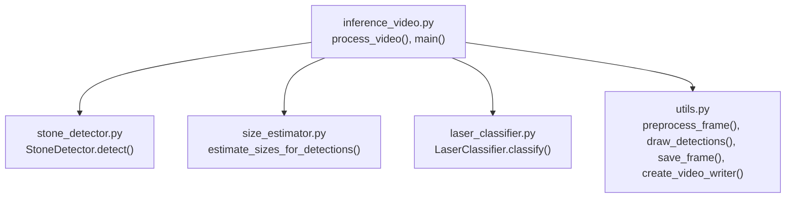
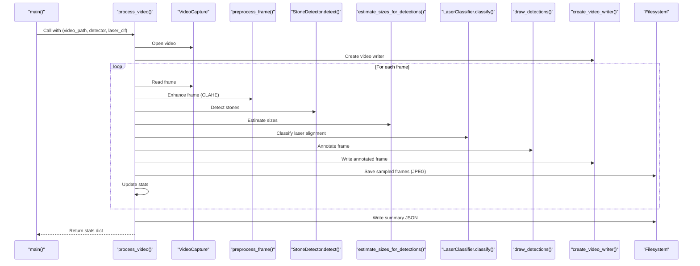
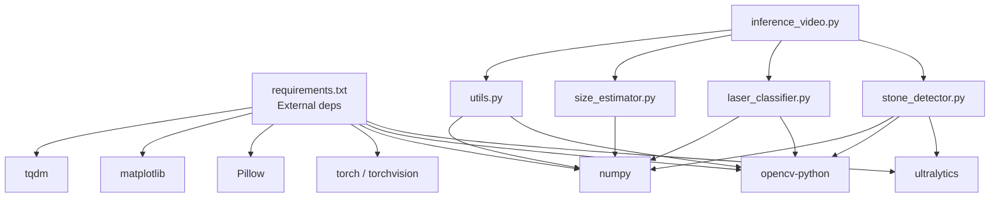

# Inference Pipeline API

<cite>
**Referenced Files in This Document**
- [inference_video.py](file://src/inference_video.py)
- [stone_detector.py](file://src/stone_detector.py)
- [laser_classifier.py](file://src/laser_classifier.py)
- [utils.py](file://src/utils.py)
- [size_estimator.py](file://src/size_estimator.py)
- [requirements.txt](file://requirements.txt)
</cite>

## Table of Contents
1. [Introduction](#introduction)
2. [Project Structure](#project-structure)
3. [Core Components](#core-components)
4. [Architecture Overview](#architecture-overview)
5. [Detailed Component Analysis](#detailed-component-analysis)
6. [Dependency Analysis](#dependency-analysis)
7. [Performance Considerations](#performance-considerations)
8. [Troubleshooting Guide](#troubleshooting-guide)
9. [Conclusion](#conclusion)
10. [Appendices](#appendices)

## Introduction
This document provides API documentation for the RIRS inference pipeline, focusing on the video processing workflow and the main entry points. It explains how to process individual videos through the full pipeline, how to initialize models, and how to run batch processing over multiple test videos. It covers the process_video() function’s parameters, return value format, and usage patterns, along with the main() function’s command-line execution, video discovery, model initialization, and batch processing workflows. It also documents parameter specifications, error handling patterns, output directory management, and performance statistics generation.

## Project Structure
The inference pipeline is implemented in the src/ directory with modular components:
- inference_video.py: orchestrates the end-to-end pipeline, defines process_video(), and provides main() for batch processing.
- stone_detector.py: wraps YOLOv8 for kidney stone detection with a custom likelihood scoring function.
- laser_classifier.py: detects laser alignment using HSV thresholding and Hough line transforms, classifying safety status.
- size_estimator.py: estimates stone sizes from bounding boxes using calibrated field-of-view assumptions.
- utils.py: preprocessing, drawing annotations, saving frames, and creating video writers.

**Diagram sources**
- [inference_video.py:59-201](file://src/inference_video.py#L59-L201)
- [stone_detector.py:77-161](file://src/stone_detector.py#L77-L161)
- [laser_classifier.py:160-224](file://src/laser_classifier.py#L160-L224)
- [size_estimator.py:95-110](file://src/size_estimator.py#L95-L110)
- [utils.py:20-175](file://src/utils.py#L20-L175)

**Section sources**
- [inference_video.py:1-50](file://src/inference_video.py#L1-L50)
- [stone_detector.py:1-35](file://src/stone_detector.py#L1-L35)
- [laser_classifier.py:1-40](file://src/laser_classifier.py#L1-L40)
- [size_estimator.py:1-25](file://src/size_estimator.py#L1-L25)
- [utils.py:1-10](file://src/utils.py#L1-L10)

## Core Components
- process_video(video_path: Path, detector: StoneDetector, laser_clf: LaserClassifier) -> dict
  - Processes a single video through the full pipeline and returns a statistics dictionary.
- main() -> None
  - Discovers test videos, initializes models, and runs batch processing.

Key behaviors:
- Reads video frames, preprocesses with CLAHE, detects stones, estimates sizes, classifies laser alignment, draws annotations, writes annotated video, and saves sampled frames.
- Generates performance statistics and a summary JSON per video.

**Section sources**
- [inference_video.py:59-201](file://src/inference_video.py#L59-L201)
- [inference_video.py:204-249](file://src/inference_video.py#L204-L249)

## Architecture Overview
The pipeline stages per frame:
1. Read original frame.
2. Preprocess with CLAHE.
3. Stone detection via StoneDetector.
4. Size estimation for detections.
5. Laser alignment classification via LaserClassifier.
6. Draw annotations and write to output video.
7. Save sampled frames as JPEGs.
8. Aggregate statistics and write summary JSON.

**Diagram sources**
- [inference_video.py:59-201](file://src/inference_video.py#L59-L201)
- [utils.py:20-175](file://src/utils.py#L20-L175)
- [stone_detector.py:111-156](file://src/stone_detector.py#L111-L156)
- [laser_classifier.py:181-224](file://src/laser_classifier.py#L181-L224)
- [size_estimator.py:95-110](file://src/size_estimator.py#L95-L110)

## Detailed Component Analysis

### process_video(video_path, detector, laser_clf) API
Purpose:
- Run the full RIRS pipeline on a single video and produce annotated outputs and statistics.

Parameters:
- video_path: pathlib.Path to the input MP4 video file.
- detector: StoneDetector instance initialized with desired thresholds and model selection.
- laser_clf: LaserClassifier instance configured with proximity and area thresholds.

Processing steps:
- Validates video availability and opens with VideoCapture.
- Creates output directories for frames and videos.
- Initializes VideoWriter for annotated MP4.
- Iterates frames, applying:
  - CLAHE preprocessing.
  - Stone detection with confidence and stone-likelihood filtering.
  - Size estimation per detection.
  - Laser alignment classification returning status and line/tip.
  - Drawing annotations and writing frames.
  - Saving sampled frames every N frames.
- Aggregates statistics and writes summary JSON.

Return value (stats dict):
- Keys include:
  - video: input filename.
  - total_frames: total frames processed.
  - frames_with_stones: frames containing at least one detection.
  - total_stone_detections: total number of detections across frames.
  - laser_safe, laser_not_safe, laser_uncertain: counts of classifications.
  - size_distribution: counts per clinical category "<5mm", "5-10mm", ">10mm".
  - per_frame: list of sampled per-frame entries (every 50 frames) with keys: frame, stones, laser, sizes.
  - elapsed_seconds: total processing time in seconds.
  - avg_fps_processed: average FPS over elapsed time.

Usage examples:
- Single video processing:
  - Initialize detector and classifier.
  - Call process_video(video_path, detector, laser_clf).
  - Inspect returned stats for performance and detection summaries.
- Batch processing:
  - Iterate over discovered video paths and call process_video() for each.

Error handling:
- Prints errors and returns an empty dict if video cannot be opened.
- Handles missing detections gracefully during statistics aggregation.

Output management:
- Outputs:
  - Annotated MP4 in outputs/annotated_videos/<video_stem>_annotated.mp4.
  - Sampled frames in outputs/annotated_frames/<video_stem>/ as JPEGs.
  - summary.json in outputs/annotated_frames/<video_stem>/ with statistics.

Performance statistics:
- Computes elapsed time and average FPS and includes them in the stats dictionary.

**Section sources**
- [inference_video.py:59-201](file://src/inference_video.py#L59-L201)

### main() API
Purpose:
- Command-line entry point for batch processing of test videos.

Workflow:
- Discovers test videos under a fixed directory path.
- Initializes shared StoneDetector and LaserClassifier instances.
- Iterates over discovered videos and calls process_video() for each.
- Prints global completion summary with output locations.

Command-line execution:
- Run as a Python script: python src/inference_video.py.

Video discovery:
- Scans VIDEO_DIR for .mp4 files and prints discovered list.

Model initialization:
- StoneDetector:
  - Uses fine-tuned weights if present, otherwise defaults to yolov8n.
  - Applies configurable confidence and stone-likelihood thresholds.
- LaserClassifier:
  - Configurable proximity factor and minimum bright area for tip detection.

Batch processing:
- Iterates over all discovered videos and collects per-video stats.

Outputs:
- Prints final output locations for frames and videos.

**Section sources**
- [inference_video.py:204-249](file://src/inference_video.py#L204-L249)

### StoneDetector API
Purpose:
- Detect kidney stones in CLAHE-enhanced frames using YOLOv8 with custom post-filtering.

Key methods:
- detect(frame: np.ndarray) -> List[Dict]: returns detections with bbox, confidence, class_id, and computed stone_score.
- detect_batch(frames: List[np.ndarray]) -> List[List[Dict]]: convenience wrapper.

Parameters:
- conf_threshold: minimum YOLO confidence to keep a detection.
- stone_score_threshold: minimum stone-likelihood score to keep a detection.
- use_finetuned: if True and fine-tuned weights exist, use them.

Detection logic:
- Runs YOLO inference with provided confidence threshold.
- Applies _stone_likelihood() to filter detections by brightness, compactness, and texture.
- Sorts detections by confidence descending.

**Section sources**
- [stone_detector.py:77-161](file://src/stone_detector.py#L77-L161)

### LaserClassifier API
Purpose:
- Classify laser alignment safety using HSV thresholding and Hough line detection.

Key methods:
- classify(frame: np.ndarray, detections: List[Dict]) -> Tuple[str, Optional[Tuple], Optional[Tuple]]:
  - Returns status ('safe_to_shoot', 'not_safe_to_shoot', 'uncertain'), tip coordinates, and line segment.

Detection strategy:
- Bright-region detector:
  - HSV thresholding to isolate bright near-white regions.
  - Largest valid contour identified as potential laser tip.
- Line detector:
  - Edge detection on brightness channel.
  - Probabilistic Hough lines; selects the line whose endpoint is closest to the tip.

Alignment check:
- If tip is inside any stone bbox or within proximity factor × bbox diagonal of centroid → safe_to_shoot.
- If a line is detected but aimed elsewhere → not_safe_to_shoot.
- If no laser detected → uncertain.

**Section sources**
- [laser_classifier.py:160-224](file://src/laser_classifier.py#L160-L224)

### Size Estimator API
Purpose:
- Estimate stone sizes from bounding boxes using calibrated field-of-view assumptions.

Key methods:
- estimate_size(bbox: List[int], frame_shape: Tuple[int,int], fov_mm: float = FOV_MM) -> Dict:
  - Returns diameter_mm, area_mm2, category, human-readable label, and mm_per_pixel.
- estimate_sizes_for_detections(detections: List[Dict], frame_shape: Tuple[int,int], fov_mm: float = FOV_MM) -> List[str]:
  - Convenience wrapper returning human-readable labels.

Calibration:
- Assumes flexible ureteroscope FOV diameter of 15 mm mapped to the shorter frame dimension.

Categories:
- < 5 mm, 5–10 mm, > 10 mm.

**Section sources**
- [size_estimator.py:32-110](file://src/size_estimator.py#L32-L110)

### Utilities API
Purpose:
- Provide preprocessing, annotation drawing, frame saving, and video writer creation.

Key functions:
- preprocess_frame(frame: np.ndarray) -> np.ndarray: CLAHE enhancement in LAB colorspace.
- draw_detections(frame: np.ndarray, detections: List[Dict], size_labels: List[str], laser_status: str, laser_line: Optional[Tuple[int,int,int,int]]) -> np.ndarray: overlays boxes, labels, and badges.
- save_frame(frame: np.ndarray, path: str) -> None: writes JPEG with quality setting.
- create_video_writer(output_path: str, fps: float, width: int, height: int) -> cv2.VideoWriter: creates MP4 writer.

Color mapping and badges:
- Maps laser status to colors and draws status and count badges.

**Section sources**
- [utils.py:20-175](file://src/utils.py#L20-L175)

## Dependency Analysis
External dependencies (as declared):
- ultralytics>=8.2.0: YOLOv8 model interface.
- opencv-python>=4.9.0: Video I/O and image processing.
- numpy>=1.24.0,<2.0: Numerical computations.
- torch>=2.1.0, torchvision>=0.16.0: PyTorch backend for YOLO.
- Pillow>=10.0.0, matplotlib>=3.7.0: Additional image and plotting support.
- tqdm>=4.66.0: Progress bars.

Internal dependencies:
- inference_video.py depends on utils, stone_detector, size_estimator, and laser_classifier.
- stone_detector.py depends on ultralytics YOLO and OpenCV/Numpy.
- laser_classifier.py depends on OpenCV/Numpy.
- size_estimator.py depends on math and typing.
- utils.py depends on OpenCV/Numpy.

**Diagram sources**
- [requirements.txt:1-9](file://requirements.txt#L1-L9)
- [inference_video.py:38-41](file://src/inference_video.py#L38-L41)
- [stone_detector.py:24-24](file://src/stone_detector.py#L24-L24)
- [laser_classifier.py:38-40](file://src/laser_classifier.py#L38-L40)
- [size_estimator.py:21-22](file://src/size_estimator.py#L21-L22)
- [utils.py:5-7](file://src/utils.py#L5-L7)

**Section sources**
- [requirements.txt:1-9](file://requirements.txt#L1-L9)
- [inference_video.py:38-41](file://src/inference_video.py#L38-L41)

## Performance Considerations
- Frame sampling:
  - FRAME_SAVE_EVERY controls how often frames are saved as JPEGs to manage output size.
- Video writing:
  - VideoWriter is created with original FPS and frame dimensions; ensure hardware can encode at that rate.
- Model inference:
  - YOLO inference runs per frame; consider GPU acceleration via CUDA-enabled torch installation.
- Post-processing:
  - CLAHE, contour finding, and Hough transforms are CPU-intensive; batching frames is not implemented here.
- Progress reporting:
  - tqdm provides per-frame progress; consider disabling for headless environments.

[No sources needed since this section provides general guidance]

## Troubleshooting Guide
Common issues and resolutions:
- Video cannot be opened:
  - The pipeline prints an error and returns an empty stats dict. Verify video_path exists and is readable.
- No .mp4 files found:
  - main() exits with an error if VIDEO_DIR does not exist or contains no .mp4 files. Ensure test_videos directory exists and contains MP4 files.
- Missing fine-tuned weights:
  - StoneDetector falls back to yolov8n if fine-tuned weights are absent. Confirm models/rirs_best.pt presence if expecting fine-tuned behavior.
- Empty detections:
  - Stats frames_with_stones and total_stone_detections will remain zero. Adjust detector thresholds or verify preprocessing effectiveness.
- Uncertain laser status:
  - Occurs when no bright region or line is detected. Verify lighting conditions and frame quality.
- Output directories not created:
  - The pipeline creates OUTPUT_FRAMES_DIR and OUTPUT_VIDEOS_DIR automatically; ensure write permissions.

**Section sources**
- [inference_video.py:80-82](file://src/inference_video.py#L80-L82)
- [inference_video.py:210-217](file://src/inference_video.py#L210-L217)
- [stone_detector.py:102-107](file://src/stone_detector.py#L102-L107)

## Conclusion
The RIRS inference pipeline provides a robust, modular framework for automated kidney stone detection, size estimation, and laser alignment classification in RIRS videos. The process_video() function encapsulates the end-to-end workflow and returns comprehensive statistics, while main() enables straightforward batch processing. The APIs are designed for clarity and extensibility, with well-defined parameters, error handling, and output management.

[No sources needed since this section summarizes without analyzing specific files]

## Appendices

### Parameter Specifications
- process_video():
  - video_path: pathlib.Path to an MP4 file.
  - detector: StoneDetector instance with conf_threshold, stone_score_threshold, use_finetuned.
  - laser_clf: LaserClassifier instance with proximity_factor, min_bright_area.
- main():
  - No explicit parameters; discovers videos from VIDEO_DIR and initializes models globally.

**Section sources**
- [inference_video.py:59-63](file://src/inference_video.py#L59-L63)
- [inference_video.py:224-231](file://src/inference_video.py#L224-L231)

### Return Value Format (stats dict)
- Keys:
  - video, total_frames, frames_with_stones, total_stone_detections
  - laser_safe, laser_not_safe, laser_uncertain
  - size_distribution: "<5mm", "5-10mm", ">10mm"
  - per_frame: list of dicts with keys: frame, stones, laser, sizes
  - elapsed_seconds, avg_fps_processed
- Example usage:
  - Access total_stone_detections and size_distribution for summary reports.
  - Use per_frame entries for periodic inspection logs.

**Section sources**
- [inference_video.py:98-108](file://src/inference_video.py#L98-L108)
- [inference_video.py:170-177](file://src/inference_video.py#L170-L177)

### Usage Examples
- Single video:
  - Initialize detector and laser_clf.
  - Call process_video(video_path, detector, laser_clf).
  - Inspect returned stats for performance and detection summaries.
- Batch:
  - main() discovers videos and processes them sequentially, printing completion summary.

**Section sources**
- [inference_video.py:234-237](file://src/inference_video.py#L234-L237)
- [inference_video.py:240-246](file://src/inference_video.py#L240-L246)