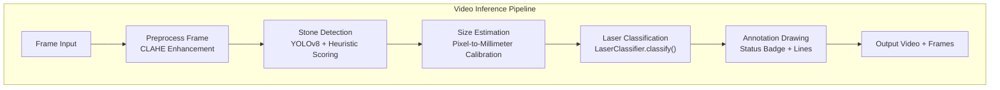
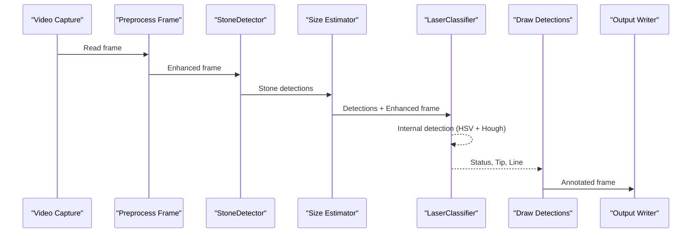
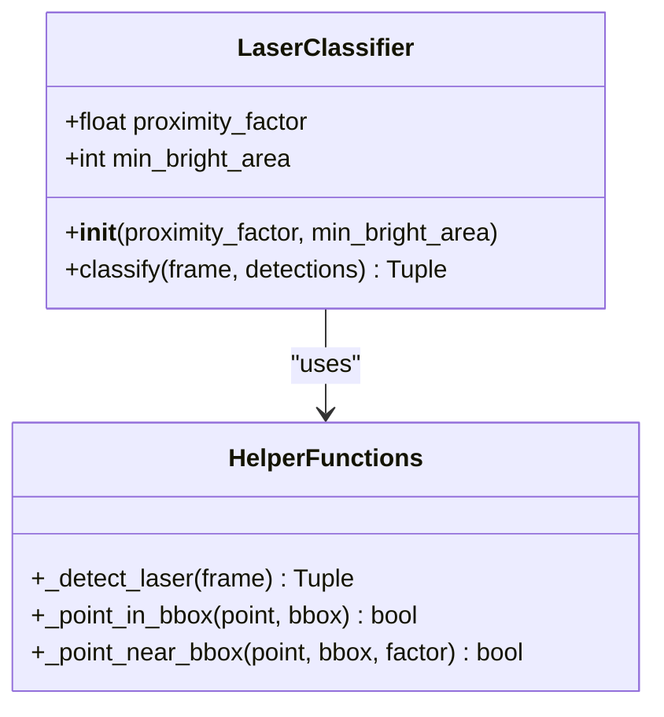
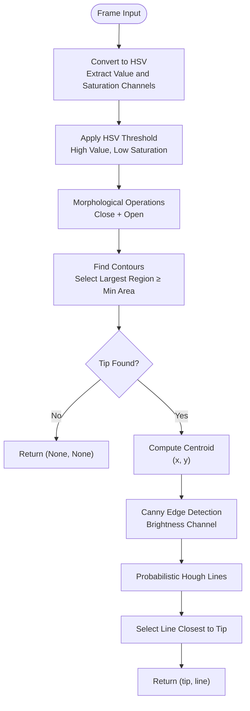
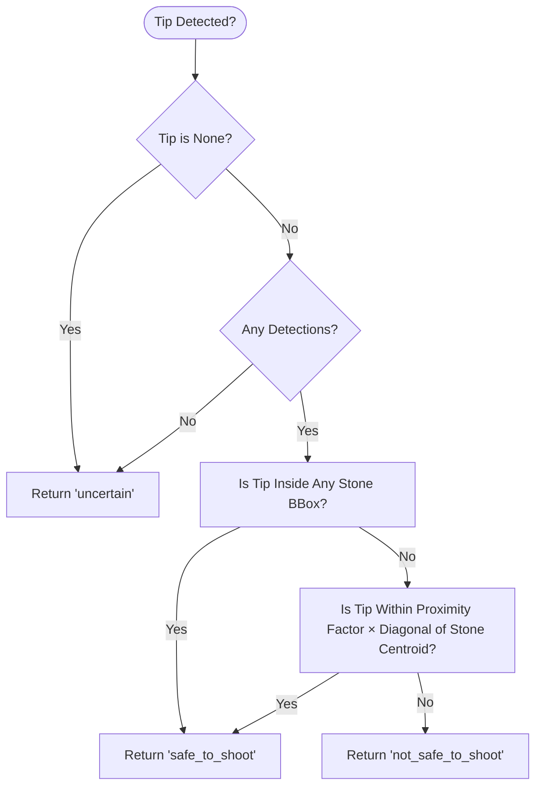
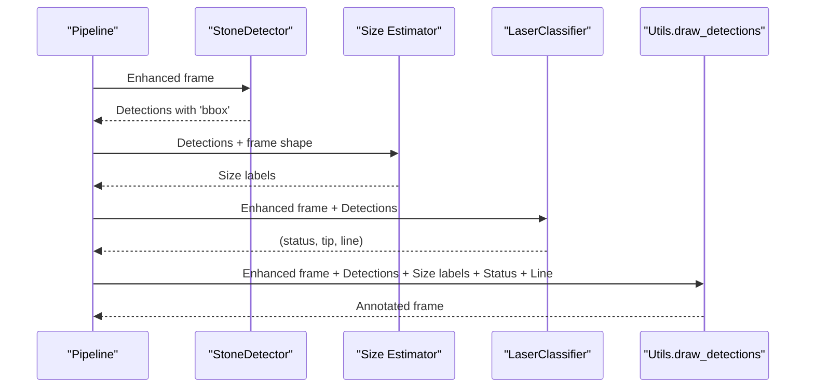
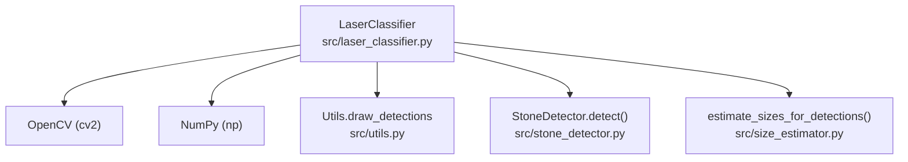

# Laser Classification API

<cite>
**Referenced Files in This Document**
- [laser_classifier.py](file://src/laser_classifier.py)
- [inference_video.py](file://src/inference_video.py)
- [utils.py](file://src/utils.py)
- [stone_detector.py](file://src/stone_detector.py)
- [size_estimator.py](file://src/size_estimator.py)
</cite>

## Table of Contents
1. [Introduction](#introduction)
2. [Project Structure](#project-structure)
3. [Core Components](#core-components)
4. [Architecture Overview](#architecture-overview)
5. [Detailed Component Analysis](#detailed-component-analysis)
6. [Dependency Analysis](#dependency-analysis)
7. [Performance Considerations](#performance-considerations)
8. [Troubleshooting Guide](#troubleshooting-guide)
9. [Conclusion](#conclusion)

## Introduction
This document provides comprehensive API documentation for the LaserClassifier class, focusing on its safety assessment functionality for real-time robotic interventional radiology (RIRS) procedures. The LaserClassifier integrates two complementary computer vision techniques—HSV thresholding and Hough transform—to detect laser fiber tips and lines in endoscopic video frames and assess whether the laser is safely aligned with kidney stones.

Key capabilities:
- Real-time laser tip and line detection using HSV thresholding and Hough transform
- Safety assessment based on spatial relationships between detected laser positions and stone bounding boxes
- Three-class safety classification: safe_to_shoot, not_safe_to_shoot, and uncertain
- Integration-ready API designed for seamless incorporation into endoscopy video pipelines

## Project Structure
The LaserClassifier resides in the RIRS AI pipeline and works alongside stone detection, size estimation, and annotation utilities. The primary integration occurs during video inference where each frame undergoes preprocessing, stone detection, size estimation, laser classification, and annotation.

**Diagram sources**
- [inference_video.py:119-138](file://src/inference_video.py#L119-L138)
- [utils.py:79-161](file://src/utils.py#L79-L161)

**Section sources**
- [inference_video.py:13-20](file://src/inference_video.py#L13-L20)
- [inference_video.py:44-57](file://src/inference_video.py#L44-L57)

## Core Components
This section documents the LaserClassifier class and its classification method, including parameters, return values, and safety status semantics.

- Class: LaserClassifier
  - Purpose: Classify laser alignment safety for each video frame using HSV thresholding and Hough transform.
  - Constructor parameters:
    - proximity_factor: Controls how close the laser tip must be to a stone bounding box to be considered safe. Higher values increase permissiveness.
    - min_bright_area: Minimum pixel area for a bright region to qualify as a laser tip.
  - Method: classify(frame, detections)
    - Parameters:
      - frame: CLAHE-enhanced BGR frame (np.ndarray).
      - detections: List of stone detection dictionaries, each containing a 'bbox' key with coordinates [x1, y1, x2, y2].
    - Returns:
      - status: String indicating safety classification ('safe_to_shoot', 'not_safe_to_shoot', or 'uncertain').
      - tip: Optional tuple of (x, y) coordinates representing the detected laser tip position, or None if undetected.
      - line: Optional tuple of (x1, y1, x2, y2) representing the detected laser line segment, or None if undetected.

Safety status categories:
- safe_to_shoot: The laser tip is either inside a stone bounding box or within a proximity threshold of the stone centroid.
- not_safe_to_shoot: A laser line was detected, but it is not aligned with any stone.
- uncertain: No laser was detected, visibility is poor, or there are no visible stones to assess alignment.

Integration example (from the pipeline):
- The classify() method is invoked after stone detection and size estimation, returning status, tip, and line for annotation and statistical tracking.

**Section sources**
- [laser_classifier.py:160-180](file://src/laser_classifier.py#L160-L180)
- [laser_classifier.py:181-224](file://src/laser_classifier.py#L181-L224)
- [inference_video.py:128-129](file://src/inference_video.py#L128-L129)

## Architecture Overview
The LaserClassifier participates in a multi-stage video processing pipeline. It receives a CLAHE-enhanced frame and a set of stone detections, performs internal detection, and produces a safety classification along with geometric data for visualization.

**Diagram sources**
- [inference_video.py:119-138](file://src/inference_video.py#L119-L138)
- [laser_classifier.py:60-133](file://src/laser_classifier.py#L60-L133)
- [utils.py:79-161](file://src/utils.py#L79-L161)

## Detailed Component Analysis

### LaserClassifier Class
The LaserClassifier encapsulates the laser safety assessment logic. It exposes a single public method, classify(), which orchestrates detection and classification.

**Diagram sources**
- [laser_classifier.py:160-180](file://src/laser_classifier.py#L160-L180)
- [laser_classifier.py:60-133](file://src/laser_classifier.py#L60-L133)
- [laser_classifier.py:136-158](file://src/laser_classifier.py#L136-L158)

Implementation highlights:
- Internal detection pipeline:
  - HSV thresholding on CLAHE-enhanced frames to isolate bright regions consistent with laser tips.
  - Morphological cleanup to reduce noise.
  - Contour analysis to locate the largest bright region meeting minimum area criteria.
  - Hough probabilistic line detection on edge-detected brightness channels, selecting the line whose endpoint is closest to the detected tip.
- Safety assessment:
  - If the tip is inside any stone bounding box or within a proximity threshold of the stone centroid → safe_to_shoot.
  - If a line is detected but not aligned with any stone → not_safe_to_shoot.
  - If no tip is detected or no stones are visible → uncertain.

Parameter specifications:
- proximity_factor: Float controlling proximity threshold relative to bbox diagonal.
- min_bright_area: Integer minimum pixel area for a bright region to qualify as a tip.

Return value format:
- status: String from ['safe_to_shoot', 'not_safe_to_shoot', 'uncertain'].
- tip: Optional (x, y) tuple or None.
- line: Optional (x1, y1, x2, y2) tuple or None.

Usage example (integration with detection results):
- After obtaining detections from StoneDetector.detect(), pass the CLAHE-enhanced frame and detections to LaserClassifier.classify().
- Use the returned status, tip, and line to annotate frames and update statistics.

Interpretation of classification outcomes:
- safe_to_shoot: Proceed with laser ablation; tip is aligned with a stone.
- not_safe_to_shoot: Adjust laser direction; tip is not aligned with any stone.
- uncertain: Insufficient evidence to assess safety; recheck lighting or magnification.

**Section sources**
- [laser_classifier.py:160-224](file://src/laser_classifier.py#L160-L224)
- [laser_classifier.py:60-133](file://src/laser_classifier.py#L60-L133)
- [laser_classifier.py:136-158](file://src/laser_classifier.py#L136-L158)
- [inference_video.py:128-129](file://src/inference_video.py#L128-L129)

### Detection Strategy: HSV Thresholding and Hough Transform
The internal detection routine combines HSV thresholding and Hough transform to robustly identify laser artifacts.

**Diagram sources**
- [laser_classifier.py:60-133](file://src/laser_classifier.py#L60-L133)

Algorithmic approach:
- HSV thresholding isolates bright, near-white regions characteristic of laser tips and fibers.
- Morphological operations remove noise and refine connected components.
- Contour analysis identifies the largest region meeting minimum area, computing its centroid as the tip position.
- Hough transform detects straight-line segments; the line endpoint nearest the tip is selected as the laser line.

Parameter specifications:
- HSV_V_MIN: Minimum Value channel threshold for bright regions.
- HSV_S_MAX: Maximum Saturation threshold for near-white appearance.
- MIN_BRIGHT_AREA: Minimum pixel area for a region to qualify as a tip.
- HOUGH_THRESHOLD: Minimum votes for line detection.
- HOUGH_MIN_LINE_LEN: Minimum line length to accept.
- HOUGH_MAX_LINE_GAP: Maximum gap between points to connect a line.

**Section sources**
- [laser_classifier.py:46-58](file://src/laser_classifier.py#L46-L58)
- [laser_classifier.py:60-133](file://src/laser_classifier.py#L60-L133)

### Safety Assessment Logic
The safety classification is determined by spatial relationships between the detected laser tip and stone bounding boxes.

**Diagram sources**
- [laser_classifier.py:205-224](file://src/laser_classifier.py#L205-L224)
- [laser_classifier.py:136-158](file://src/laser_classifier.py#L136-L158)

Safety status semantics:
- safe_to_shoot: Tip is either inside a stone bounding box or within a proximity threshold of the stone centroid.
- not_safe_to_shoot: A line was detected, but it does not align with any stone.
- uncertain: No tip detected or no stones present to evaluate alignment.

**Section sources**
- [laser_classifier.py:196-224](file://src/laser_classifier.py#L196-L224)
- [laser_classifier.py:136-158](file://src/laser_classifier.py#L136-L158)

### Integration with Detection Results
The LaserClassifier integrates seamlessly into the RIRS pipeline. The inference script demonstrates the end-to-end workflow:

- Frame preprocessing with CLAHE enhancement
- Stone detection using YOLOv8 with custom likelihood scoring
- Size estimation for clinical categorization
- Laser classification using LaserClassifier.classify()
- Annotation drawing with status badges and laser lines

**Diagram sources**
- [inference_video.py:119-138](file://src/inference_video.py#L119-L138)
- [utils.py:79-161](file://src/utils.py#L79-L161)

**Section sources**
- [inference_video.py:119-138](file://src/inference_video.py#L119-L138)
- [stone_detector.py:111-156](file://src/stone_detector.py#L111-L156)
- [size_estimator.py:95-110](file://src/size_estimator.py#L95-L110)

## Dependency Analysis
The LaserClassifier depends on OpenCV and NumPy for image processing and mathematical operations. It interacts with the broader pipeline through the inference script and drawing utilities.

**Diagram sources**
- [laser_classifier.py:38-40](file://src/laser_classifier.py#L38-L40)
- [utils.py:79-161](file://src/utils.py#L79-L161)
- [stone_detector.py:111-156](file://src/stone_detector.py#L111-L156)
- [size_estimator.py:95-110](file://src/size_estimator.py#L95-L110)

**Section sources**
- [laser_classifier.py:38-40](file://src/laser_classifier.py#L38-L40)
- [inference_video.py:38-41](file://src/inference_video.py#L38-L41)

## Performance Considerations
- Preprocessing: CLAHE enhancement improves visibility in dark endoscopic conditions, aiding detection reliability.
- Detection thresholds: Tunable parameters (HSV thresholds, minimum bright area, Hough parameters) balance sensitivity and specificity.
- Computational cost: The detection routine operates on a single frame and returns early when no tip is found, minimizing unnecessary computation.
- Practical tuning: Adjust proximity_factor and min_bright_area based on camera setup, lighting, and magnification to optimize classification accuracy.

[No sources needed since this section provides general guidance]

## Troubleshooting Guide
Common issues and resolutions:
- Poor visibility or low contrast:
  - Verify CLAHE preprocessing is applied consistently before classification.
  - Adjust HSV thresholds and minimum bright area to accommodate varying lighting conditions.
- Misaligned laser lines:
  - Increase HOUGH_THRESHOLD or HOUGH_MIN_LINE_LEN to reduce false positives.
  - Ensure the frame quality and focus are adequate for reliable edge detection.
- False negatives:
  - Lower min_bright_area slightly if legitimate tips are being filtered out.
  - Confirm that detections contain valid 'bbox' entries from the stone detector.
- False positives:
  - Raise proximity_factor to require stricter alignment with stones.
  - Review Hough parameters and consider morphological operations to refine masks.

**Section sources**
- [laser_classifier.py:46-58](file://src/laser_classifier.py#L46-L58)
- [laser_classifier.py:160-180](file://src/laser_classifier.py#L160-L180)

## Conclusion
The LaserClassifier provides a robust, tunable solution for real-time laser safety assessment in RIRS procedures. By combining HSV thresholding and Hough transform, it reliably detects laser tips and lines and classifies safety outcomes with clear semantics suitable for both automated systems and clinical feedback. Its integration into the RIRS pipeline enables continuous monitoring and annotation of laser alignment, supporting safer and more efficient lithotripsy procedures.