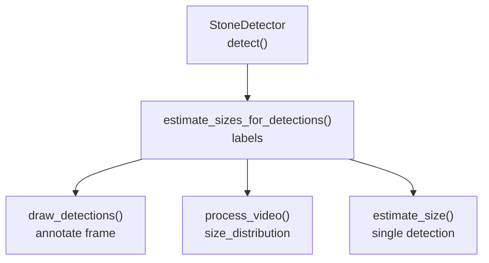
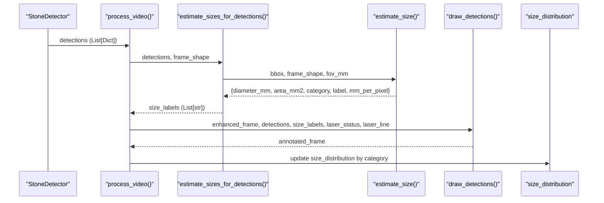
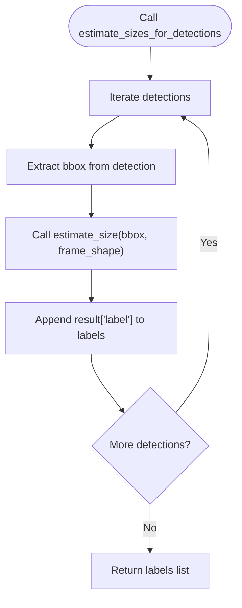
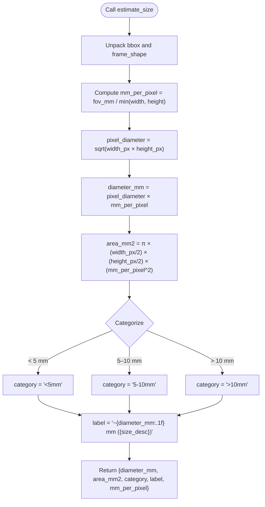
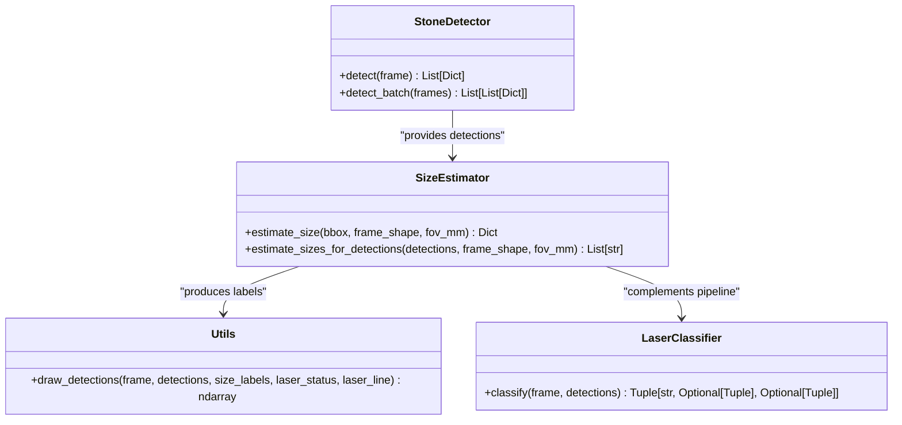
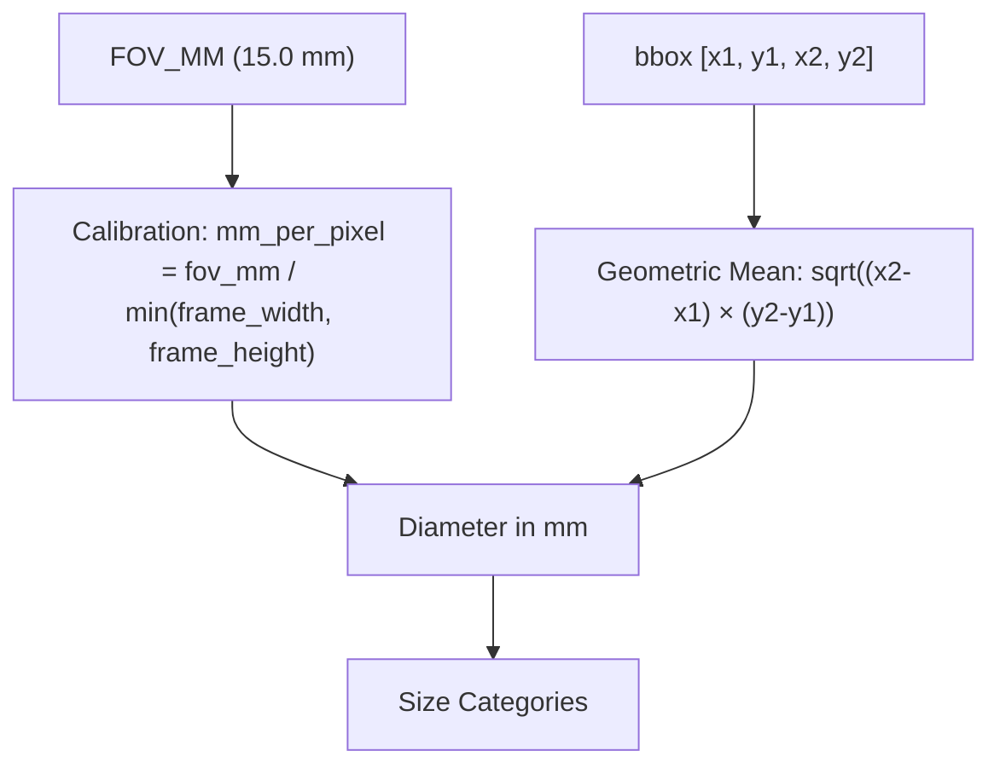

# Size Estimation API

<cite>
**Referenced Files in This Document**
- [size_estimator.py](file://src/size_estimator.py)
- [inference_video.py](file://src/inference_video.py)
- [utils.py](file://src/utils.py)
- [stone_detector.py](file://src/stone_detector.py)
- [laser_classifier.py](file://src/laser_classifier.py)
</cite>

## Table of Contents
1. [Introduction](#introduction)
2. [Project Structure](#project-structure)
3. [Core Components](#core-components)
4. [Architecture Overview](#architecture-overview)
5. [Detailed Component Analysis](#detailed-component-analysis)
6. [Dependency Analysis](#dependency-analysis)
7. [Performance Considerations](#performance-considerations)
8. [Troubleshooting Guide](#troubleshooting-guide)
9. [Conclusion](#conclusion)
10. [Appendices](#appendices)

## Introduction
This document provides API documentation for the size estimation functions used in the RIRS (Rigid or Flexible Ureteroscopy) AI pipeline. It focuses on:
- estimate_sizes_for_detections(): batch processing of detection results to produce human-readable size labels
- estimate_size(): individual detection sizing using bounding box coordinates and frame dimensions

The documentation covers parameter specifications, return value formats, size categorization logic, geometric mean calculation methodology, and RIRS scope calibration constants. It also demonstrates integration with detection results and size distribution analysis.

## Project Structure
The size estimation functionality is implemented in a dedicated module and integrated into the broader RIRS inference pipeline. The relevant components are organized as follows:
- src/size_estimator.py: Contains the size estimation functions and calibration constants
- src/inference_video.py: Demonstrates end-to-end usage of size estimation within the pipeline
- src/utils.py: Provides visualization utilities that consume size labels
- src/stone_detector.py: Supplies detection results consumed by size estimation
- src/laser_classifier.py: Provides complementary pipeline components

**Diagram sources**
- [inference_video.py:122-138](file://src/inference_video.py#L122-L138)
- [size_estimator.py:95-109](file://src/size_estimator.py#L95-L109)
- [utils.py:79-161](file://src/utils.py#L79-L161)

**Section sources**
- [size_estimator.py:1-110](file://src/size_estimator.py#L1-L110)
- [inference_video.py:1-250](file://src/inference_video.py#L1-L250)

## Core Components
This section documents the primary size estimation APIs and their roles within the pipeline.

- estimate_sizes_for_detections(detections, frame_shape, fov_mm=FOV_MM)
  - Purpose: Batch-size size estimation for multiple detections
  - Parameters:
    - detections: List of detection dictionaries, each containing a bounding box and metadata
    - frame_shape: Tuple of (height, width) representing the frame dimensions
    - fov_mm: Optional field-of-view diameter in millimeters (default calibrated to 15.0 mm)
  - Returns: List of human-readable size labels (strings)
  - Typical usage: Used in the pipeline to annotate frames and compute size distributions

- estimate_size(bbox, frame_shape, fov_mm=FOV_MM)
  - Purpose: Single-detection size estimation with detailed metrics
  - Parameters:
    - bbox: List of integers [x1, y1, x2, y2] representing the bounding box coordinates
    - frame_shape: Tuple of (height, width) representing the frame dimensions
    - fov_mm: Optional field-of-view diameter in millimeters (default calibrated to 15.0 mm)
  - Returns: Dictionary with keys:
    - diameter_mm: Estimated diameter in millimeters (rounded to two decimals)
    - area_mm2: Estimated area in square millimeters (rounded to two decimals)
    - category: Size category string ('<5mm', '5-10mm', '>10mm')
    - label: Human-readable label (e.g., "~7.3 mm (medium)")
    - mm_per_pixel: Calibration factor used for conversion

**Section sources**
- [size_estimator.py:32-92](file://src/size_estimator.py#L32-L92)
- [size_estimator.py:95-109](file://src/size_estimator.py#L95-L109)

## Architecture Overview
The size estimation API integrates seamlessly into the RIRS pipeline. The following sequence illustrates the end-to-end flow from detection to annotation and statistics collection.

**Diagram sources**
- [inference_video.py:122-138](file://src/inference_video.py#L122-L138)
- [size_estimator.py:95-109](file://src/size_estimator.py#L95-L109)
- [size_estimator.py:32-92](file://src/size_estimator.py#L32-L92)
- [utils.py:79-161](file://src/utils.py#L79-L161)

## Detailed Component Analysis

### estimate_sizes_for_detections()
- Role: Convenience wrapper for batch processing detections
- Input format: List of detection dictionaries with at least a 'bbox' key
- Output format: List of human-readable labels (strings)
- Integration points:
  - Called during pipeline processing to annotate frames
  - Used alongside draw_detections() for visualization
  - Consumed by process_video() to update size_distribution statistics

**Diagram sources**
- [size_estimator.py:95-109](file://src/size_estimator.py#L95-L109)

**Section sources**
- [size_estimator.py:95-109](file://src/size_estimator.py#L95-L109)
- [inference_video.py:122-138](file://src/inference_video.py#L122-L138)

### estimate_size()
- Role: Computes precise size metrics for a single detection
- Input parameters:
  - bbox: [x1, y1, x2, y2] coordinates
  - frame_shape: (height, width) tuple
  - fov_mm: Optional field-of-view diameter (default 15.0 mm)
- Calculation methodology:
  - Calibration: mm_per_pixel = fov_mm / min(frame_width, frame_height)
  - Geometric mean diameter: pixel_diameter = sqrt(width_px × height_px)
  - Diameter in mm: diameter_mm = pixel_diameter × mm_per_pixel
  - Area approximation: treating the detection as an ellipse, area_mm2 = π × (width_px/2) × (height_px/2) × (mm_per_pixel^2)
- Categorization logic:
  - < 5 mm: small
  - 5–10 mm: medium
  - > 10 mm: large
- Output format: Dictionary with keys described above

**Diagram sources**
- [size_estimator.py:32-92](file://src/size_estimator.py#L32-L92)

**Section sources**
- [size_estimator.py:32-92](file://src/size_estimator.py#L32-L92)

### Integration with Detection Results and Size Distribution Analysis
- Detection results: Provided by StoneDetector.detect(), each detection dictionary includes 'bbox', 'conf', 'class_id', and additional metadata
- Size estimation integration:
  - estimate_sizes_for_detections() produces labels for visualization
  - estimate_size() is used to update size_distribution statistics during pipeline processing
- Visualization integration:
  - draw_detections() consumes size_labels to annotate frames with size information

**Diagram sources**
- [stone_detector.py:111-156](file://src/stone_detector.py#L111-L156)
- [size_estimator.py:32-109](file://src/size_estimator.py#L32-L109)
- [utils.py:79-161](file://src/utils.py#L79-L161)
- [laser_classifier.py:181-223](file://src/laser_classifier.py#L181-L223)

**Section sources**
- [inference_video.py:122-138](file://src/inference_video.py#L122-L138)
- [inference_video.py:162-168](file://src/inference_video.py#L162-L168)
- [utils.py:79-161](file://src/utils.py#L79-L161)

## Dependency Analysis
The size estimation API depends on:
- Frame dimensions: Used to compute mm_per_pixel based on the shorter frame dimension
- Bounding box geometry: Width and height are used to calculate geometric mean diameter
- Calibration constant: FOV_MM (default 15.0 mm) defines the field-of-view diameter at the working distance

**Diagram sources**
- [size_estimator.py:29](file://src/size_estimator.py#L29)
- [size_estimator.py:64](file://src/size_estimator.py#L64)
- [size_estimator.py:67](file://src/size_estimator.py#L67)
- [size_estimator.py:74-82](file://src/size_estimator.py#L74-L82)

**Section sources**
- [size_estimator.py:28-30](file://src/size_estimator.py#L28-L30)
- [size_estimator.py:62-92](file://src/size_estimator.py#L62-L92)

## Performance Considerations
- Computational cost: estimate_size() performs simple arithmetic operations and is efficient for real-time inference
- Batch processing: estimate_sizes_for_detections() iterates through detections; for large batches, consider vectorized operations if needed
- Calibration reuse: Using a fixed FOV_MM reduces repeated computations; adjust only when camera optics change
- Memory footprint: Both functions operate on input parameters and return dictionaries; minimal memory overhead

## Troubleshooting Guide
Common issues and resolutions:
- Invalid bounding box coordinates:
  - Ensure bbox values are within frame bounds and represent [x1, y1, x2, y2]
  - Verify frame_shape corresponds to (height, width)
- Unexpected size categories:
  - Confirm FOV_MM setting matches the actual scope calibration
  - Check that frame dimensions are correct (height, width order)
- Incorrect labels in visualization:
  - Verify that size_labels produced by estimate_sizes_for_detections() match detection order
  - Ensure draw_detections() receives the correct number of labels

**Section sources**
- [size_estimator.py:58-92](file://src/size_estimator.py#L58-L92)
- [utils.py:117-128](file://src/utils.py#L117-L128)

## Conclusion
The size estimation API provides robust, clinically meaningful size categorization for kidney stone detections in RIRS endoscopic video. Its integration into the pipeline enables real-time annotation and statistical analysis, supporting clinical decision-making and procedural planning.

## Appendices

### API Reference Summary
- estimate_sizes_for_detections(detections, frame_shape, fov_mm=FOV_MM)
  - Returns: List[str] of human-readable size labels
- estimate_size(bbox, frame_shape, fov_mm=FOV_MM)
  - Returns: Dict with keys: diameter_mm, area_mm2, category, label, mm_per_pixel

### Example Usage Scenarios
- Batch labeling for visualization:
  - Input: detections from StoneDetector.detect()
  - Output: size_labels for draw_detections()
- Size distribution analysis:
  - Input: detections from each frame
  - Output: aggregated counts per category in size_distribution

**Section sources**
- [inference_video.py:122-138](file://src/inference_video.py#L122-L138)
- [inference_video.py:162-168](file://src/inference_video.py#L162-L168)