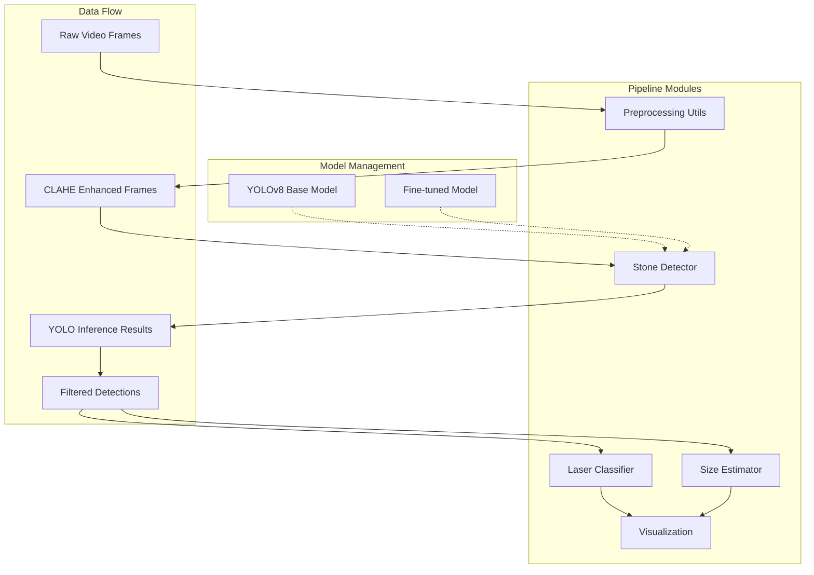
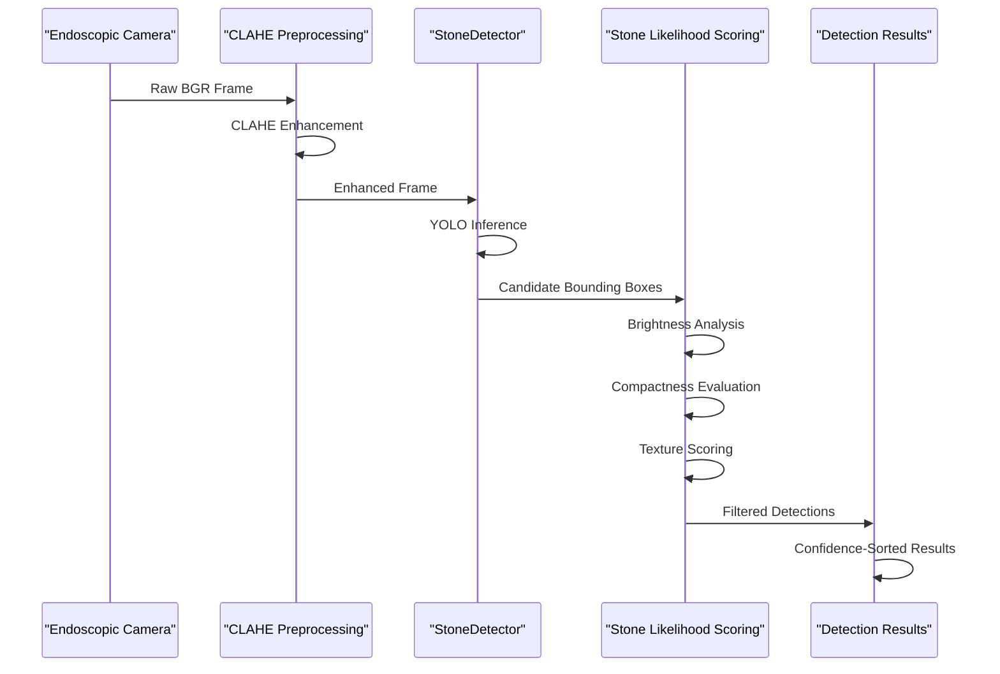
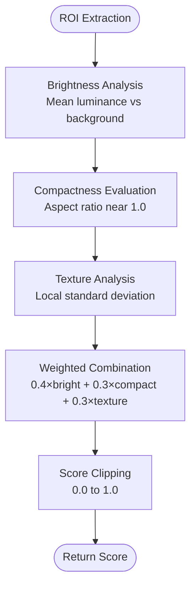
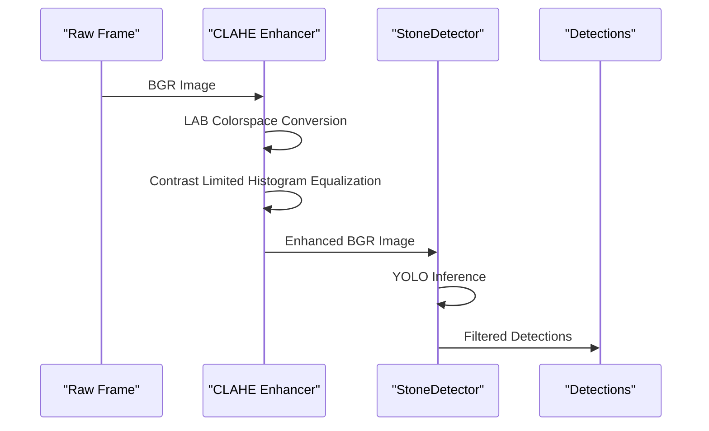
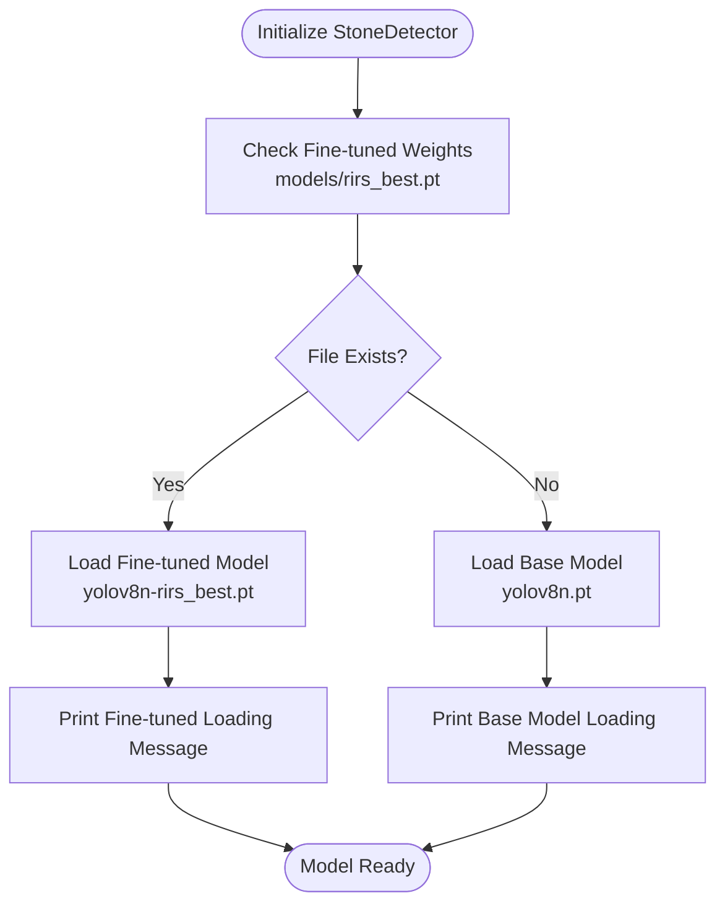
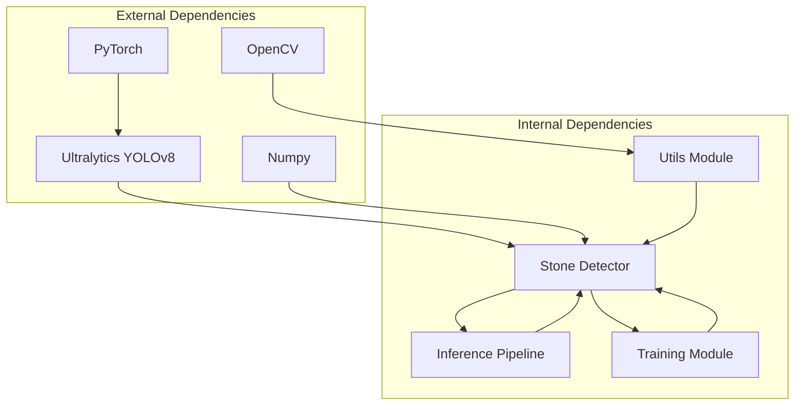

# Stone Detection API

<cite>
**Referenced Files in This Document**
- [stone_detector.py](file://src/stone_detector.py)
- [inference_video.py](file://src/inference_video.py)
- [utils.py](file://src/utils.py)
- [train.py](file://src/train.py)
- [requirements.txt](file://requirements.txt)
</cite>

## Table of Contents
1. [Introduction](#introduction)
2. [Project Structure](#project-structure)
3. [Core Components](#core-components)
4. [Architecture Overview](#architecture-overview)
5. [Detailed Component Analysis](#detailed-component-analysis)
6. [Dependency Analysis](#dependency-analysis)
7. [Performance Considerations](#performance-considerations)
8. [Troubleshooting Guide](#troubleshooting-guide)
9. [Conclusion](#conclusion)

## Introduction
This document provides comprehensive API documentation for the StoneDetector class, which performs kidney stone detection in RIRS (Rigid Internal Repsectoscope) endoscopic video frames. The system employs a YOLOv8-based approach combined with domain-specific heuristics to identify stones in challenging endoscopic conditions where manual annotation is unavailable.

The StoneDetector integrates seamlessly with a complete preprocessing pipeline that includes CLAHE (Contrast Limited Adaptive Histogram Equalization) enhancement to improve visibility in dark, murky endoscopic environments. The detector uses both model confidence thresholds and custom stone likelihood scoring to filter false positives while maintaining sensitivity for clinically relevant detections.

## Project Structure
The stone detection system is organized around several key modules that work together to provide a complete RIRS AI assistance pipeline:

**Diagram sources**
- [stone_detector.py:1-161](file://src/stone_detector.py#L1-L161)
- [utils.py:20-44](file://src/utils.py#L20-L44)
- [inference_video.py:19-42](file://src/inference_video.py#L19-L42)

**Section sources**
- [stone_detector.py:1-161](file://src/stone_detector.py#L1-L161)
- [inference_video.py:1-250](file://src/inference_video.py#L1-L250)
- [utils.py:1-175](file://src/utils.py#L1-L175)

## Core Components
The stone detection system consists of several interconnected components that handle different aspects of the RIRS pipeline:

### StoneDetector Class
The primary component responsible for detecting kidney stones in endoscopic frames. It encapsulates YOLOv8 model loading, inference, and post-processing logic.

### Preprocessing Pipeline
Handles CLAHE enhancement to improve stone visibility in low-contrast endoscopic conditions.

### Domain-Specific Heuristics
Custom scoring function that evaluates detection quality based on stone characteristics (brightness, compactness, texture).

### Integration Components
Supporting modules for visualization, size estimation, and laser classification that work alongside the detection system.

**Section sources**
- [stone_detector.py:77-161](file://src/stone_detector.py#L77-L161)
- [utils.py:20-44](file://src/utils.py#L20-L44)
- [inference_video.py:19-42](file://src/inference_video.py#L19-L42)

## Architecture Overview
The stone detection architecture follows a modular design that separates concerns between preprocessing, detection, and post-processing:

**Diagram sources**
- [stone_detector.py:111-156](file://src/stone_detector.py#L111-L156)
- [utils.py:20-44](file://src/utils.py#L20-L44)
- [inference_video.py:119-123](file://src/inference_video.py#L119-L123)

The architecture emphasizes robustness through multiple filtering stages and provides flexibility for model selection between base YOLOv8 and fine-tuned variants.

## Detailed Component Analysis

### StoneDetector Constructor Parameters

The StoneDetector class accepts three key parameters during initialization:

| Parameter | Type | Default | Description |
|-----------|------|---------|-------------|
| `conf_threshold` | float | 0.30 | Minimum YOLO confidence score to retain a detection |
| `stone_score_threshold` | float | 0.30 | Minimum stone likelihood score for heuristic filtering |
| `use_finetuned` | bool | True | Whether to use fine-tuned weights if available |

**Constructor Implementation Details:**
- Model loading prioritizes fine-tuned weights (`models/rirs_best.pt`) when available
- Falls back to base YOLOv8n (COCO-pretrained) when fine-tuned weights are absent
- Prints loading status messages for transparency

**Section sources**
- [stone_detector.py:92-109](file://src/stone_detector.py#L92-L109)

### Detection Method Signature and Behavior

The `detect()` method processes individual frames through the complete detection pipeline:

**Method Signature:** `detect(frame: np.ndarray) -> List[Dict]`

**Input Requirements:**
- Frame must be a CLAHE-enhanced BGR image
- Expected data type: `np.ndarray` with shape `(height, width, 3)`
- Color channel order: BGR (OpenCV standard)

**Return Value Format:**
Each detection is represented as a dictionary containing:
- `bbox`: [x1, y1, x2, y2] - pixel coordinates of bounding box
- `conf`: float - YOLO confidence score (0.0 to 1.0)
- `class_id`: int - predicted class identifier
- `stone_score`: float - custom stone likelihood score (0.0 to 1.0)

**Processing Logic:**
1. Executes YOLOv8 inference with configured confidence threshold
2. Applies custom stone likelihood scoring to each candidate
3. Filters detections below stone_score_threshold
4. Sorts remaining detections by confidence (highest first)

**Section sources**
- [stone_detector.py:111-156](file://src/stone_detector.py#L111-L156)

### Stone Likelihood Scoring Algorithm

The `_stone_likelihood()` function implements domain-specific heuristics for evaluating detection quality:

**Scoring Components:**
- **Brightness Score (40% weight):** Stones typically appear brighter than surrounding tissue
- **Compactness Score (30% weight):** Round/irregular shapes preferred over long linear objects
- **Texture Score (30% weight):** Granular surface texture characteristic of stones

**Diagram sources**
- [stone_detector.py:38-74](file://src/stone_detector.py#L38-L74)

**Section sources**
- [stone_detector.py:38-74](file://src/stone_detector.py#L38-L74)

### Batch Processing Capabilities

The StoneDetector provides batch processing through the `detect_batch()` method:

**Method Signature:** `detect_batch(frames: List[np.ndarray]) -> List[List[Dict]]`

**Behavior:**
- Processes multiple frames in sequence
- Returns list of detection lists corresponding to input frames
- Maintains consistent threshold filtering across all frames

**Section sources**
- [stone_detector.py:158-161](file://src/stone_detector.py#L158-L161)

### Integration with Preprocessing Pipeline

The detection system requires frames to be processed through CLAHE enhancement:

**Preprocessing Specifications:**
- Colorspace transformation: BGR → LAB
- CLAHE parameters: clipLimit=2.5, tileGridSize=(8,8)
- Channel recombination: Enhanced L-channel + original A/B channels
- Final conversion: LAB → BGR

**Diagram sources**
- [utils.py:20-44](file://src/utils.py#L20-L44)
- [inference_video.py:119-123](file://src/inference_video.py#L119-L123)

**Section sources**
- [utils.py:20-44](file://src/utils.py#L20-L44)
- [inference_video.py:119-123](file://src/inference_video.py#L119-L123)

### Model Loading and Selection Strategy

The system implements intelligent model selection:

**Model Configuration:**
- Base model: yolov8n.pt (automatically downloaded by Ultralytics)
- Fine-tuned model: models/rirs_best.pt (if present)
- Automatic fallback ensures system reliability

**Diagram sources**
- [stone_detector.py:101-109](file://src/stone_detector.py#L101-L109)

**Section sources**
- [stone_detector.py:101-109](file://src/stone_detector.py#L101-L109)

## Dependency Analysis

The stone detection system relies on several external libraries and internal module dependencies:

**External Dependencies:**
- **Ultralytics YOLOv8 (≥8.2.0):** Primary computer vision framework
- **OpenCV (≥4.9.0):** Image processing and video handling
- **NumPy (<2.0):** Numerical computation and array operations
- **PyTorch (≥2.1.0):** Deep learning framework for model inference

**Internal Module Dependencies:**
- StoneDetector depends on preprocessing utilities
- Inference pipeline orchestrates detector usage
- Training module generates fine-tuned weights
- All components share common data structures

**Diagram sources**
- [requirements.txt:1-9](file://requirements.txt#L1-L9)
- [stone_detector.py:15-24](file://src/stone_detector.py#L15-L24)
- [inference_video.py:38-41](file://src/inference_video.py#L38-L41)

**Section sources**
- [requirements.txt:1-9](file://requirements.txt#L1-L9)
- [stone_detector.py:15-24](file://src/stone_detector.py#L15-L24)
- [inference_video.py:38-41](file://src/inference_video.py#L38-L41)

## Performance Considerations

### Computational Efficiency
- **Batch Processing:** Use `detect_batch()` for multiple frames to reduce overhead
- **Threshold Tuning:** Adjust `conf_threshold` and `stone_score_threshold` based on deployment requirements
- **Memory Management:** Large batches may require careful memory monitoring

### Accuracy Optimization
- **Threshold Calibration:** Start with default values (0.30) and adjust based on validation
- **Model Selection:** Fine-tuned models generally provide better performance than base models
- **Preprocessing Quality:** Ensure consistent CLAHE enhancement for optimal results

### Resource Requirements
- **GPU Acceleration:** Recommended for training; inference runs on CPU
- **Memory Usage:** Monitor memory consumption during batch processing
- **Processing Speed:** Typical real-time performance depends on hardware specifications

## Troubleshooting Guide

### Common Issues and Solutions

**Issue: No detections found**
- Verify CLAHE preprocessing is applied before detection
- Check confidence thresholds are not set too high
- Ensure model weights are properly loaded

**Issue: False positive detections**
- Lower `stone_score_threshold` to apply stricter filtering
- Verify fine-tuned model is being used when available
- Review lighting conditions in source video

**Issue: Model loading failures**
- Confirm `models/rirs_best.pt` exists when `use_finetuned=True`
- Check Ultralytics installation and version compatibility
- Verify sufficient disk space for automatic downloads

**Issue: Performance bottlenecks**
- Implement batch processing for multiple frames
- Consider reducing input resolution for real-time applications
- Monitor memory usage during extended processing sessions

### Debugging Tips
- Enable verbose logging during model loading
- Test with known good frames to validate preprocessing
- Compare results with and without fine-tuned models
- Validate bounding box coordinates are within image bounds

**Section sources**
- [stone_detector.py:101-109](file://src/stone_detector.py#L101-L109)
- [inference_video.py:224-231](file://src/inference_video.py#L224-L231)

## Conclusion

The StoneDetector class provides a robust, configurable solution for kidney stone detection in RIRS endoscopic procedures. Its design incorporates both machine learning capabilities and domain-specific heuristics to achieve reliable performance in challenging clinical environments.

Key strengths of the implementation include:
- Flexible model selection between base and fine-tuned variants
- Comprehensive preprocessing pipeline for enhanced visibility
- Multi-stage filtering to minimize false positives
- Clear API design with well-defined input/output specifications
- Integration with broader RIRS AI assistance pipeline

The system demonstrates practical applicability for clinical support applications while maintaining extensibility for future improvements and adaptations to different medical imaging scenarios.