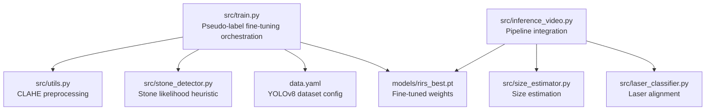
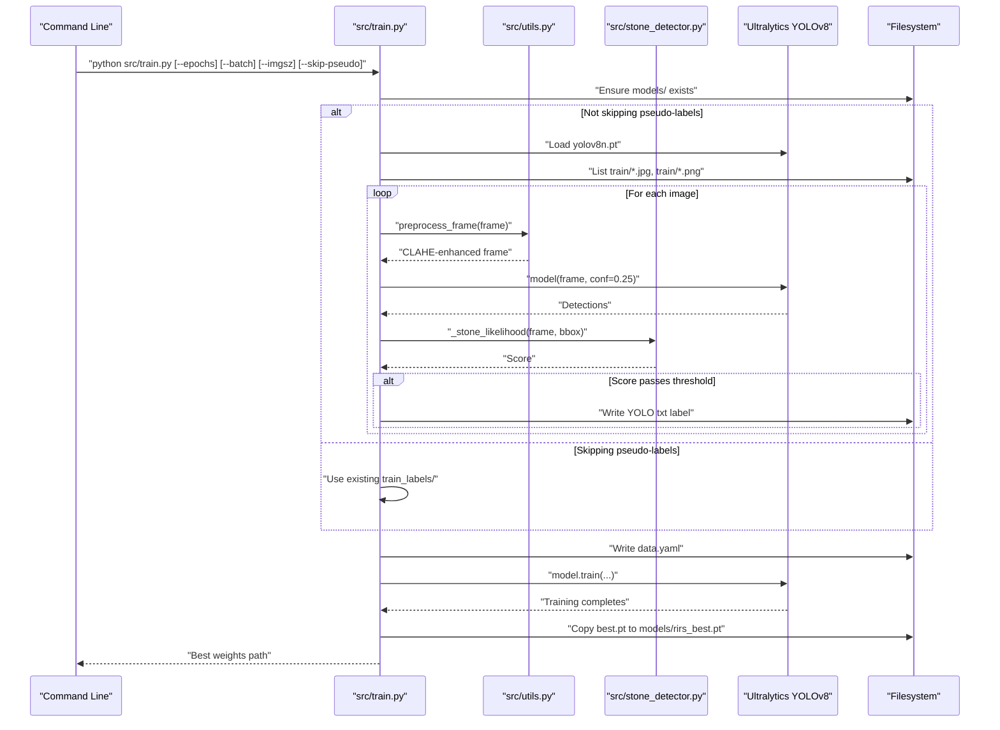
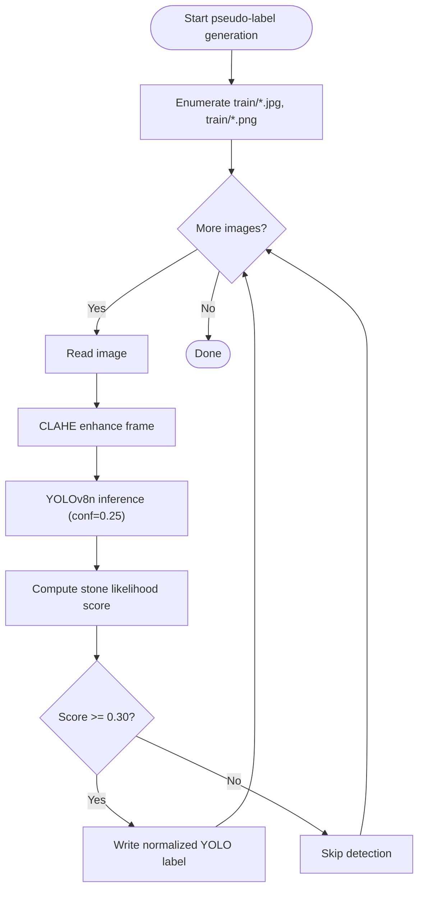
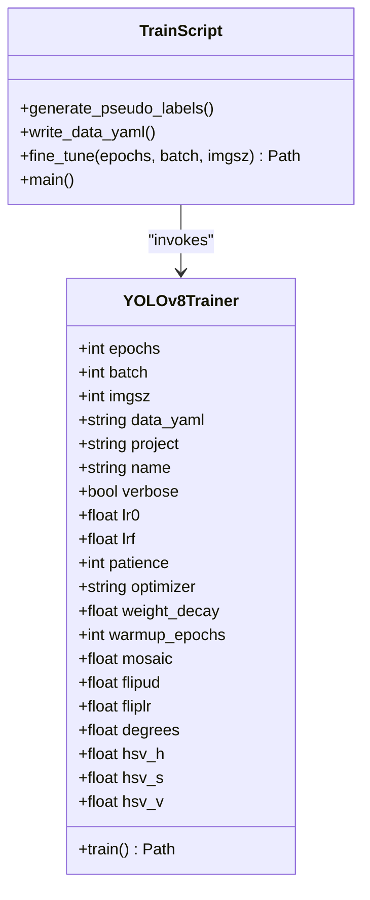
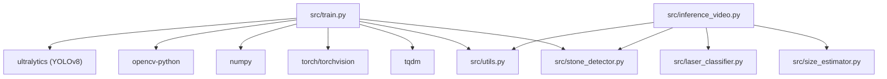

# Training API

<cite>
**Referenced Files in This Document**
- [train.py](file://src/train.py)
- [utils.py](file://src/utils.py)
- [stone_detector.py](file://src/stone_detector.py)
- [inference_video.py](file://src/inference_video.py)
- [size_estimator.py](file://src/size_estimator.py)
- [laser_classifier.py](file://src/laser_classifier.py)
- [requirements.txt](file://requirements.txt)
</cite>

## Table of Contents
1. [Introduction](#introduction)
2. [Project Structure](#project-structure)
3. [Core Components](#core-components)
4. [Architecture Overview](#architecture-overview)
5. [Detailed Component Analysis](#detailed-component-analysis)
6. [Dependency Analysis](#dependency-analysis)
7. [Performance Considerations](#performance-considerations)
8. [Troubleshooting Guide](#troubleshooting-guide)
9. [Conclusion](#conclusion)
10. [Appendices](#appendices)

## Introduction
This document describes the training API for pseudo-label fine-tuning of YOLOv8 on the RIRS (Rigid or Flexible Ureteroscopy) dataset. It covers the training script interface, configuration parameters, dataset preparation requirements, and the end-to-end training workflow. It also documents hyperparameters, pseudo-label generation, model optimization settings, evaluation metrics, command-line arguments, configuration file formats, and integration with the YOLOv8 training framework. Finally, it provides examples of training runs, model checkpoint management, and performance validation procedures.

## Project Structure
The training pipeline is implemented as a single script that orchestrates pseudo-label generation, dataset configuration, and fine-tuning of a YOLOv8 nano-sized model. Supporting modules provide preprocessing, detection heuristics, and inference integration.

**Diagram sources**
- [train.py:183-225](file://src/train.py#L183-L225)
- [utils.py:20-44](file://src/utils.py#L20-L44)
- [stone_detector.py:38-75](file://src/stone_detector.py#L38-L75)
- [inference_video.py:204-250](file://src/inference_video.py#L204-L250)

**Section sources**
- [train.py:17-25](file://src/train.py#L17-L25)
- [requirements.txt:1-9](file://requirements.txt#L1-L9)

## Core Components
- Training script: Orchestrates pseudo-label generation, writes dataset configuration, and runs YOLOv8 fine-tuning.
- Preprocessing module: Applies CLAHE contrast enhancement in LAB colorspace to improve detection on dark endoscopic frames.
- Stone likelihood heuristic: Filters detections using brightness, compactness, and texture scores.
- Dataset configuration: Generates a YOLOv8-compatible data.yaml file.
- Fine-tuned weights: Outputs best-performing weights for downstream inference.

**Section sources**
- [train.py:61-122](file://src/train.py#L61-L122)
- [train.py:125-136](file://src/train.py#L125-L136)
- [train.py:139-181](file://src/train.py#L139-L181)
- [utils.py:20-44](file://src/utils.py#L20-L44)
- [stone_detector.py:38-75](file://src/stone_detector.py#L38-L75)

## Architecture Overview
The training workflow consists of three stages:
1. Pseudo-label generation: Run YOLOv8n on training images, apply CLAHE, filter detections with a stone likelihood heuristic, and write YOLO-format labels.
2. Dataset configuration: Write a data.yaml file pointing to the training directory and labels.
3. Fine-tuning: Train YOLOv8n on the pseudo-labeled dataset with tuned hyperparameters and save the best weights.

**Diagram sources**
- [train.py:183-225](file://src/train.py#L183-L225)
- [train.py:61-122](file://src/train.py#L61-L122)
- [train.py:125-136](file://src/train.py#L125-L136)
- [train.py:139-181](file://src/train.py#L139-L181)
- [utils.py:20-44](file://src/utils.py#L20-L44)
- [stone_detector.py:38-75](file://src/stone_detector.py#L38-L75)

## Detailed Component Analysis

### Training Script Interface
The training script exposes a simple command-line interface and orchestrates the entire pipeline.

- Command-line arguments:
  - --epochs: Number of training epochs (default 30)
  - --batch: Batch size (default 16)
  - --imgsz: Input image size (default 640)
  - --skip-pseudo: Skip pseudo-label generation and use existing train_labels/

- Workflow:
  - Ensures models directory exists.
  - Optionally generates pseudo-labels from raw training images.
  - Writes data.yaml for YOLOv8 training.
  - Starts fine-tuning with tuned hyperparameters.
  - Copies best weights to models/rirs_best.pt for inference.

- Outputs:
  - Pseudo-labeled .txt files in train_labels/.
  - data.yaml in project root.
  - Best weights at models/rirs_best.pt.

**Section sources**
- [train.py:183-225](file://src/train.py#L183-L225)
- [train.py:139-181](file://src/train.py#L139-L181)

### Pseudo-Label Generation
Pseudo-labels are generated by running a pre-trained YOLOv8n model on training images, applying CLAHE preprocessing, and filtering detections using a stone likelihood heuristic. Only detections meeting the threshold are saved as YOLO-format labels.

- Inputs:
  - Raw training images under train/ (supports jpg/png).
  - Pretrained YOLOv8n weights (auto-downloaded by Ultralytics).

- Processing:
  - CLAHE enhancement in LAB colorspace.
  - Inference with confidence threshold 0.25.
  - Stone likelihood scoring with threshold 0.30.
  - Normalized YOLO labels written to train_labels/.

- Outputs:
  - One .txt label file per image in train_labels/.
  - Console summary of labeled images.

**Diagram sources**
- [train.py:61-122](file://src/train.py#L61-L122)
- [utils.py:20-44](file://src/utils.py#L20-L44)
- [stone_detector.py:38-75](file://src/stone_detector.py#L38-L75)

**Section sources**
- [train.py:61-122](file://src/train.py#L61-L122)
- [utils.py:20-44](file://src/utils.py#L20-L44)
- [stone_detector.py:38-75](file://src/stone_detector.py#L38-L75)

### Dataset Configuration (data.yaml)
The training script writes a YOLOv8-compatible data.yaml file that defines the dataset layout and class metadata.

- Fields:
  - path: Root directory of the dataset.
  - train: Directory containing training images.
  - val: Validation directory (set to train due to lack of a separate split).
  - nc: Number of classes (1 for "stone").
  - names: Class names list.

- Output location:
  - data.yaml written to project root.

**Section sources**
- [train.py:125-136](file://src/train.py#L125-L136)

### Fine-Tuning with YOLOv8
The script initializes a YOLOv8n model and starts training on the pseudo-labeled dataset with carefully selected hyperparameters.

- Hyperparameters:
  - Optimizer: AdamW
  - Learning rate schedule: cosine decay with final ratio 0.01
  - Warmup: 3 epochs
  - Early stopping: patience 10
  - Batch size: configurable via CLI
  - Image size: configurable via CLI
  - Epochs: configurable via CLI
  - Augmentation: mild mosaic and flips, slight rotation, and HSV jitter

- Metrics and logging:
  - Training logs are printed to console.
  - Best weights saved during training lifecycle.

- Output:
  - Best weights copied to models/rirs_best.pt for inference.

**Diagram sources**
- [train.py:139-181](file://src/train.py#L139-L181)

**Section sources**
- [train.py:139-181](file://src/train.py#L139-L181)

### Integration with Inference Pipeline
The best weights produced by training are consumed by the inference pipeline. The inference script loads the fine-tuned model automatically when available.

- Inference behavior:
  - Loads models/rirs_best.pt if present; otherwise falls back to yolov8n.pt.
  - Uses the same CLAHE preprocessing and detection heuristics.

**Section sources**
- [inference_video.py:224-231](file://src/inference_video.py#L224-L231)
- [stone_detector.py:92-109](file://src/stone_detector.py#L92-L109)

## Dependency Analysis
The training script depends on external libraries and internal modules.

- External dependencies (as declared):
  - ultralytics>=8.2.0
  - opencv-python>=4.9.0
  - numpy>=1.24.0,<2.0
  - torch>=2.1.0
  - torchvision>=0.16.0
  - Pillow>=10.0.0
  - matplotlib>=3.7.0
  - tqdm>=4.66.0

- Internal dependencies:
  - src/utils.py: CLAHE preprocessing
  - src/stone_detector.py: Stone likelihood heuristic
  - src/inference_video.py: Inference pipeline integration

**Diagram sources**
- [requirements.txt:1-9](file://requirements.txt#L1-L9)
- [train.py:45-46](file://src/train.py#L45-L46)
- [inference_video.py:38-41](file://src/inference_video.py#L38-L41)

**Section sources**
- [requirements.txt:1-9](file://requirements.txt#L1-L9)
- [train.py:45-46](file://src/train.py#L45-L46)
- [inference_video.py:38-41](file://src/inference_video.py#L38-L41)

## Performance Considerations
- Hardware: Training is significantly faster on CUDA GPUs; CPU-only training is possible but slow.
- Preprocessing: CLAHE enhances detection quality on dark endoscopic frames.
- Early stopping: Patience of 10 prevents overfitting on small datasets.
- Augmentation: Mild augmentations improve generalization without degrading performance.
- Batch size: Larger batches increase throughput but require more memory.
- Image size: Larger input images improve localization but reduce throughput.

[No sources needed since this section provides general guidance]

## Troubleshooting Guide
- No images found in train/: Ensure images are placed under train/ with .jpg or .png extensions.
- data.yaml not found: The script writes data.yaml automatically; verify permissions and path resolution.
- best.pt missing after training: The script copies best.pt to models/rirs_best.pt; check filesystem permissions and YOLOv8 training logs.
- Low-quality pseudo-labels: Adjust confidence threshold (0.25) and stone likelihood threshold (0.30) in the script.
- CUDA errors: Verify GPU drivers and PyTorch CUDA installation match the requirements.

**Section sources**
- [train.py:73-76](file://src/train.py#L73-L76)
- [train.py:172-180](file://src/train.py#L172-L180)

## Conclusion
The training API provides a streamlined workflow for pseudo-label fine-tuning of YOLOv8 on the RIRS dataset. By combining CLAHE preprocessing, a domain-adaptive stone likelihood heuristic, and tuned YOLOv8 hyperparameters, it produces robust stone detection weights suitable for real-time inference. The resulting models integrate seamlessly with the broader RIRS pipeline, enabling automated stone detection, size estimation, and laser alignment assessment.

[No sources needed since this section summarizes without analyzing specific files]

## Appendices

### Command-Line Arguments
- --epochs: Integer, default 30
- --batch: Integer, default 16
- --imgsz: Integer, default 640
- --skip-pseudo: Flag to reuse existing train_labels/

**Section sources**
- [train.py:183-193](file://src/train.py#L183-L193)

### Configuration File Formats
- data.yaml:
  - path: Project root
  - train: train
  - val: train
  - nc: 1
  - names: ["stone"]

**Section sources**
- [train.py:125-136](file://src/train.py#L125-L136)

### Example Training Runs
- Basic run:
  - python src/train.py
- Custom epochs and batch size:
  - python src/train.py --epochs 50 --batch 8
- Skip pseudo-label generation:
  - python src/train.py --skip-pseudo

**Section sources**
- [train.py:183-193](file://src/train.py#L183-L193)

### Model Checkpoint Management
- Best weights path: models/rirs_best.pt
- Training project directory: models/rirs/
- Weights are copied post-training for inference readiness

**Section sources**
- [train.py:172-177](file://src/train.py#L172-L177)

### Performance Validation Procedures
- Inference validation:
  - Run the inference pipeline to evaluate detection quality and integrated metrics (size distribution, laser classification).
- Metrics observed in inference:
  - Frames with stones detected
  - Laser safety counts
  - Size category distributions

**Section sources**
- [inference_video.py:98-108](file://src/inference_video.py#L98-L108)
- [inference_video.py:151-169](file://src/inference_video.py#L151-L169)