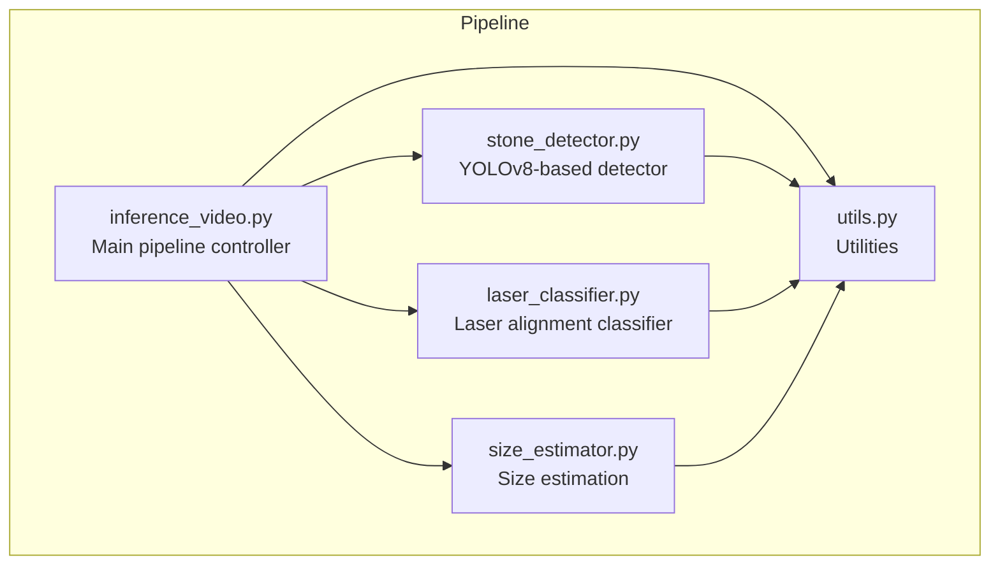
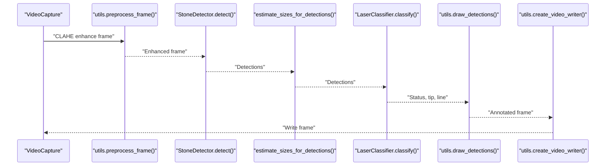
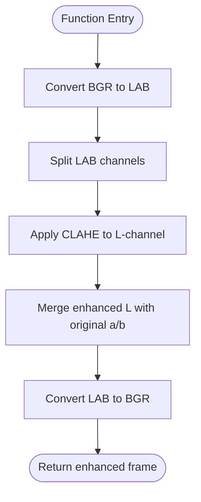
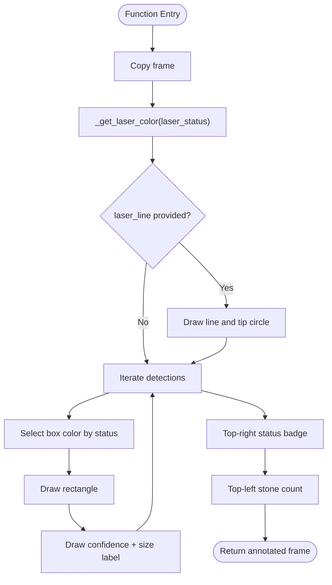
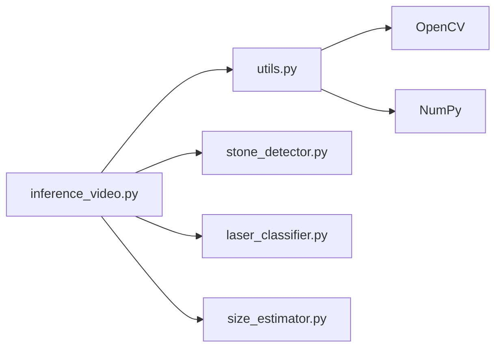

# Utility Functions API

<cite>
**Referenced Files in This Document**
- [utils.py](file://src/utils.py)
- [inference_video.py](file://src/inference_video.py)
- [stone_detector.py](file://src/stone_detector.py)
- [laser_classifier.py](file://src/laser_classifier.py)
- [size_estimator.py](file://src/size_estimator.py)
</cite>

## Table of Contents
1. [Introduction](#introduction)
2. [Project Structure](#project-structure)
3. [Core Components](#core-components)
4. [Architecture Overview](#architecture-overview)
5. [Detailed Component Analysis](#detailed-component-analysis)
6. [Dependency Analysis](#dependency-analysis)
7. [Performance Considerations](#performance-considerations)
8. [Troubleshooting Guide](#troubleshooting-guide)
9. [Conclusion](#conclusion)

## Introduction
This document provides API documentation for the utility functions used throughout the RIRS (Rigid or Flexible Ureteroscopy) pipeline. It focuses on:
- preprocess_frame(): CLAHE-based contrast enhancement for improved visibility in endoscopic images
- draw_detections(): annotation overlay for bounding boxes, size labels, and laser status
- save_frame(): JPEG output for individual frames
- create_video_writer(): video writer initialization for MP4 output

It also documents integration patterns with the main pipeline components and provides usage examples, parameter validation, and best practices.

## Project Structure
The utility functions are centralized in a dedicated module and integrated into the main pipeline script. The pipeline orchestrates preprocessing, detection, size estimation, laser classification, annotation, and output saving.

**Diagram sources**
- [inference_video.py:38](file://src/inference_video.py#L38)
- [stone_detector.py:111](file://src/stone_detector.py#L111)
- [laser_classifier.py:181](file://src/laser_classifier.py#L181)
- [size_estimator.py:95](file://src/size_estimator.py#L95)
- [utils.py:20](file://src/utils.py#L20)

**Section sources**
- [inference_video.py:13-20](file://src/inference_video.py#L13-L20)
- [inference_video.py:38](file://src/inference_video.py#L38)

## Core Components
This section documents the primary utility functions and their roles in the pipeline.

- preprocess_frame(frame)
  - Purpose: Enhance CLAHE contrast on the L-channel of LAB color space to improve visibility in dark/murky endoscopic frames.
  - Input: BGR image array
  - Output: Contrast-enhanced BGR image
  - Parameters: frame (np.ndarray)
  - Behavior: Converts BGR to LAB, applies CLAHE with clipLimit and tileGridSize, merges channels, converts back to BGR
  - Validation: Expects a valid BGR image array; no explicit type checks are performed inside the function

- draw_detections(frame, detections, size_labels, laser_status, laser_line=None)
  - Purpose: Overlay bounding boxes, confidence and size labels, laser line, and status badges onto the frame.
  - Input: frame (BGR), detections (list of dicts), size_labels (list of strings), laser_status (string), laser_line (tuple or None)
  - Output: Annotated frame (np.ndarray)
  - Parameters:
    - frame: BGR image (modified in-place and returned)
    - detections: [{'bbox': [x1,y1,x2,y2], 'conf': float, 'class_id': int}, ...]
    - size_labels: ['~X.x mm (category)', ...] with one label per detection
    - laser_status: 'safe_to_shoot', 'not_safe_to_shoot', or 'uncertain'
    - laser_line: (x1, y1, x2, y2) representing the detected laser line endpoint, or None
  - Behavior: Draws rectangles around detections, labels with confidence and size, draws laser line and tip if present, adds top-right status badge and top-left stone count badge
  - Validation: Expects detections to contain 'bbox'; size_labels length is handled gracefully

- save_frame(frame, path)
  - Purpose: Save a single frame as JPEG to the specified path with quality setting.
  - Input: frame (np.ndarray), path (str)
  - Output: None
  - Behavior: Writes frame to disk using OpenCV with JPEG quality 92

- create_video_writer(output_path, fps, width, height)
  - Purpose: Initialize an OpenCV VideoWriter for MP4 output.
  - Input: output_path (str), fps (float), width (int), height (int)
  - Output: cv2.VideoWriter
  - Behavior: Creates a VideoWriter with mp4v codec and specified resolution/fps

**Section sources**
- [utils.py:20-43](file://src/utils.py#L20-L43)
- [utils.py:79-161](file://src/utils.py#L79-L161)
- [utils.py:164-166](file://src/utils.py#L164-L166)
- [utils.py:169-174](file://src/utils.py#L169-L174)

## Architecture Overview
The pipeline integrates the utility functions with detection and classification modules. The main flow is:
- Read frame
- preprocess_frame()
- StoneDetector.detect()
- estimate_sizes_for_detections()
- LaserClassifier.classify()
- draw_detections()
- write to video and optionally save frames

**Diagram sources**
- [inference_video.py:119-141](file://src/inference_video.py#L119-L141)
- [utils.py:20-43](file://src/utils.py#L20-L43)
- [stone_detector.py:111-156](file://src/stone_detector.py#L111-L156)
- [size_estimator.py:95-109](file://src/size_estimator.py#L95-L109)
- [laser_classifier.py:181-223](file://src/laser_classifier.py#L181-L223)
- [utils.py:79-161](file://src/utils.py#L79-L161)
- [utils.py:169-174](file://src/utils.py#L169-L174)

## Detailed Component Analysis

### preprocess_frame(frame)
- Purpose: Improve visibility in dark/murky endoscopic frames using CLAHE on the L-channel of LAB color space.
- Input/Output specifications:
  - Input: np.ndarray (BGR image)
  - Output: np.ndarray (BGR image)
- Image processing parameters:
  - LAB conversion
  - CLAHE with clipLimit and tileGridSize
  - Merge enhanced L-channel with original a/b channels
  - Convert back to BGR
- Parameter validation:
  - Expects a valid BGR image array; no explicit type checks are performed inside the function
- Usage example:
  - Call preprocess_frame(frame) before detection to enhance visibility
- Integration pattern:
  - Called in the pipeline before detection and classification steps

**Diagram sources**
- [utils.py:20-43](file://src/utils.py#L20-L43)

**Section sources**
- [utils.py:20-43](file://src/utils.py#L20-L43)
- [inference_video.py:119-123](file://src/inference_video.py#L119-L123)

### draw_detections(frame, detections, size_labels, laser_status, laser_line=None)
- Purpose: Annotate a frame with bounding boxes, confidence and size labels, laser line, and status badges.
- Input/Output specifications:
  - Inputs:
    - frame: np.ndarray (BGR)
    - detections: list of dicts with 'bbox', 'conf', 'class_id'
    - size_labels: list of strings (human-readable labels)
    - laser_status: string ('safe_to_shoot', 'not_safe_to_shoot', 'uncertain')
    - laser_line: tuple (x1, y1, x2, y2) or None
  - Output: np.ndarray (annotated BGR frame)
- Annotation details:
  - Bounding boxes colored according to laser_status
  - Labels include confidence and size
  - Optional laser line and tip circle
  - Top-right status badge
  - Top-left stone count badge
- Parameter validation:
  - Expects detections to contain 'bbox'; size_labels length is handled gracefully
  - laser_status must be one of the allowed values
- Usage example:
  - Call draw_detections(enhanced, detections, size_labels, laser_status, laser_line) to produce the final annotated frame
- Integration pattern:
  - Used after detection, size estimation, and laser classification

**Diagram sources**
- [utils.py:79-161](file://src/utils.py#L79-L161)
- [utils.py:46-53](file://src/utils.py#L46-L53)
- [utils.py:56-76](file://src/utils.py#L56-L76)

**Section sources**
- [utils.py:79-161](file://src/utils.py#L79-L161)
- [inference_video.py:129-138](file://src/inference_video.py#L129-L138)

### save_frame(frame, path)
- Purpose: Save a single frame as JPEG to the specified path.
- Input/Output specifications:
  - Inputs: frame (np.ndarray), path (str)
  - Output: None
- Behavior:
  - Uses OpenCV to write JPEG with quality 92
- Usage example:
  - Call save_frame(enhanced, path) and save_frame(annotated, path) during pipeline processing
- Integration pattern:
  - Called periodically to save sample frames

**Section sources**
- [utils.py:164-166](file://src/utils.py#L164-L166)
- [inference_video.py:144-148](file://src/inference_video.py#L144-L148)

### create_video_writer(output_path, fps, width, height)
- Purpose: Initialize an OpenCV VideoWriter for MP4 output.
- Input/Output specifications:
  - Inputs: output_path (str), fps (float), width (int), height (int)
  - Output: cv2.VideoWriter
- Behavior:
  - Creates a VideoWriter with mp4v codec and specified resolution/fps
- Usage example:
  - Call create_video_writer(path, fps, width, height) to initialize the writer
- Integration pattern:
  - Called once per video to create the output writer

**Section sources**
- [utils.py:169-174](file://src/utils.py#L169-L174)
- [inference_video.py:94-95](file://src/inference_video.py#L94-L95)

## Dependency Analysis
The utility functions are used by the main pipeline and depend on OpenCV and NumPy. The pipeline orchestrator imports and invokes these utilities.

**Diagram sources**
- [inference_video.py:38](file://src/inference_video.py#L38)
- [utils.py:5-7](file://src/utils.py#L5-L7)

**Section sources**
- [inference_video.py:38](file://src/inference_video.py#L38)
- [utils.py:5-7](file://src/utils.py#L5-L7)

## Performance Considerations
- preprocess_frame():
  - LAB conversion and CLAHE are relatively lightweight; suitable for real-time processing
  - Consider caching or reusing intermediate arrays if processing many frames
- draw_detections():
  - Drawing operations scale with number of detections; keep detection lists reasonable
  - Text rendering and rectangle drawing are fast; avoid excessive label updates
- save_frame():
  - JPEG compression with quality 92 balances size and speed; adjust quality if storage is constrained
- create_video_writer():
  - Ensure fps matches input video; mismatch can cause dropped frames or artifacts

## Troubleshooting Guide
- preprocess_frame():
  - Ensure input is a valid BGR image array; unexpected shapes may cause conversion errors
- draw_detections():
  - Verify detections contain 'bbox' entries; missing keys will cause errors
  - Confirm laser_status is one of the allowed values
  - If size_labels is shorter than detections, missing labels will be shown as '?'
- save_frame():
  - Ensure the output directory exists; permission errors will prevent saving
- create_video_writer():
  - Verify output_path is writable and has sufficient disk space
  - Ensure fps, width, and height match the frame properties

**Section sources**
- [utils.py:79-161](file://src/utils.py#L79-L161)
- [utils.py:164-166](file://src/utils.py#L164-L166)
- [utils.py:169-174](file://src/utils.py#L169-L174)

## Conclusion
The utility functions provide essential image preprocessing, annotation, and output capabilities for the RIRS pipeline. They integrate seamlessly with detection and classification modules, enabling robust processing of endoscopic video streams. Following the documented usage patterns and validations ensures reliable operation across diverse video conditions.