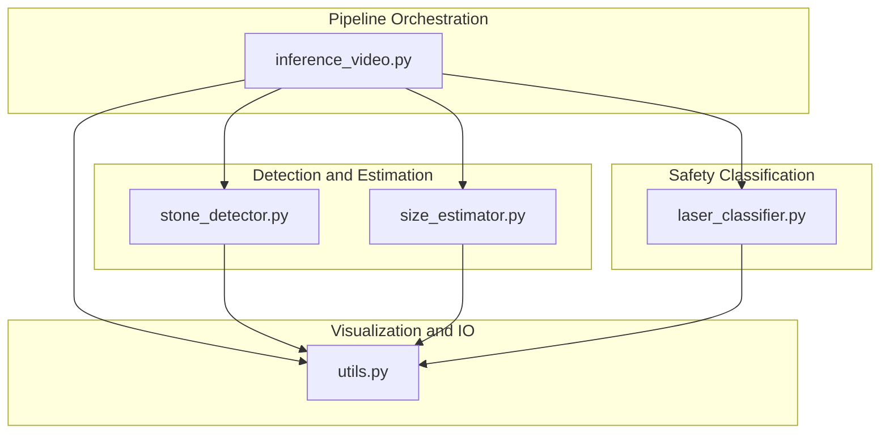
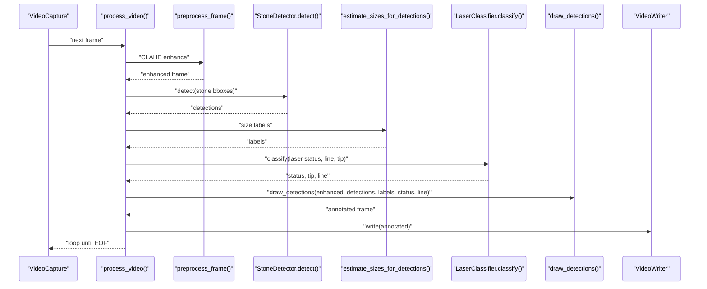
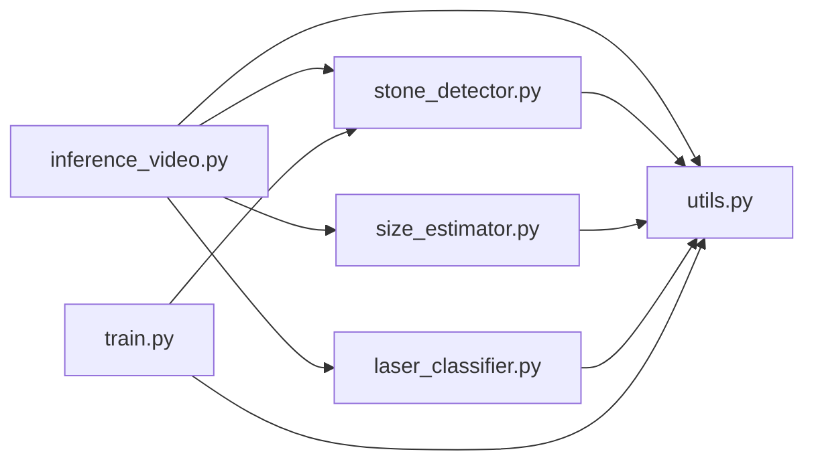

# Annotation and Visualization

<cite>
**Referenced Files in This Document**
- [utils.py](file://src/utils.py)
- [inference_video.py](file://src/inference_video.py)
- [stone_detector.py](file://src/stone_detector.py)
- [laser_classifier.py](file://src/laser_classifier.py)
- [size_estimator.py](file://src/size_estimator.py)
- [train.py](file://src/train.py)
</cite>

## Table of Contents
1. [Introduction](#introduction)
2. [Project Structure](#project-structure)
3. [Core Components](#core-components)
4. [Architecture Overview](#architecture-overview)
5. [Detailed Component Analysis](#detailed-component-analysis)
6. [Dependency Analysis](#dependency-analysis)
7. [Performance Considerations](#performance-considerations)
8. [Troubleshooting Guide](#troubleshooting-guide)
9. [Conclusion](#conclusion)
10. [Appendices](#appendices)

## Introduction
This document describes the annotation and visualization system in RIRS, focusing on how detection results are transformed into a final annotated video. It explains the drawing functions for bounding boxes, text labels, and safety status overlays, details color coding for safety statuses, badge placement strategies, and visual hierarchy design. It also documents the complete annotation pipeline from raw frames to final output, including implementation specifics for text rendering, background rectangles, and color mapping, and outlines customization options for different display requirements and output formatting standards.

## Project Structure
The annotation and visualization pipeline spans several modules:
- Utilities for preprocessing and drawing
- Inference orchestration for end-to-end processing
- Stone detection and size estimation
- Laser alignment classification
- Training utilities for pseudo-labelling and fine-tuning

**Diagram sources**
- [inference_video.py:13-20](file://src/inference_video.py#L13-L20)
- [stone_detector.py:111-156](file://src/stone_detector.py#L111-L156)
- [size_estimator.py:95-109](file://src/size_estimator.py#L95-L109)
- [laser_classifier.py:181-223](file://src/laser_classifier.py#L181-L223)
- [utils.py:79-161](file://src/utils.py#L79-L161)

**Section sources**
- [inference_video.py:13-20](file://src/inference_video.py#L13-L20)
- [utils.py:10-18](file://src/utils.py#L10-L18)

## Core Components
- Drawing primitives and color mapping:
  - Color constants for safety statuses and overlay elements
  - Text label drawing with background rectangles
  - Bounding box drawing and badge overlays
- Annotation pipeline:
  - Frame preprocessing with CLAHE
  - Stone detection with post-filtering
  - Size estimation per detection
  - Laser alignment classification and line/tip visualization
  - Final annotation composition and video output

Key implementation specifics:
- Text rendering uses OpenCV’s text metrics to compute background rectangles precisely around labels.
- Color mapping ties laser alignment status to bounding box and badge colors.
- Badge placement is fixed to top-left (stone count) and top-right (laser status) corners for consistent visual hierarchy.

**Section sources**
- [utils.py:13-17](file://src/utils.py#L13-L17)
- [utils.py:56-76](file://src/utils.py#L56-L76)
- [utils.py:79-161](file://src/utils.py#L79-L161)
- [inference_video.py:119-141](file://src/inference_video.py#L119-L141)

## Architecture Overview
The end-to-end pipeline reads a video, preprocesses frames, detects stones, estimates sizes, classifies laser alignment, draws annotations, writes frames to a video, and saves sample frames.

**Diagram sources**
- [inference_video.py:119-141](file://src/inference_video.py#L119-L141)
- [stone_detector.py:111-156](file://src/stone_detector.py#L111-L156)
- [size_estimator.py:95-109](file://src/size_estimator.py#L95-L109)
- [laser_classifier.py:181-223](file://src/laser_classifier.py#L181-L223)
- [utils.py:79-161](file://src/utils.py#L79-L161)

## Detailed Component Analysis

### Drawing Functions and Visual Elements
- Color constants:
  - Safety: green for “safe to shoot”, red for “not safe to shoot”, yellow for “uncertain”
  - Overlay: cyan for default stone boxes; dark grey background for text labels
- Text label drawing:
  - Uses OpenCV text metrics to compute background rectangle size and position
  - Draws a filled rectangle behind the text, then renders the text with anti-aliased line endings
- Bounding boxes:
  - Boxes adopt the laser alignment status color when the status is not “uncertain”; otherwise use default cyan
  - Confidence and size label are rendered above each box
- Laser visualization:
  - Draws a line representing the fiber trajectory and a circle at the tip
- Badge overlays:
  - Top-right badge displays the laser status with a dark grey background
  - Top-left badge displays the stone count with a dark grey background

Implementation specifics:
- Text background rectangle sizing uses OpenCV’s text size calculation and baseline offsets to ensure tight fit around text
- Badge placement uses frame dimensions to anchor to the top-right and top-left corners with padding
- Box color mapping aligns with laser status to visually communicate risk

**Section sources**
- [utils.py:13-17](file://src/utils.py#L13-L17)
- [utils.py:56-76](file://src/utils.py#L56-L76)
- [utils.py:79-161](file://src/utils.py#L79-L161)

### Color Coding Scheme for Safety Statuses
- “safe_to_shoot”: green
- “not_safe_to_shoot”: red
- “uncertain”: yellow
- Default box color: cyan (when status is “uncertain”)

These colors are mapped to:
- Bounding boxes for stones
- Laser status badge
- Text labels inside boxes

**Section sources**
- [utils.py:46-53](file://src/utils.py#L46-L53)
- [utils.py:122-124](file://src/utils.py#L122-L124)
- [utils.py:132-137](file://src/utils.py#L132-L137)

### Badge Placement Strategies and Visual Hierarchy
- Top-right badge:
  - Displays the current laser alignment status
  - Uses dark grey background rectangle and anti-aliased text
  - Positioned using frame width and computed text size plus padding
- Top-left badge:
  - Displays the number of detected stones
  - Uses dark grey background rectangle and anti-aliased text
  - Positioned near the top-left corner with a fixed offset
- Visual hierarchy:
  - Laser status badge is prioritized for immediate operator awareness
  - Stone count badge provides situational context
  - Per-detection labels provide precise information per stone

**Section sources**
- [utils.py:130-161](file://src/utils.py#L130-L161)

### Annotation Pipeline: From Detection to Final Video
End-to-end steps:
1. Read frame
2. Preprocess with CLAHE
3. Detect stones with post-filtering
4. Estimate sizes for each detection
5. Classify laser alignment and extract line/tip
6. Draw annotations (boxes, labels, badges, laser line/tip)
7. Write annotated frame to output video
8. Optionally save sample frames as JPEGs

Statistics and logging:
- Tracks frames with stones, total detections, laser status distribution, and size categories
- Writes a per-frame summary periodically to a JSON file

Output formatting:
- MP4 video using VideoWriter with MP4V codec
- JPEG frames saved at a configurable interval

**Section sources**
- [inference_video.py:119-199](file://src/inference_video.py#L119-L199)
- [utils.py:169-175](file://src/utils.py#L169-L175)

### Stone Detection and Post-Filtering
- Uses YOLOv8n (or fine-tuned weights) to produce candidate detections
- Applies a stone-likelihood heuristic combining:
  - Brightness contrast relative to background
  - Compactness (aspect ratio near 1)
  - Texture (local standard deviation)
- Filters detections below a configurable threshold and sorts by confidence

**Section sources**
- [stone_detector.py:111-156](file://src/stone_detector.py#L111-L156)
- [stone_detector.py:38-74](file://src/stone_detector.py#L38-L74)

### Size Estimation
- Estimates diameter and area using geometric mean of bbox dimensions and a fixed field-of-view calibration
- Categorizes stones into size bins for clinical relevance
- Produces human-readable labels for display

**Section sources**
- [size_estimator.py:32-92](file://src/size_estimator.py#L32-L92)
- [size_estimator.py:95-109](file://src/size_estimator.py#L95-L109)

### Laser Alignment Classification
- Detects laser tip via HSV thresholding and morphological cleanup
- Detects fiber line via edge detection and Hough probabilistic line transform
- Determines alignment status by checking whether the tip is inside a stone or within proximity to any stone
- Returns status, tip coordinates, and line segment

**Section sources**
- [laser_classifier.py:60-133](file://src/laser_classifier.py#L60-L133)
- [laser_classifier.py:181-223](file://src/laser_classifier.py#L181-L223)

### Training Utilities (Pseudo-Label Fine-Tuning)
- Generates pseudo-labels by applying CLAHE and YOLO inference, then filtering with the stone-likelihood heuristic
- Writes a data.yaml for training and fine-tunes YOLOv8n
- Copies best weights to a shared location for inference

While not part of the visualization pipeline itself, these utilities support improved detection quality, indirectly affecting annotation fidelity.

**Section sources**
- [train.py:61-122](file://src/train.py#L61-L122)
- [train.py:125-136](file://src/train.py#L125-L136)
- [train.py:139-181](file://src/train.py#L139-L181)

## Dependency Analysis
The pipeline exhibits clear functional separation:
- Inference orchestrator depends on detection, estimation, and classification modules
- Visualization utilities depend on OpenCV for drawing and text rendering
- Training utilities depend on YOLO and OpenCV for pseudo-labelling and writing outputs

**Diagram sources**
- [inference_video.py:38-41](file://src/inference_video.py#L38-L41)
- [stone_detector.py:24](file://src/stone_detector.py#L24)
- [size_estimator.py:22](file://src/size_estimator.py#L22)
- [laser_classifier.py:39-40](file://src/laser_classifier.py#L39-L40)
- [utils.py:5-7](file://src/utils.py#L5-L7)
- [train.py:36](file://src/train.py#L36)

**Section sources**
- [inference_video.py:38-41](file://src/inference_video.py#L38-L41)
- [utils.py:5-7](file://src/utils.py#L5-L7)

## Performance Considerations
- CLAHE preprocessing improves visibility in dark/murky frames, aiding downstream detection and classification
- Text rendering uses OpenCV’s efficient text metrics and anti-aliased drawing for readable overlays
- Video writing uses a fixed codec and resolution to ensure consistent output formatting
- Badge placement and label positioning are computed per frame using text metrics to minimize layout overhead

[No sources needed since this section provides general guidance]

## Troubleshooting Guide
Common issues and remedies:
- No detections or low-quality detections:
  - Adjust detection thresholds in the inference orchestrator and stone detector
  - Verify CLAHE preprocessing is active and effective
- Misclassified laser status:
  - Tune HSV thresholds and Hough parameters in the laser classifier
  - Adjust proximity factor for safer or stricter alignment criteria
- Overlapping or clipped labels:
  - Reduce font scale or thickness in the label drawing function
  - Adjust padding around badges and labels
- Slow video output:
  - Reduce frame save interval or output FPS
  - Ensure hardware acceleration is available for OpenCV operations

**Section sources**
- [inference_video.py:54-57](file://src/inference_video.py#L54-L57)
- [laser_classifier.py:46-58](file://src/laser_classifier.py#L46-L58)
- [utils.py:61-76](file://src/utils.py#L61-L76)
- [utils.py:169-175](file://src/utils.py#L169-L175)

## Conclusion
The RIRS annotation and visualization system integrates detection, estimation, and classification into a coherent visual output. It uses a consistent color scheme, precise text rendering, and strategic badge placement to communicate safety status and stone information clearly. The pipeline is modular, enabling tuning of detection and classification thresholds, and produces standardized video outputs suitable for surgical assistance and reporting.

[No sources needed since this section summarizes without analyzing specific files]

## Appendices

### Implementation Details: Text Rendering and Background Rectangles
- Text metrics:
  - Computes text width and height plus baseline for accurate background sizing
- Background rectangle:
  - Filled rectangle positioned to tightly wrap the text
- Anti-aliased text:
  - Uses OpenCV’s anti-aliased line option for crisp readability

**Section sources**
- [utils.py:66-76](file://src/utils.py#L66-L76)

### Implementation Details: Color Mapping and Box Drawing
- Laser status to color mapping:
  - Safe/not-safe/uncertain mapped to distinct BGR values
- Box color logic:
  - When status is not “uncertain”, boxes adopt the status color
  - Otherwise, default cyan is used
- Laser line and tip:
  - Line drawn between detected endpoints
  - Tip marked with a circle for emphasis

**Section sources**
- [utils.py:46-53](file://src/utils.py#L46-L53)
- [utils.py:122-124](file://src/utils.py#L122-L124)
- [utils.py:111-115](file://src/utils.py#L111-L115)

### Implementation Details: Badge Placement and Layout
- Top-right badge:
  - Computed using frame width and text metrics with padding
  - Displays status text in the mapped color
- Top-left badge:
  - Fixed offset from the top-left corner
  - Displays stone count

**Section sources**
- [utils.py:130-161](file://src/utils.py#L130-L161)

### Implementation Details: Output Formatting Standards
- Video output:
  - MP4V codec with configured FPS and resolution
- Image output:
  - JPEG quality preset for balanced file size and readability

**Section sources**
- [utils.py:169-175](file://src/utils.py#L169-L175)