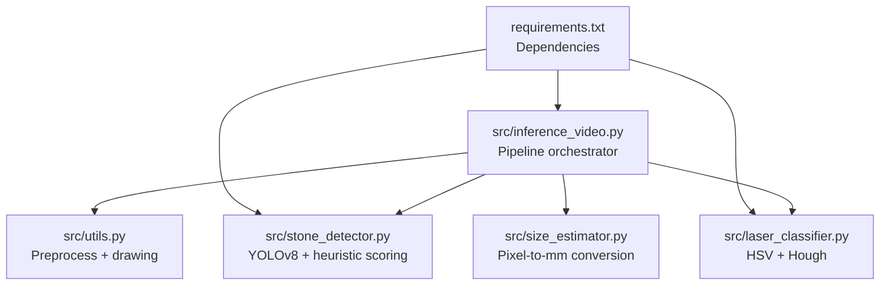
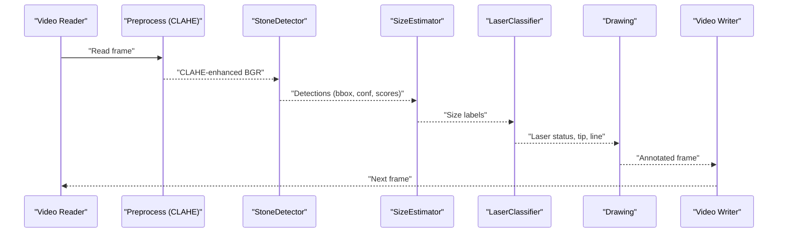
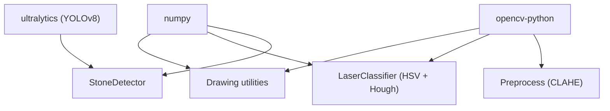

# Computer Vision Techniques

<cite>
**Referenced Files in This Document**
- [inference_video.py](file://src/inference_video.py)
- [utils.py](file://src/utils.py)
- [stone_detector.py](file://src/stone_detector.py)
- [laser_classifier.py](file://src/laser_classifier.py)
- [size_estimator.py](file://src/size_estimator.py)
- [requirements.txt](file://requirements.txt)
</cite>

## Table of Contents
1. [Introduction](#introduction)
2. [Project Structure](#project-structure)
3. [Core Components](#core-components)
4. [Architecture Overview](#architecture-overview)
5. [Detailed Component Analysis](#detailed-component-analysis)
6. [Dependency Analysis](#dependency-analysis)
7. [Performance Considerations](#performance-considerations)
8. [Troubleshooting Guide](#troubleshooting-guide)
9. [Conclusion](#conclusion)

## Introduction
This document explains the computer vision techniques implemented in RIRS, focusing on:
- CLAHE preprocessing for improved image quality
- YOLOv8 object detection for kidney stone localization
- HSV thresholding for laser tip detection
- Hough transform line detection for laser fiber alignment
- Feature extraction and post-processing filters used across the pipeline

It provides technical foundations, parameter configurations, algorithmic optimizations, and performance characteristics for each stage, along with a complete pipeline visualization.

## Project Structure
RIRS organizes its pipeline into modular Python modules under src/. The primary stages are orchestrated in a top-level script that loads models, runs inference, and writes annotated outputs.

**Diagram sources**
- [inference_video.py:1-250](file://src/inference_video.py#L1-L250)
- [utils.py:1-175](file://src/utils.py#L1-L175)
- [stone_detector.py:1-161](file://src/stone_detector.py#L1-L161)
- [laser_classifier.py:1-224](file://src/laser_classifier.py#L1-L224)
- [size_estimator.py:1-110](file://src/size_estimator.py#L1-L110)
- [requirements.txt:1-9](file://requirements.txt#L1-L9)

**Section sources**
- [inference_video.py:1-250](file://src/inference_video.py#L1-L250)
- [requirements.txt:1-9](file://requirements.txt#L1-L9)

## Core Components
- CLAHE preprocessing: Enhances the L-channel in LAB colorspace to improve visibility in low-light endoscopic images.
- YOLOv8 stone detection: Uses a pre-trained model with a custom post-filtering heuristic to select stone-like regions.
- Laser classifier: Combines HSV thresholding for bright tip detection and Hough line detection to infer fiber alignment.
- Size estimation: Converts pixel bounding boxes to clinical size categories using a calibrated field-of-view assumption.

**Section sources**
- [utils.py:20-44](file://src/utils.py#L20-L44)
- [stone_detector.py:77-161](file://src/stone_detector.py#L77-L161)
- [laser_classifier.py:160-224](file://src/laser_classifier.py#L160-L224)
- [size_estimator.py:32-110](file://src/size_estimator.py#L32-L110)

## Architecture Overview
The pipeline processes each video frame through a deterministic sequence of steps, producing annotated frames and a summary report.

**Diagram sources**
- [inference_video.py:119-141](file://src/inference_video.py#L119-L141)
- [utils.py:20-44](file://src/utils.py#L20-L44)
- [stone_detector.py:111-156](file://src/stone_detector.py#L111-L156)
- [size_estimator.py:95-110](file://src/size_estimator.py#L95-L110)
- [laser_classifier.py:181-224](file://src/laser_classifier.py#L181-L224)
- [utils.py:79-161](file://src/utils.py#L79-L161)

## Detailed Component Analysis

### CLAHE Preprocessing
Purpose:
- Improve visibility in dark or unevenly lit endoscopic scenes by enhancing the L-channel in LAB colorspace.

Implementation highlights:
- Convert BGR to LAB, split channels, apply CLAHE with clip limit and tile grid size, merge back, and convert to BGR.
- Applied to the full frame before detection.

Parameters:
- Clip limit and tile grid size are set during CLAHE creation.
- The enhanced frame is returned as BGR for downstream processing.

Performance characteristics:
- Adds moderate computational overhead due to color space conversions and histogram equalization.
- Improves detection robustness in low-light conditions.

Mathematical formulation:
- Let \( L \) be the L-channel of the LAB image. The CLAHE operator applies adaptive histogram equalization with parameters clip limit and tile grid size to produce \( L_{\text{enhanced}} \). The enhanced LAB image is merged back and converted to BGR.

Optimization tips:
- Adjust clip limit/tile grid size based on scene illumination.
- Consider caching or vectorized operations for batch processing.

**Section sources**
- [utils.py:20-44](file://src/utils.py#L20-L44)

### YOLOv8 Stone Detection
Purpose:
- Localize kidney stones using a domain-adaptive approach with a custom heuristic post-filter.

Implementation highlights:
- Loads either fine-tuned weights (if present) or the base YOLOv8n model.
- Runs inference with a configurable confidence threshold.
- Applies a custom stone likelihood scoring function to filter detections.

Heuristic scoring:
- Brightness: mean grayscale intensity normalized by 255.
- Compactness: aspect ratio normalized to [0, 1].
- Texture: local standard deviation normalized by 128.
- Combined score is a weighted sum: 0.4×brightness + 0.3×compactness + 0.3×texture.

Post-processing:
- Filters detections below a configurable threshold.
- Sorts results by confidence descending.

Parameters:
- Confidence threshold for initial filtering.
- Heuristic threshold for stone likelihood.
- Model selection switches between fine-tuned and pre-trained weights.

Performance characteristics:
- Inference speed depends on model size and device acceleration.
- Heuristic filtering reduces false positives by preferring stone-like shapes and textures.

**Section sources**
- [stone_detector.py:77-161](file://src/stone_detector.py#L77-L161)
- [stone_detector.py:38-75](file://src/stone_detector.py#L38-L75)

### HSV Thresholding for Laser Tip Detection
Purpose:
- Detect bright, near-white glows that correspond to the laser fiber tip.

Implementation highlights:
- Convert BGR to HSV, extract Value and Saturation channels.
- Threshold to isolate high-value, low-saturation regions (warm glow or blue-white).
- Apply morphological operations to clean the binary mask.
- Find contours and select the largest region meeting a minimum area requirement.
- Compute centroid as the estimated tip position.

Parameters:
- Minimum Value threshold for brightness.
- Maximum Saturation threshold for near-white appearance.
- Minimum bright region area to qualify as a tip.

Robustness:
- Morphological closing/opening reduces noise and small artifacts.
- Contour filtering ensures only significant regions are considered.

**Section sources**
- [laser_classifier.py:46-58](file://src/laser_classifier.py#L46-L58)
- [laser_classifier.py:60-134](file://src/laser_classifier.py#L60-L134)

### Hough Transform Line Detection for Laser Alignment
Purpose:
- Detect the straight fiber line and associate it with the detected tip.

Implementation highlights:
- Edge detection on the grayscale frame.
- Probabilistic Hough lines transform to find candidate lines.
- Select the line whose endpoint is closest to the HSV-detected tip centroid.

Parameters:
- Hough threshold, minimum line length, and maximum line gap.

Association logic:
- Endpoint nearest to the tip is chosen as the terminal point of the fiber line.

**Section sources**
- [laser_classifier.py:54-58](file://src/laser_classifier.py#L54-L58)
- [laser_classifier.py:103-133](file://src/laser_classifier.py#L103-L133)

### Laser Alignment Classification
Purpose:
- Determine whether the laser is safe to shoot, not safe to shoot, or uncertain.

Implementation highlights:
- If no tip is detected → uncertain.
- If detections exist, check:
  - Tip inside any stone bounding box → safe.
  - Tip within proximity factor × diagonal of the stone’s centroid → safe.
  - Otherwise → not safe to shoot.
- If detections are absent but a tip is visible → uncertain.

Proximity factor:
- Controls how close the tip must be to a stone to be considered “safe.”

**Section sources**
- [laser_classifier.py:160-224](file://src/laser_classifier.py#L160-L224)
- [laser_classifier.py:136-158](file://src/laser_classifier.py#L136-L158)

### Size Estimation from Bounding Boxes
Purpose:
- Convert pixel-based detections into clinical size categories.

Implementation highlights:
- Compute geometric mean diameter from bbox width and height.
- Calibrate mm-per-pixel using a fixed field-of-view diameter mapped to the shorter frame dimension.
- Estimate area assuming an elliptical cross-section.
- Map diameter to categories: <5 mm, 5–10 mm, >10 mm.

Calibration constant:
- Field-of-view diameter in millimeters is used to compute mm-per-pixel.

**Section sources**
- [size_estimator.py:32-110](file://src/size_estimator.py#L32-L110)

### Drawing and Annotation Utilities
Purpose:
- Render detections, size labels, and laser status overlays.

Implementation highlights:
- Draw bounding boxes colored according to laser status.
- Overlay confidence and size labels.
- Draw laser line and tip indicator.
- Place status badges in the frame corners.
- Save frames and write annotated video.

Color mapping:
- Safe: green
- Not safe: red
- Uncertain: yellow
- Default box: cyan

**Section sources**
- [utils.py:79-161](file://src/utils.py#L79-L161)

## Dependency Analysis
External libraries and their roles:
- OpenCV: Image processing, color conversions, morphological operations, edge detection, Hough transforms, video writing.
- NumPy: Numerical operations for arrays and geometry.
- Ultralytics YOLOv8: Object detection model loading and inference.
- Torch/TorchVision/Pillow/Matplotlib/tqdm: Backend support and progress reporting.

**Diagram sources**
- [requirements.txt:1-9](file://requirements.txt#L1-L9)
- [stone_detector.py:24](file://src/stone_detector.py#L24)
- [utils.py:5](file://src/utils.py#L5)
- [laser_classifier.py:38-39](file://src/laser_classifier.py#L38-L39)

**Section sources**
- [requirements.txt:1-9](file://requirements.txt#L1-L9)

## Performance Considerations
- CLAHE cost: Single LAB conversion and CLAHE application per frame; negligible overhead on modern hardware.
- YOLOv8 inference: Depends on GPU acceleration and model size; tune confidence and NMS thresholds to balance speed and accuracy.
- Heuristic filtering: Adds minimal overhead but improves precision by reducing false positives.
- HSV + Hough pipeline:
  - HSV thresholding is fast; morphological operations are lightweight.
  - Hough transform scales with edge density; tune thresholds to reduce false edges.
- Video I/O: Writing MP4 is I/O bound; ensure adequate disk throughput.
- Batch processing: Consider batching frames for inference to amortize model overhead.

[No sources needed since this section provides general guidance]

## Troubleshooting Guide
Common issues and remedies:
- Poor CLAHE results:
  - Adjust CLAHE clip limit and tile grid size to avoid over/under-enhancement.
  - Verify input is BGR and color space conversions are correct.
- YOLO false positives:
  - Increase the stone likelihood threshold to filter out non-stone regions.
  - Ensure fine-tuned weights are present and selected when available.
- Laser tip not detected:
  - Lower HSV Value threshold or increase minimum bright area if tip is dim.
  - Verify lighting conditions; ensure fiber tip is sufficiently bright.
- Hough lines misaligned:
  - Reduce Hough threshold or adjust minimum line length/gap to avoid noise.
  - Confirm grayscale conversion and edge detection parameters.
- Incorrect size estimates:
  - Validate frame dimensions and ensure FOV calibration aligns with the scope used.
  - Confirm bbox coordinates are in pixel units.

**Section sources**
- [utils.py:20-44](file://src/utils.py#L20-L44)
- [stone_detector.py:92-107](file://src/stone_detector.py#L92-L107)
- [laser_classifier.py:46-58](file://src/laser_classifier.py#L46-L58)
- [size_estimator.py:28-64](file://src/size_estimator.py#L28-L64)

## Conclusion
RIRS integrates classical and deep learning techniques to deliver a robust, real-time pipeline for kidney stone detection and laser alignment assessment in RIRS. CLAHE improves illumination uniformity, YOLOv8 provides strong localization, and HSV plus Hough enables reliable fiber tip and line detection. The system’s modular design allows tuning of thresholds and heuristics for diverse clinical environments.

[No sources needed since this section summarizes without analyzing specific files]