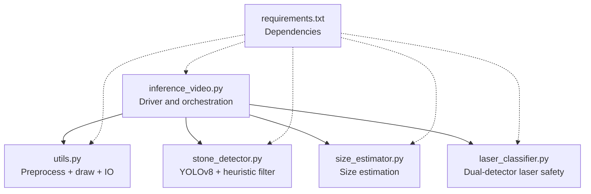
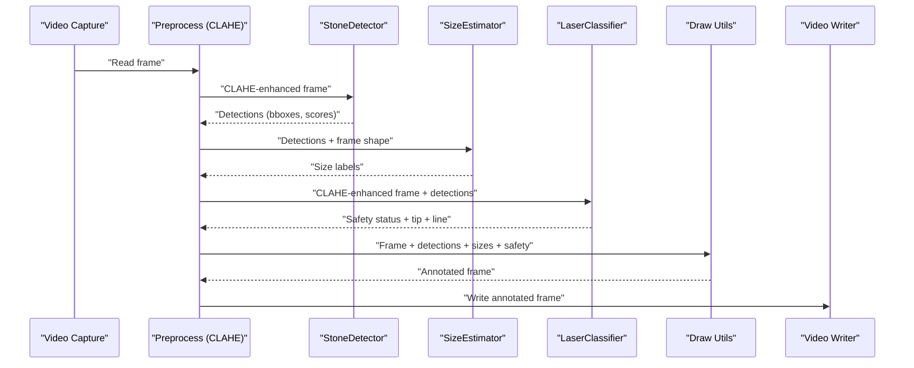
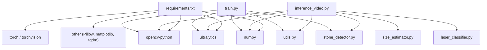

# Laser Detection Methods

<cite>
**Referenced Files in This Document**
- [inference_video.py](file://src/inference_video.py)
- [laser_classifier.py](file://src/laser_classifier.py)
- [utils.py](file://src/utils.py)
- [stone_detector.py](file://src/stone_detector.py)
- [size_estimator.py](file://src/size_estimator.py)
- [train.py](file://src/train.py)
- [requirements.txt](file://requirements.txt)
</cite>

## Table of Contents
1. [Introduction](#introduction)
2. [Project Structure](#project-structure)
3. [Core Components](#core-components)
4. [Architecture Overview](#architecture-overview)
5. [Detailed Component Analysis](#detailed-component-analysis)
6. [Dependency Analysis](#dependency-analysis)
7. [Performance Considerations](#performance-considerations)
8. [Troubleshooting Guide](#troubleshooting-guide)
9. [Conclusion](#conclusion)
10. [Appendices](#appendices)

## Introduction
This document explains the dual-detector laser detection methods used in the RIRS AI pipeline. It focuses on:
- HSV thresholding for bright region detection around the laser tip
- Hough probabilistic line detection for the laser fiber trajectory
- Mathematical foundations of color-based segmentation and line detection
- Integration of both methods for robust fiber identification
- Parameter tuning guidelines for varying lighting conditions
- Safety assessment logic and uncertainty handling
- False-positive reduction techniques and confidence scoring

The pipeline runs on endoscopic video frames, enhances visibility with CLAHE, detects stones, estimates sizes, classifies laser alignment safety, and annotates the output.

## Project Structure
The RIRS pipeline is organized into modular Python modules under src/. The laser detection logic resides primarily in the LaserClassifier, with preprocessing and visualization helpers in utils.py. Stone detection and size estimation are handled by StoneDetector and size_estimator.py respectively. The inference driver orchestrates the full pipeline.

**Diagram sources**
- [inference_video.py](file://src/inference_video.py)
- [utils.py](file://src/utils.py)
- [stone_detector.py](file://src/stone_detector.py)
- [size_estimator.py](file://src/size_estimator.py)
- [laser_classifier.py](file://src/laser_classifier.py)
- [requirements.txt](file://requirements.txt)

**Section sources**
- [inference_video.py](file://src/inference_video.py)
- [utils.py](file://src/utils.py)
- [stone_detector.py](file://src/stone_detector.py)
- [size_estimator.py](file://src/size_estimator.py)
- [laser_classifier.py](file://src/laser_classifier.py)
- [requirements.txt](file://requirements.txt)

## Core Components
- Preprocessing: CLAHE on the L-channel of LAB color space to improve visibility in dark/murky endoscopic scenes.
- Stone detection: YOLOv8 inference with a custom stone likelihood heuristic to filter false positives.
- Size estimation: Geometric mean diameter conversion to millimeters using a fixed field-of-view calibration.
- Laser detection and safety:
  - Bright-region detector: HSV thresholding to isolate near-white/high-brightness regions; moments-based centroid as tip estimate.
  - Line detector: Canny edge detection followed by probabilistic Hough lines; select the line endpoint closest to the tip.
  - Safety logic: inside-stone bbox, proximity to centroid, or absence of detection determines safe/not-safe/uncertain.

These components are orchestrated by the inference driver, which saves annotated frames and videos and logs statistics.

**Section sources**
- [utils.py](file://src/utils.py)
- [stone_detector.py](file://src/stone_detector.py)
- [size_estimator.py](file://src/size_estimator.py)
- [laser_classifier.py](file://src/laser_classifier.py)
- [inference_video.py](file://src/inference_video.py)

## Architecture Overview
The end-to-end flow integrates detection and safety assessment:

**Diagram sources**
- [inference_video.py](file://src/inference_video.py)
- [utils.py](file://src/utils.py)
- [stone_detector.py](file://src/stone_detector.py)
- [size_estimator.py](file://src/size_estimator.py)
- [laser_classifier.py](file://src/laser_classifier.py)

## Detailed Component Analysis

### HSV Thresholding for Bright Region Detection
The bright-region detector operates in HSV color space to isolate the laser tip’s near-white/high-brightness glow:
- Transform BGR to HSV.
- Threshold on Value (V) for high brightness and Saturation (S) for near-white behavior.
- Morphological closing/opening cleans noise.
- Contour detection identifies connected regions; only the largest region exceeding a minimum area is considered the tip.
- Centroid of the largest region yields (tip_x, tip_y).

Mathematical foundation:
- HSV separates intensity (Value) from color (Hue/Saturation). Laser tips often exhibit high Value and low S (nearly neutral white/grey), enabling robust isolation from tissue color variations.
- Contour moments compute the centroid, a robust spatial descriptor for the tip location.

Implementation highlights:
- Threshold parameters for V_min and S_max are tunable constants.
- Minimum bright area filters out tiny speckle/noise.
- Morphological operations reduce false positives caused by specular reflections or camera artifacts.

Parameter tuning tips:
- Lower V_min for dim lighting; raise for bright scenes.
- Adjust S_max to tolerate more colored glows (e.g., warmer vs. cooler bleeds).
- Increase minimum bright area when motion blur or noise increases.

False-positive reduction:
- Combine with proximity logic to the stone bounding box.
- Require the detected line endpoint to align with the tip.

**Section sources**
- [laser_classifier.py](file://src/laser_classifier.py)

### Hough Probabilistic Line Detection
The line detector complements the bright-region detector by identifying the fiber trajectory:
- Convert frame to grayscale and apply Canny edge detection.
- Use probabilistic Hough transform to find line segments.
- Among detected lines, pick the one whose endpoint is closest to the HSV-derived tip centroid.

Mathematical foundation:
- Hough probabilistic transform detects straight line segments robustly under noise by accumulating votes in parameter space (rho, theta).
- Endpoint proximity to the tip enforces geometric consistency with the fiber path.

Implementation highlights:
- Tunable thresholds for edge sensitivity and line completeness.
- Minimal line length and maximum gap control fragmentation and spurious detections.
- Selection by nearest endpoint reduces ambiguity when multiple lines are present.

Parameter tuning tips:
- Increase edge thresholds for high-contrast fiber-on-tissue boundaries.
- Adjust minLineLength to avoid short fragments; increase maxLineGap to connect broken lines.
- If the fiber is faint, lower thresholds cautiously and rely on proximity logic.

False-positive reduction:
- Reject lines not near the tip.
- Require at least one stone detection for “safe” classification; otherwise mark “not safe” if a line exists without a stone.

**Section sources**
- [laser_classifier.py](file://src/laser_classifier.py)

### Safety Assessment Logic and Confidence Scoring
Safety classification combines spatial checks against detected stones:
- Tip inside any stone bbox → safe_to_shoot
- Tip within proximity to a stone centroid (scaled by bbox diagonal) → safe_to_shoot
- A line is detected but tip is far from any stone → not_safe_to_shoot
- No tip detected → uncertain

Confidence scoring:
- Stone detection uses YOLOv8 confidence and a custom stone likelihood score combining brightness, compactness, and texture.
- Laser classification returns a discrete status; optional tip and line outputs enable visualization and further checks.

Uncertainty handling:
- “Uncertain” indicates insufficient evidence or poor visibility; the bounding box color reflects uncertainty until more evidence appears.

Integration with size estimation:
- Size labels inform clinical categorization; safety decisions remain independent of size but can be combined for reporting.

**Section sources**
- [laser_classifier.py](file://src/laser_classifier.py)
- [stone_detector.py](file://src/stone_detector.py)
- [size_estimator.py](file://src/size_estimator.py)

### Implementation Details and Orchestration
- Preprocessing: CLAHE on L-channel improves contrast in low-light endoscopic conditions.
- Drawing: Laser line and tip are overlaid; stone boxes adopt the laser status color when not uncertain; badges indicate stone count and laser status.
- Inference loop: Reads frames, preprocesses, detects stones, estimates sizes, classifies laser safety, draws annotations, writes video, and periodically saves sample frames.

Training support:
- Pseudo-label generation uses YOLOv8 inference plus a stone likelihood heuristic to produce training labels without manual annotation.
- Fine-tuning produces weights that are automatically selected by the inference pipeline when available.

**Section sources**
- [utils.py](file://src/utils.py)
- [inference_video.py](file://src/inference_video.py)
- [train.py](file://src/train.py)

## Dependency Analysis
External libraries and versions are declared in requirements.txt. The pipeline relies on:
- OpenCV for computer vision primitives (color space transforms, morphological operations, edge detection, Hough transforms, drawing).
- NumPy for numerical computations.
- Ultralytics YOLO for object detection and training support.

**Diagram sources**
- [requirements.txt](file://requirements.txt)
- [inference_video.py](file://src/inference_video.py)
- [utils.py](file://src/utils.py)
- [stone_detector.py](file://src/stone_detector.py)
- [size_estimator.py](file://src/size_estimator.py)
- [laser_classifier.py](file://src/laser_classifier.py)
- [train.py](file://src/train.py)

**Section sources**
- [requirements.txt](file://requirements.txt)
- [inference_video.py](file://src/inference_video.py)
- [train.py](file://src/train.py)

## Performance Considerations
- Prefer GPU acceleration for YOLO training and inference to meet real-time constraints during deployment.
- Tune CLAHE clip limit and tile grid size for scene-specific illumination.
- Adjust HSV thresholds and morphological kernel sizes to balance sensitivity and noise robustness.
- Calibrate Hough parameters to the expected fiber thickness and imaging conditions.
- Reduce post-processing operations on low-power devices by disabling optional overlays or saving fewer frames.

[No sources needed since this section provides general guidance]

## Troubleshooting Guide
Common issues and remedies:
- Poor visibility or darkness:
  - Verify CLAHE is applied before detection.
  - Lower V_min and/or S_max thresholds moderately; increase minimum bright area to suppress noise.
- Speckle/false bright regions:
  - Increase minimum bright area; refine morphological operations.
  - Ensure proximity threshold is appropriate for the camera’s working distance.
- Faint fiber lines:
  - Decrease edge thresholds slightly; adjust minLineLength and maxLineGap.
  - Confirm the fiber tip is detected; otherwise classification defaults to uncertain.
- Misclassification as safe:
  - Tighten proximity factor or require tip inside bbox.
  - Validate stone detections; “safe” requires either tip-in-stone or proximity-to-centroid.
- No detections:
  - Review YOLO confidence and stone likelihood thresholds.
  - Re-run pseudo-label generation and fine-tuning if weights are outdated.

**Section sources**
- [laser_classifier.py](file://src/laser_classifier.py)
- [utils.py](file://src/utils.py)
- [stone_detector.py](file://src/stone_detector.py)
- [size_estimator.py](file://src/size_estimator.py)
- [train.py](file://src/train.py)

## Conclusion
The dual-detector approach leverages color-based segmentation (HSV) and geometric line detection (Hough) to robustly identify laser fiber tips and trajectories. By integrating these detectors with spatial safety checks against stone locations, the system achieves reliable “safe/not safe/uncertain” assessments. Proper parameter tuning for lighting conditions, careful false-positive suppression, and clear uncertainty signaling ensure safe and interpretable operation in clinical environments.

[No sources needed since this section summarizes without analyzing specific files]

## Appendices

### Mathematical Foundations Summary
- Color-based segmentation:
  - HSV separates chroma and intensity; high Value and low Saturation target near-white laser tips.
  - Binary mask derived from thresholds isolates candidate regions; morphological cleaning reduces noise.
- Contour-based tip localization:
  - Largest contour meeting area threshold is selected; centroid computed via spatial moments.
- Edge-based line detection:
  - Canny edge detection highlights boundaries; probabilistic Hough transform accumulates line segments.
  - Nearest endpoint selection ensures geometric consistency with the tip.
- Safety scoring:
  - Discrete classification based on spatial relations to stones; optional proximity scaling by bbox diagonal.

[No sources needed since this section provides general guidance]