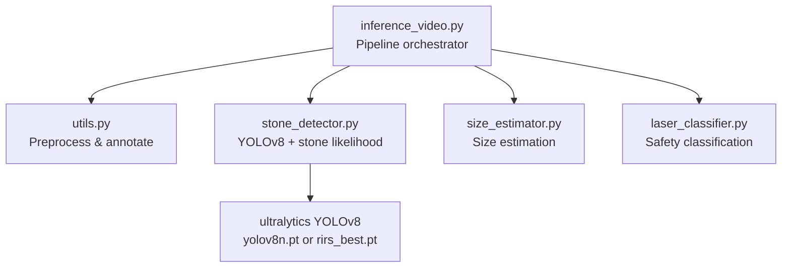
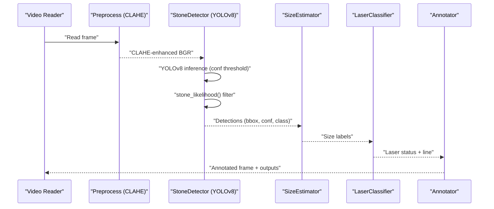
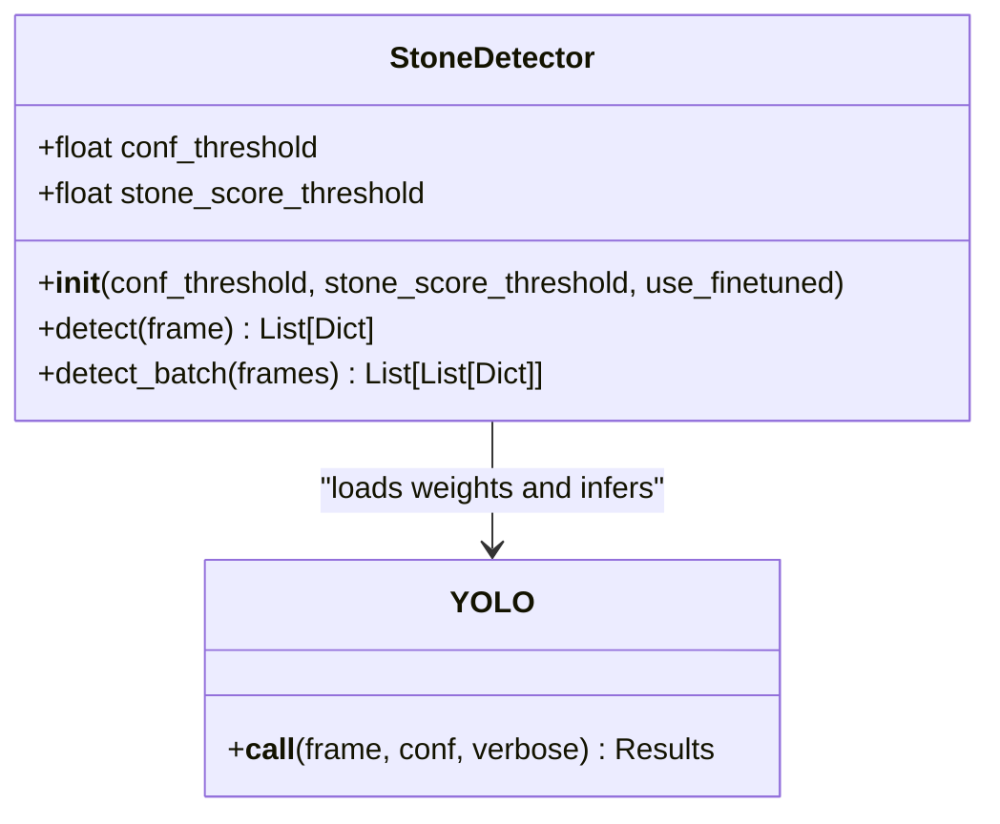
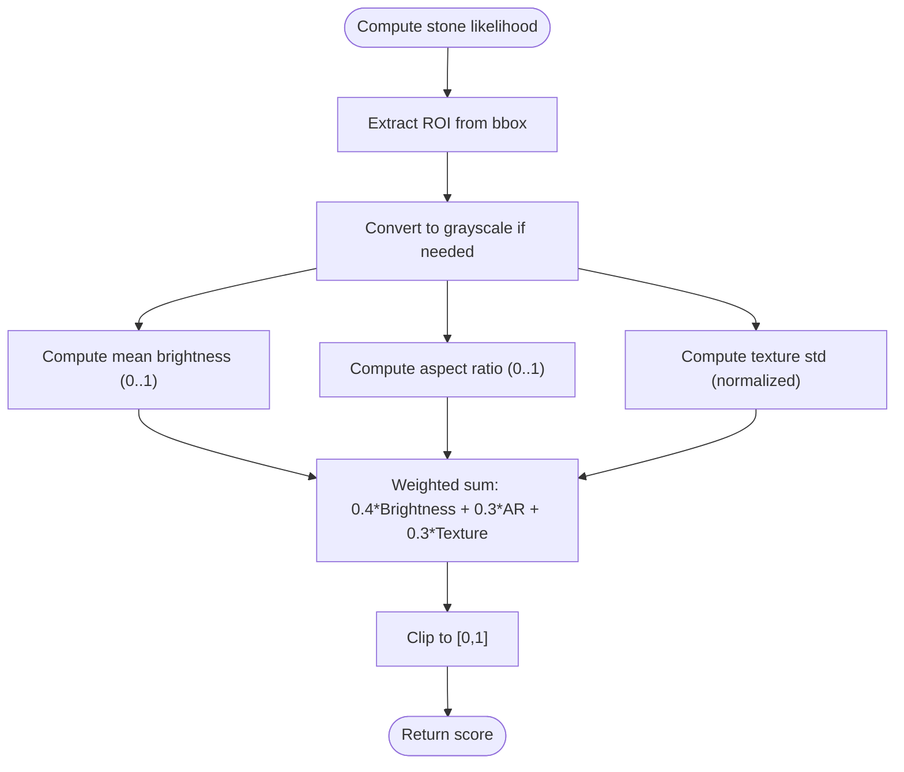
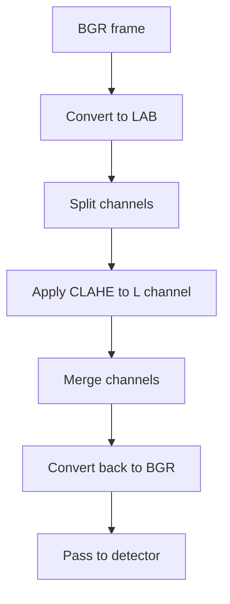
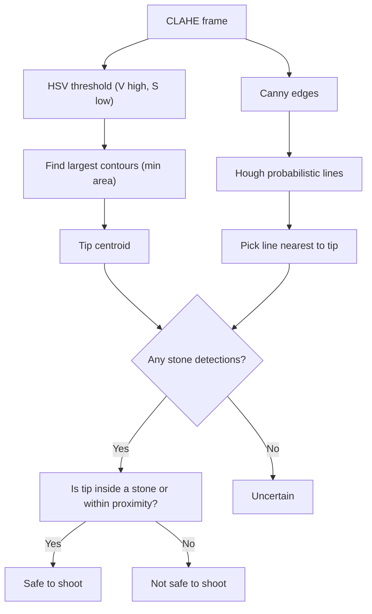
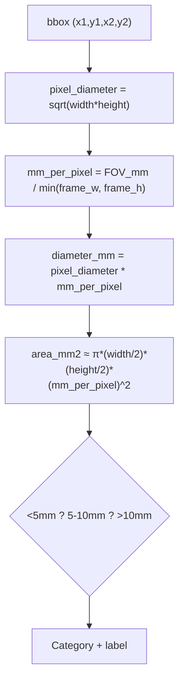
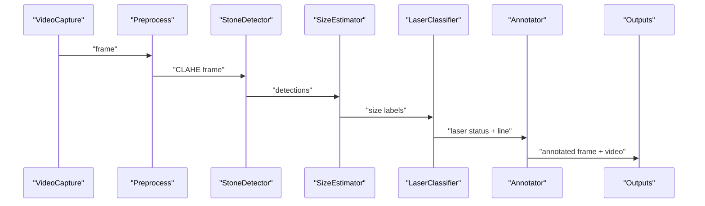
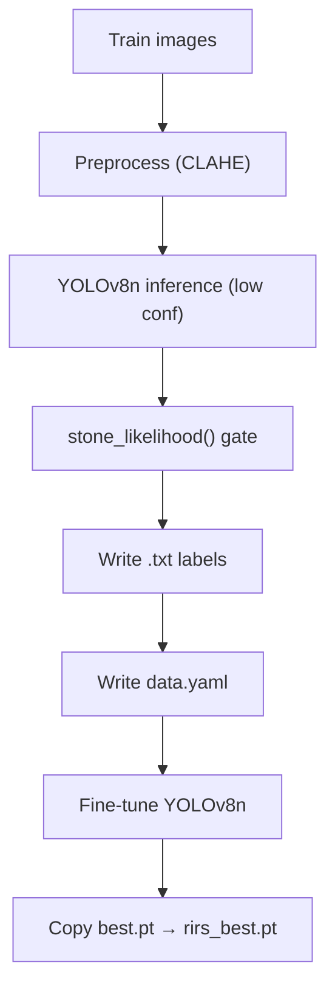
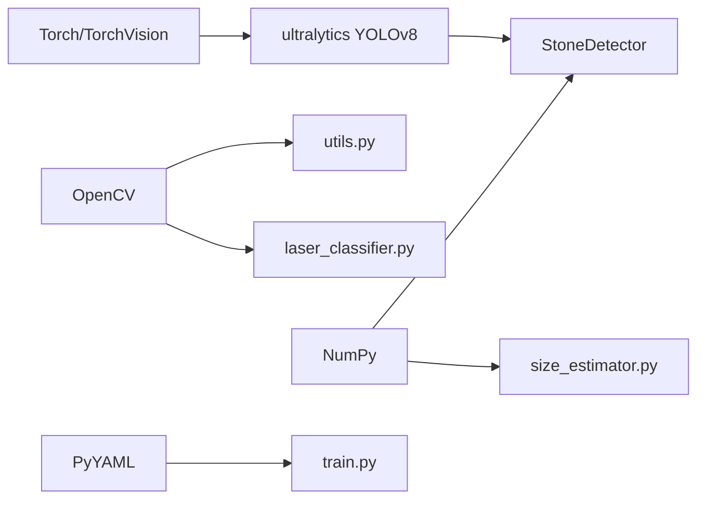

# Object Detection Strategies

<cite>
**Referenced Files in This Document**
- [stone_detector.py](file://src/stone_detector.py)
- [inference_video.py](file://src/inference_video.py)
- [utils.py](file://src/utils.py)
- [laser_classifier.py](file://src/laser_classifier.py)
- [size_estimator.py](file://src/size_estimator.py)
- [train.py](file://src/train.py)
- [requirements.txt](file://requirements.txt)
</cite>

## Table of Contents
1. [Introduction](#introduction)
2. [Project Structure](#project-structure)
3. [Core Components](#core-components)
4. [Architecture Overview](#architecture-overview)
5. [Detailed Component Analysis](#detailed-component-analysis)
6. [Dependency Analysis](#dependency-analysis)
7. [Performance Considerations](#performance-considerations)
8. [Troubleshooting Guide](#troubleshooting-guide)
9. [Conclusion](#conclusion)
10. [Appendices](#appendices)

## Introduction
This document explains the YOLOv8-based object detection pipeline used for kidney stone detection in RIRS (Rigid or Flexible Ureteroscopy) endoscopic videos. It covers the YOLOv8 model loading and inference, the custom stone-likelihood scoring function, confidence threshold filtering, and the end-to-end detection workflow from frame preprocessing to annotated output. It also documents model weight management, class definitions, and detection result interpretation, along with practical tuning tips and performance optimization strategies.

## Project Structure
The detection pipeline is organized around a small set of focused modules:
- src/stone_detector.py: YOLOv8 wrapper and stone-likelihood post-processing
- src/utils.py: Frame preprocessing (CLAHE) and annotation drawing
- src/laser_classifier.py: Laser alignment classifier for safety assessment
- src/size_estimator.py: Size estimation from bounding boxes
- src/inference_video.py: Orchestration of the full pipeline over videos
- src/train.py: Pseudo-label generation and fine-tuning workflow
- requirements.txt: Python dependencies including Ultralytics YOLOv8

**Diagram sources**
- [inference_video.py:13-19](file://src/inference_video.py#L13-L19)
- [stone_detector.py:109](file://src/stone_detector.py#L109)
- [utils.py:20-44](file://src/utils.py#L20-L44)
- [size_estimator.py:32-92](file://src/size_estimator.py#L32-L92)
- [laser_classifier.py:160-224](file://src/laser_classifier.py#L160-L224)

**Section sources**
- [inference_video.py:13-19](file://src/inference_video.py#L13-L19)
- [requirements.txt:1-9](file://requirements.txt#L1-L9)

## Core Components
- StoneDetector: Loads either pre-trained yolov8n.pt or fine-tuned models/rirs_best.pt, runs inference with configurable confidence, and filters detections using a custom stone-likelihood heuristic. Outputs detections with bounding boxes, YOLO confidence, class ID, and a stone-specific likelihood score.
- Preprocessing: CLAHE applied to the L-channel in LAB colorspace to enhance visibility in dark endoscopic frames.
- LaserClassifier: Detects laser tip and fiber line candidates using HSV thresholding and Hough transform, then classifies safety based on proximity to detected stones.
- SizeEstimator: Converts pixel bounding boxes to approximate millimetre diameters and categorizes stones for clinical planning.
- Inference pipeline: Reads video frames, preprocesses, detects stones, estimates sizes, classifies laser safety, draws annotations, and writes outputs.

**Section sources**
- [stone_detector.py:77-161](file://src/stone_detector.py#L77-L161)
- [utils.py:20-44](file://src/utils.py#L20-L44)
- [laser_classifier.py:160-224](file://src/laser_classifier.py#L160-L224)
- [size_estimator.py:32-110](file://src/size_estimator.py#L32-L110)
- [inference_video.py:59-201](file://src/inference_video.py#L59-L201)

## Architecture Overview
The pipeline integrates three detection stages: appearance-based (YOLOv8), shape/texture-based (stone likelihood), and laser alignment safety. The YOLOv8 model is domain-adapted via CLAHE preprocessing and a post-hoc scoring filter tuned for kidney stones.

**Diagram sources**
- [inference_video.py:119-141](file://src/inference_video.py#L119-L141)
- [stone_detector.py:111-156](file://src/stone_detector.py#L111-L156)
- [size_estimator.py:95-110](file://src/size_estimator.py#L95-L110)
- [laser_classifier.py:181-224](file://src/laser_classifier.py#L181-L224)
- [utils.py:79-161](file://src/utils.py#L79-L161)

## Detailed Component Analysis

### YOLOv8 Model Loading and Detection Pipeline
- Model selection: The detector chooses between a pre-trained yolov8n.pt and a fine-tuned models/rirs_best.pt if present. If fine-tuned weights are unavailable, it falls back to the pre-trained model.
- Inference: Runs YOLOv8 inference on CLAHE-enhanced frames with a configurable confidence threshold. Extracts bounding boxes, confidence scores, and class IDs.
- Post-processing: Applies a custom stone-likelihood score to filter detections. The score considers brightness, compactness (aspect ratio), and texture (local standard deviation).
- Output: Returns detections sorted by confidence, including the stone likelihood score.

**Diagram sources**
- [stone_detector.py:77-161](file://src/stone_detector.py#L77-L161)
- [stone_detector.py:109](file://src/stone_detector.py#L109)

**Section sources**
- [stone_detector.py:92-107](file://src/stone_detector.py#L92-L107)
- [stone_detector.py:111-156](file://src/stone_detector.py#L111-L156)

### Stone-Likelihood Scoring Function
The heuristic evaluates whether a detection is stone-like by combining:
- Brightness: Mean grayscale intensity normalized by 255
- Compactness: Normalized aspect ratio (min(width,height)/max(width,height))
- Texture: Local standard deviation normalized by ~128

These components are combined with equal weights and clipped to [0,1].

**Diagram sources**
- [stone_detector.py:38-74](file://src/stone_detector.py#L38-L74)

**Section sources**
- [stone_detector.py:38-74](file://src/stone_detector.py#L38-L74)

### Frame Preprocessing (CLAHE)
CLAHE is applied to the L-channel in LAB colorspace to improve contrast in dark, murky endoscopic frames. The enhanced frame is passed to the detector.

**Diagram sources**
- [utils.py:20-44](file://src/utils.py#L20-L44)

**Section sources**
- [utils.py:20-44](file://src/utils.py#L20-L44)

### Laser Alignment Classification
The classifier identifies:
- Laser tip: Largest bright region in HSV (high V, low S)
- Laser line: Dominant Hough line whose endpoint is closest to the tip centroid
It then classifies safety based on proximity to detected stones.

**Diagram sources**
- [laser_classifier.py:60-134](file://src/laser_classifier.py#L60-L134)
- [laser_classifier.py:181-224](file://src/laser_classifier.py#L181-L224)

**Section sources**
- [laser_classifier.py:46-58](file://src/laser_classifier.py#L46-L58)
- [laser_classifier.py:181-224](file://src/laser_classifier.py#L181-L224)

### Size Estimation
Size estimation converts pixel bounding boxes to approximate millimetre diameters using a fixed field-of-view calibration. Clinical categories are derived from diameter thresholds.

**Diagram sources**
- [size_estimator.py:32-92](file://src/size_estimator.py#L32-L92)

**Section sources**
- [size_estimator.py:32-92](file://src/size_estimator.py#L32-L92)

### End-to-End Inference Workflow
The pipeline processes each video frame through:
1. Read frame
2. CLAHE preprocessing
3. Stone detection with confidence filtering and stone likelihood gating
4. Size estimation for each detection
5. Laser alignment classification
6. Annotation drawing and writing outputs

**Diagram sources**
- [inference_video.py:119-141](file://src/inference_video.py#L119-L141)
- [utils.py:79-161](file://src/utils.py#L79-L161)

**Section sources**
- [inference_video.py:59-201](file://src/inference_video.py#L59-L201)

### Training and Fine-Tuning (Pseudo-Labeling)
To adapt YOLOv8 to the RIRS domain without manual labels:
- Run pre-trained YOLOv8n over training images with CLAHE preprocessing
- Apply confidence and stone-likelihood thresholds to generate pseudo-labels
- Write YOLO-format labels and a data.yaml configuration
- Fine-tune YOLOv8n for a fixed number of epochs
- Copy the best weights to models/rirs_best.pt for inference

**Diagram sources**
- [train.py:61-122](file://src/train.py#L61-L122)
- [train.py:125-136](file://src/train.py#L125-L136)
- [train.py:139-181](file://src/train.py#L139-L181)

**Section sources**
- [train.py:61-122](file://src/train.py#L61-L122)
- [train.py:125-136](file://src/train.py#L125-L136)
- [train.py:139-181](file://src/train.py#L139-L181)

## Dependency Analysis
- Ultralytics YOLOv8: Provides model loading, inference, and result parsing
- OpenCV: Image I/O, preprocessing (CLAHE), drawing, and Hough transforms
- NumPy: Numerical operations for ROI extraction, statistics, and geometry
- PyYAML: Writing training configuration
- Torch/TorchVision: Backends for YOLOv8

**Diagram sources**
- [requirements.txt:1-9](file://requirements.txt#L1-L9)
- [stone_detector.py:24](file://src/stone_detector.py#L24)
- [utils.py:5-7](file://src/utils.py#L5-L7)
- [laser_classifier.py:38-40](file://src/laser_classifier.py#L38-L40)
- [size_estimator.py:21-22](file://src/size_estimator.py#L21-L22)
- [train.py:34-36](file://src/train.py#L34-L36)

**Section sources**
- [requirements.txt:1-9](file://requirements.txt#L1-L9)

## Performance Considerations
- Preprocessing: CLAHE enhances detection robustness in low-light conditions; tune clip limit and tile grid size if artifacts appear.
- Inference: Adjust conf_threshold to balance precision/recall. Lower values increase recall but may raise false positives.
- Post-processing: Increase stone_score_threshold to reduce false positives at the cost of sensitivity.
- Batch processing: Use detect_batch for multiple frames to amortize overhead.
- GPU acceleration: YOLOv8 supports CUDA; ensure GPU drivers and compatible versions are installed for speed.
- Video I/O: Use appropriate codec and resolution to balance quality and throughput.
- Early stopping and learning rate scheduling during training improve convergence and generalization.

[No sources needed since this section provides general guidance]

## Troubleshooting Guide
- Model weights not found: Ensure models/rirs_best.pt exists when use_finetuned=True; otherwise, yolov8n.pt will be downloaded automatically by Ultralytics.
- Empty detections: Lower conf_threshold or stone_score_threshold; verify CLAHE preprocessing is applied.
- Misclassified laser safety: Adjust HSV thresholds, minimum bright area, and proximity factor in LaserClassifier.
- Slow inference: Enable GPU support, reduce input resolution, or decrease batch size.
- Missing outputs: Verify output directories exist and permissions are granted.

**Section sources**
- [stone_detector.py:102-107](file://src/stone_detector.py#L102-L107)
- [laser_classifier.py:46-58](file://src/laser_classifier.py#L46-L58)
- [inference_video.py:204-250](file://src/inference_video.py#L204-L250)

## Conclusion
The RIRS pipeline leverages YOLOv8 with domain-adaptive CLAHE preprocessing and a custom stone-likelihood filter to robustly detect kidney stones in endoscopic videos. Complementary laser alignment classification and size estimation provide actionable insights for real-time surgical assistance. Training via pseudo-labeling further improves performance in the target domain.

[No sources needed since this section summarizes without analyzing specific files]

## Appendices

### Parameter Configuration Reference
- StoneDetector
  - conf_threshold: Minimum YOLO confidence to keep a detection
  - stone_score_threshold: Minimum stone-likelihood score to keep a detection
  - use_finetuned: Toggle fine-tuned vs pre-trained weights
- LaserClassifier
  - proximity_factor: Proximity threshold relative to bbox diagonal
  - min_bright_area: Minimum area for a bright region to qualify as a tip
- SizeEstimator
  - FOV_MM: Fixed field-of-view diameter for calibration
- Inference pipeline
  - CONF_THRESHOLD and STONE_SCORE_THRESHOLD: Global defaults for the pipeline
- Training
  - PSEUDO_CONF_THRESHOLD and STONE_SCORE_THRESHOLD: Pseudo-label generation thresholds
  - STONE_CLASS_ID: Class index for pseudo-labels

**Section sources**
- [stone_detector.py:92-97](file://src/stone_detector.py#L92-L97)
- [laser_classifier.py:173-179](file://src/laser_classifier.py#L173-L179)
- [size_estimator.py:28-29](file://src/size_estimator.py#L28-L29)
- [inference_video.py:54-57](file://src/inference_video.py#L54-L57)
- [train.py:54-58](file://src/train.py#L54-L58)