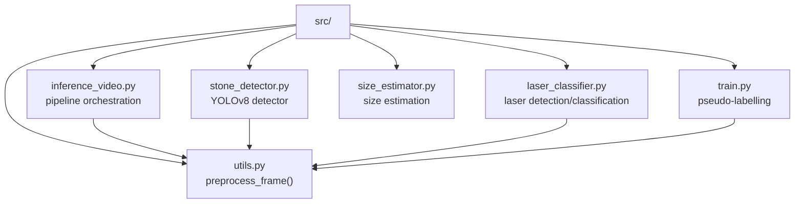
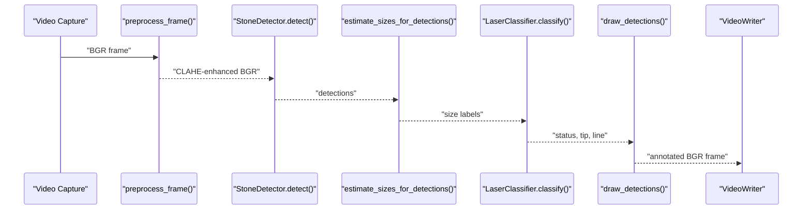
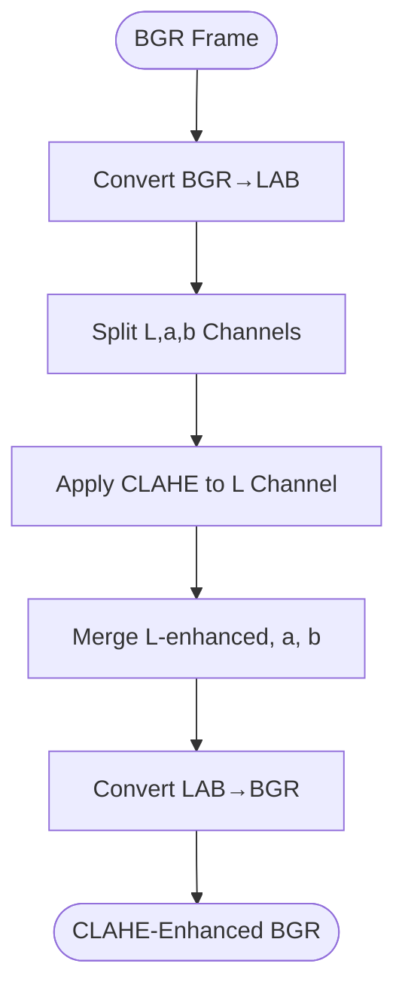
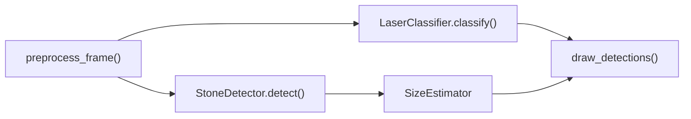
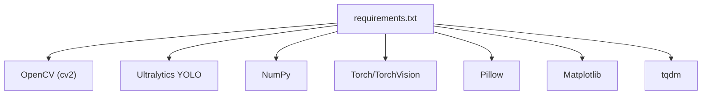

# Preprocessing Pipeline

<cite>
**Referenced Files in This Document**
- [utils.py](file://src/utils.py)
- [inference_video.py](file://src/inference_video.py)
- [stone_detector.py](file://src/stone_detector.py)
- [laser_classifier.py](file://src/laser_classifier.py)
- [size_estimator.py](file://src/size_estimator.py)
- [train.py](file://src/train.py)
- [requirements.txt](file://requirements.txt)
</cite>

## Table of Contents
1. [Introduction](#introduction)
2. [Project Structure](#project-structure)
3. [Core Components](#core-components)
4. [Architecture Overview](#architecture-overview)
5. [Detailed Component Analysis](#detailed-component-analysis)
6. [Dependency Analysis](#dependency-analysis)
7. [Performance Considerations](#performance-considerations)
8. [Troubleshooting Guide](#troubleshooting-guide)
9. [Conclusion](#conclusion)
10. [Appendices](#appendices)

## Introduction
This document describes the CLAHE preprocessing pipeline used in the RIRS (Rigid or Flexible Ureteroscopy) AI pipeline. The pipeline enhances visibility in dark and murky endoscopic video frames by applying Contrast Limited Adaptive Histogram Equalization (CLAHE) to the Lightness (L) channel of the LAB color space. The preprocessing step is central to downstream tasks: kidney stone detection, size estimation, and laser alignment classification. The document explains the LAB transformation, CLAHE algorithm, parameter choices, and the end-to-end workflow from BGR input to BGR output. It also provides guidance on parameter tuning for varying lighting conditions and video quality scenarios.

## Project Structure
The preprocessing pipeline is implemented in a dedicated module and integrated across the inference and training workflows. The key files are:
- src/utils.py: Contains the core preprocessing function and auxiliary drawing utilities.
- src/inference_video.py: Orchestrates the end-to-end pipeline and applies preprocessing to each frame.
- src/stone_detector.py: Uses the CLAHE-enhanced frame for detection.
- src/laser_classifier.py: Uses the CLAHE-enhanced frame for laser detection and alignment classification.
- src/size_estimator.py: Provides size estimation using pixel dimensions and frame geometry.
- src/train.py: Applies the same preprocessing during pseudo-labelling for training.
- requirements.txt: Lists the runtime dependencies including OpenCV and Ultralytics YOLO.

**Diagram sources**
- [utils.py](file://src/utils.py)
- [inference_video.py](file://src/inference_video.py)
- [stone_detector.py](file://src/stone_detector.py)
- [laser_classifier.py](file://src/laser_classifier.py)
- [size_estimator.py](file://src/size_estimator.py)
- [train.py](file://src/train.py)

**Section sources**
- [utils.py](file://src/utils.py)
- [inference_video.py](file://src/inference_video.py)
- [stone_detector.py](file://src/stone_detector.py)
- [laser_classifier.py](file://src/laser_classifier.py)
- [size_estimator.py](file://src/size_estimator.py)
- [train.py](file://src/train.py)
- [requirements.txt](file://requirements.txt)

## Core Components
- Preprocessing function: Converts BGR to LAB, separates channels, applies CLAHE to the L channel, merges channels, and converts back to BGR.
- Inference pipeline: Reads frames, applies preprocessing, runs detection/classification, draws annotations, and writes outputs.
- Training pipeline: Applies preprocessing during pseudo-labelling to generate YOLO labels for fine-tuning.
- Downstream modules: StoneDetector, LaserClassifier, and SizeEstimator operate on the CLAHE-enhanced frames.

Key implementation references:
- Preprocessing function definition and steps: [utils.py](file://src/utils.py)
- Inference pipeline usage of preprocessing: [inference_video.py](file://src/inference_video.py)
- Training pseudo-labelling with preprocessing: [train.py](file://src/train.py)
- Detector and classifier consuming CLAHE frames: [stone_detector.py](file://src/stone_detector.py), [laser_classifier.py](file://src/laser_classifier.py)

**Section sources**
- [utils.py](file://src/utils.py)
- [inference_video.py](file://src/inference_video.py)
- [train.py](file://src/train.py)
- [stone_detector.py](file://src/stone_detector.py)
- [laser_classifier.py](file://src/laser_classifier.py)

## Architecture Overview
The preprocessing pipeline sits at the beginning of the RIRS AI workflow. It transforms each BGR frame into a form that improves contrast and visibility, enabling robust detection and classification downstream.

**Diagram sources**
- [inference_video.py](file://src/inference_video.py)
- [utils.py](file://src/utils.py)
- [stone_detector.py](file://src/stone_detector.py)
- [laser_classifier.py](file://src/laser_classifier.py)
- [size_estimator.py](file://src/size_estimator.py)

## Detailed Component Analysis

### LAB Color Space Transformation
- Purpose: Separate luminance (L) from chrominance (a, b) to apply localized contrast enhancement only to brightness.
- Steps:
  1. Convert BGR to LAB using the standard OpenCV transform.
  2. Split into L, a, b channels.
  3. Merge back with the CLAHE-enhanced L channel and original a, b channels.
  4. Convert LAB back to BGR.

This preserves color appearance while enhancing local contrast, which is essential for detecting faint structures in endoscopic imagery.

**Section sources**
- [utils.py](file://src/utils.py)

### CLAHE Contrast Enhancement Algorithm
- What it does: Improves local contrast by redistributing intensities within small regions (tiles) under a histogram clipping limit.
- Parameters:
  - Clip limit: Controls the amount of histogram clipping; higher values increase contrast but risk amplifying noise.
  - Tile grid size: Defines the spatial granularity of local equalization; larger tiles smooth contrast changes.
- Implementation:
  - Create a CLAHE operator with configured clip limit and tile grid size.
  - Apply it to the L channel extracted from LAB.
  - Merge enhanced L with original a and b channels.
  - Convert back to BGR.

Mathematical formulation (conceptual):
- Local histogram equalization within each tile.
- Excess bins clipped at the clip limit.
- Cumulative distribution normalized to the full intensity range.
- Interpolation across tile boundaries to avoid visible seams.

Practical effects:
- Enhances faint structures (e.g., stones, tissue boundaries).
- Can amplify noise if the clip limit is too high or the tile size too small.
- Works best when the background is relatively uniform and the foreground is faint.

**Section sources**
- [utils.py](file://src/utils.py)

### Parameter Configurations
- Current defaults:
  - Clip limit: 2.5
  - Tile grid size: 8×8
- Tuning guidelines:
  - Low-light/murky conditions:
    - Increase clip limit moderately (e.g., 3.0–4.0) to boost contrast.
    - Slightly reduce tile size (e.g., 6×6) to localize enhancement and reduce halos.
  - Bright conditions:
    - Decrease clip limit (e.g., 2.0) to avoid over-enhancement.
    - Keep tile size around 8×8 to preserve smoothness.
  - Noisy or grainy sensors:
    - Reduce clip limit (e.g., 2.0–2.5) and increase tile size (e.g., 10×10) to smooth artifacts.
  - Motion blur:
    - Larger tiles (e.g., 10×10) can mitigate streaking artifacts by averaging over larger regions.

These adjustments should be validated on representative frames and iteratively refined.

**Section sources**
- [utils.py](file://src/utils.py)

### Preprocessing Workflow: BGR → LAB → CLAHE → LAB → BGR
- Input: BGR frame captured from the endoscope.
- LAB conversion: Separates luminance from color channels.
- CLAHE on L: Enhances local contrast without altering color balance.
- Channel merge: Reassemble with original a and b channels.
- LAB to BGR: Produces a contrast-enhanced BGR image ready for detection/classification.

**Diagram sources**
- [utils.py](file://src/utils.py)

**Section sources**
- [utils.py](file://src/utils.py)

### Integration Across the Pipeline
- Inference:
  - The preprocessing step is invoked per frame before detection and classification.
  - The enhanced frame is passed to downstream modules for detection, size estimation, and laser classification.
- Training:
  - During pseudo-labelling, the same preprocessing is applied to generate labels for fine-tuning.
- Downstream modules:
  - StoneDetector operates on the CLAHE-enhanced frame to detect stones.
  - LaserClassifier operates on the CLAHE-enhanced frame to detect laser tip and line.
  - SizeEstimator estimates stone sizes using pixel dimensions and frame geometry.

**Diagram sources**
- [inference_video.py](file://src/inference_video.py)
- [utils.py](file://src/utils.py)
- [stone_detector.py](file://src/stone_detector.py)
- [laser_classifier.py](file://src/laser_classifier.py)
- [size_estimator.py](file://src/size_estimator.py)

**Section sources**
- [inference_video.py](file://src/inference_video.py)
- [train.py](file://src/train.py)
- [stone_detector.py](file://src/stone_detector.py)
- [laser_classifier.py](file://src/laser_classifier.py)
- [size_estimator.py](file://src/size_estimator.py)

## Dependency Analysis
- OpenCV:
  - Used for color space conversions, splitting/merging channels, and CLAHE.
- Ultralytics YOLO:
  - Used for stone detection in both inference and training.
- NumPy:
  - Used for numerical operations and array manipulations.
- Torch/TorchVision/Pillow/Matplotlib/tqdm:
  - Supporting libraries for training, visualization, and progress tracking.

**Diagram sources**
- [requirements.txt](file://requirements.txt)

**Section sources**
- [requirements.txt](file://requirements.txt)

## Performance Considerations
- Computational cost:
  - LAB conversion and CLAHE are efficient for real-time video processing on modern CPUs/GPUs.
  - CLAHE with tile grid size 8×8 and moderate clip limit is balanced for speed and quality.
- Memory:
  - Preprocessing creates temporary arrays for LAB channels and merged frames; batching can reduce overhead.
- Quality vs. speed trade-offs:
  - Larger tile grids and lower clip limits reduce noise and artifacts but may under-enhance weak signals.
  - Smaller tile grids and higher clip limits increase contrast but risk noise and banding.
- Practical tips:
  - Profile on target hardware to tune batch size and resolution.
  - Consider GPU acceleration for heavy operations if available.

[No sources needed since this section provides general guidance]

## Troubleshooting Guide
- Poor visibility despite preprocessing:
  - Verify that the input frames are valid BGR images.
  - Adjust CLAHE clip limit upward for darker scenes; reduce for bright scenes.
  - Increase tile grid size slightly to smooth artifacts.
- Over-enhanced noise or halos:
  - Lower the clip limit and/or increase tile grid size.
  - Ensure the frame is not excessively blurred; consider deblurring if applicable.
- Incorrect color appearance:
  - Confirm that the L channel is replaced with the CLAHE-enhanced version and a,b channels remain unchanged.
- Performance bottlenecks:
  - Monitor frame rate and consider reducing resolution or disabling non-essential steps.
  - Use GPU-accelerated backends if available.

**Section sources**
- [utils.py](file://src/utils.py)

## Conclusion
The CLAHE preprocessing pipeline is a lightweight yet powerful enhancement step that significantly improves visibility in dark and murky endoscopic video frames. By operating on the L channel of the LAB color space, it preserves color fidelity while boosting local contrast, enabling robust downstream detection and classification. The current defaults (clip limit 2.5, tile grid 8×8) offer a strong baseline, with tunable parameters to adapt to diverse lighting and imaging conditions. Integrating this preprocessing into the inference and training workflows ensures consistent improvements across the entire RIRS AI pipeline.

[No sources needed since this section summarizes without analyzing specific files]

## Appendices

### Mathematical Formulation of CLAHE (Conceptual)
- Local histogram computation within each tile.
- Clipping excess bins at the clip limit.
- Cumulative distribution normalization to the full intensity range.
- Bilinear interpolation across tile boundaries to avoid seams.

[No sources needed since this section provides conceptual background]

### Parameter Tuning Reference
- Defaults:
  - Clip limit: 2.5
  - Tile grid size: 8×8
- Guidelines:
  - Murky/dark: increase clip limit; decrease tile size.
  - Bright: decrease clip limit; keep tile size around 8×8.
  - Noisy: decrease clip limit; increase tile size.
  - Motion blur: increase tile size.

**Section sources**
- [utils.py](file://src/utils.py)