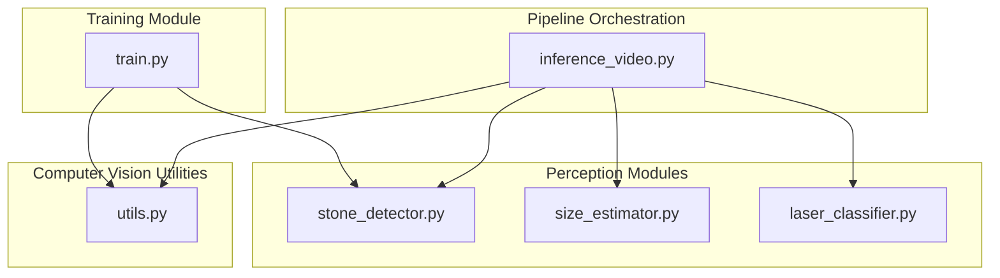
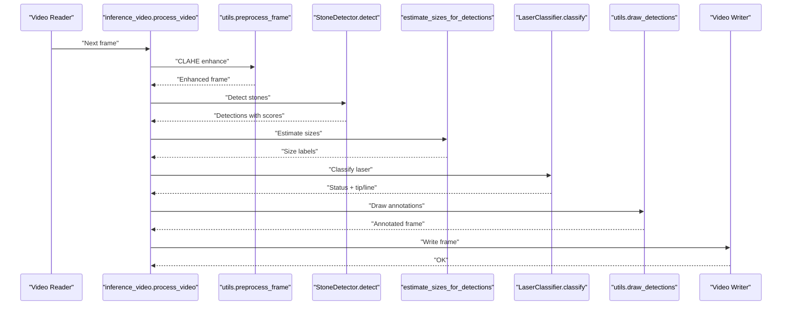
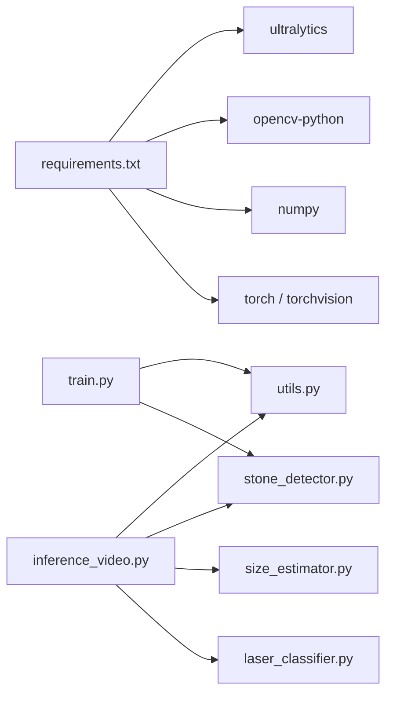
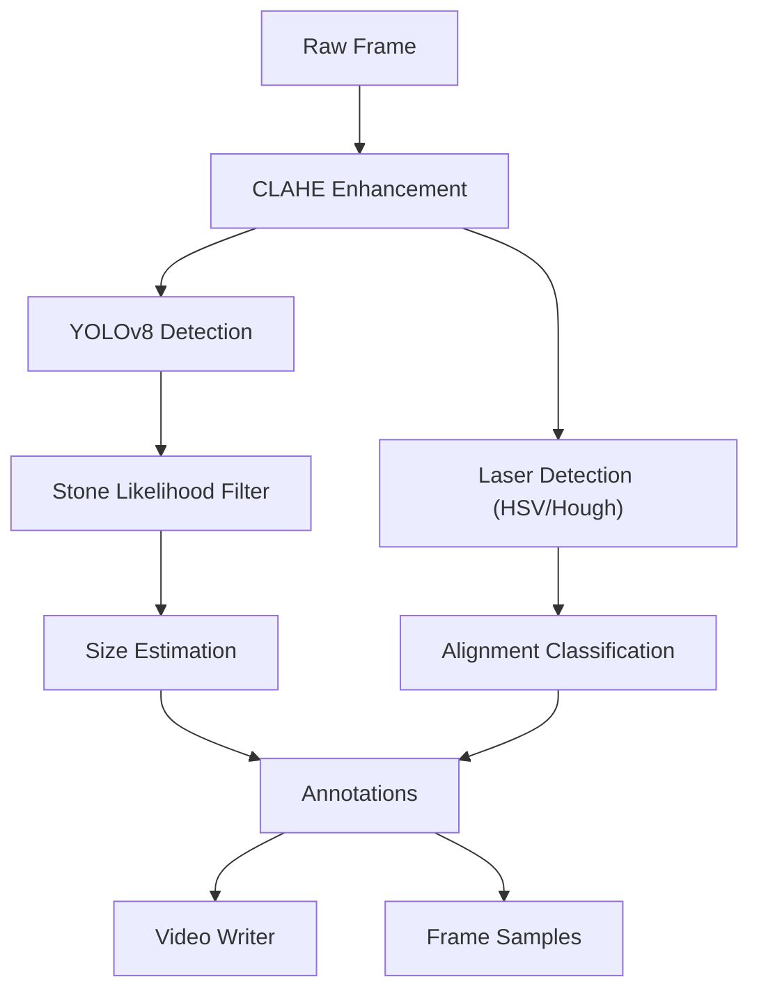

# Core Processing Modules

<cite>
**Referenced Files in This Document**
- [inference_video.py](file://src/inference_video.py)
- [stone_detector.py](file://src/stone_detector.py)
- [laser_classifier.py](file://src/laser_classifier.py)
- [size_estimator.py](file://src/size_estimator.py)
- [utils.py](file://src/utils.py)
- [train.py](file://src/train.py)
- [requirements.txt](file://requirements.txt)
</cite>

## Table of Contents
1. [Introduction](#introduction)
2. [Project Structure](#project-structure)
3. [Core Components](#core-components)
4. [Architecture Overview](#architecture-overview)
5. [Detailed Component Analysis](#detailed-component-analysis)
6. [Dependency Analysis](#dependency-analysis)
7. [Performance Considerations](#performance-considerations)
8. [Troubleshooting Guide](#troubleshooting-guide)
9. [Conclusion](#conclusion)
10. [Appendices](#appendices)

## Introduction
This document explains the RIRS core processing modules that form a complete AI-assisted pipeline for real-time analysis of rigid and flexible ureteroscopy (RIRS) videos. The pipeline orchestrates:
- Preprocessing to enhance visibility in endoscopic imagery
- YOLOv8-based kidney stone detection
- Geometric size estimation for clinical categorization
- Laser safety assessment for fiber alignment
- Annotation and output generation

The primary orchestration module is inference_video.py, which coordinates the other modules and produces annotated frames and videos for downstream review and reporting.

## Project Structure
The core processing modules reside under src/. The training module (train.py) generates pseudo-labeled datasets and fine-tunes the YOLOv8 detector for the RIRS domain. Supporting utilities (utils.py) provide shared computer vision functions used across the pipeline.

**Diagram sources**
- [inference_video.py:38-41](file://src/inference_video.py#L38-L41)
- [utils.py:10-18](file://src/utils.py#L10-L18)
- [stone_detector.py:24-24](file://src/stone_detector.py#L24-L24)
- [size_estimator.py:21-23](file://src/size_estimator.py#L21-L23)
- [laser_classifier.py:38-40](file://src/laser_classifier.py#L38-L40)
- [train.py:38-46](file://src/train.py#L38-L46)

**Section sources**
- [inference_video.py:1-250](file://src/inference_video.py#L1-L250)
- [utils.py:1-175](file://src/utils.py#L1-L175)
- [stone_detector.py:1-161](file://src/stone_detector.py#L1-L161)
- [size_estimator.py:1-110](file://src/size_estimator.py#L1-L110)
- [laser_classifier.py:1-224](file://src/laser_classifier.py#L1-L224)
- [train.py:1-225](file://src/train.py#L1-L225)

## Core Components
- inference_video.py: Orchestrates the end-to-end pipeline, iterating frames, invoking preprocessing, detection, sizing, classification, annotation, and output writing.
- utils.py: Provides preprocessing (CLAHE), drawing primitives, saving frames, and video writer creation.
- stone_detector.py: YOLOv8-based detector with a domain-adaptive heuristic to filter detections by stone likelihood.
- size_estimator.py: Converts pixel bounding boxes to millimeter diameters and areas using a calibrated field-of-view assumption.
- laser_classifier.py: Detects laser fiber tip and line using HSV thresholding and Hough transforms, then classifies alignment safety relative to detected stones.
- train.py: Generates pseudo-labels from pre-trained YOLOv8 inference and fine-tunes the model for the RIRS domain.

**Section sources**
- [inference_video.py:38-41](file://src/inference_video.py#L38-L41)
- [utils.py:20-44](file://src/utils.py#L20-L44)
- [stone_detector.py:77-161](file://src/stone_detector.py#L77-L161)
- [size_estimator.py:32-93](file://src/size_estimator.py#L32-L93)
- [laser_classifier.py:160-224](file://src/laser_classifier.py#L160-L224)
- [train.py:61-123](file://src/train.py#L61-L123)

## Architecture Overview
The pipeline follows a strict sequential flow per frame:
1. Preprocess frame (CLAHE)
2. Detect stones (YOLOv8 + stone likelihood)
3. Estimate sizes (pixel bbox → mm)
4. Classify laser safety (HSV + Hough + proximity)
5. Draw annotations (boxes, labels, badges)
6. Write to video and save sampled frames

**Diagram sources**
- [inference_video.py:119-141](file://src/inference_video.py#L119-L141)
- [utils.py:20-44](file://src/utils.py#L20-L44)
- [stone_detector.py:111-156](file://src/stone_detector.py#L111-L156)
- [size_estimator.py:95-109](file://src/size_estimator.py#L95-L109)
- [laser_classifier.py:181-223](file://src/laser_classifier.py#L181-L223)
- [utils.py:79-161](file://src/utils.py#L79-L161)

## Detailed Component Analysis

### inference_video.py
Responsibilities:
- Loads test videos and initializes shared models
- Iterates frames, applies preprocessing, detection, sizing, classification, and annotation
- Writes annotated video and saves sampled frames
- Aggregates statistics and writes a summary JSON

Key processing steps:
- Frame preprocessing via utils.preprocess_frame
- Stone detection via StoneDetector.detect
- Size estimation via size_estimator.estimate_sizes_for_detections
- Laser classification via LaserClassifier.classify
- Drawing annotations via utils.draw_detections
- Video writing via utils.create_video_writer

Inter-module communication:
- Imports and uses utils, stone_detector, size_estimator, and laser_classifier
- Passes CLAHE-enhanced frames to downstream modules
- Receives detections and classification outputs to drive annotations

**Section sources**
- [inference_video.py:59-201](file://src/inference_video.py#L59-L201)
- [inference_video.py:204-249](file://src/inference_video.py#L204-L249)

### utils.py
Responsibilities:
- Preprocessing: CLAHE on LAB L-channel to improve visibility in dark endoscopic frames
- Drawing: Bounding boxes, confidence and size labels, laser status badges, and stone count
- I/O: Saving individual frames and creating video writers

Color mapping and badge rendering:
- Maps laser status to distinct colors for visual cues
- Places status and count badges in top corners for quick interpretation

**Section sources**
- [utils.py:20-44](file://src/utils.py#L20-L44)
- [utils.py:79-161](file://src/utils.py#L79-L161)
- [utils.py:164-175](file://src/utils.py#L164-L175)

### stone_detector.py
Responsibilities:
- Loads either fine-tuned or pre-trained YOLOv8 weights
- Runs detection on CLAHE-enhanced frames
- Applies a domain-adaptive heuristic to filter detections by:
  - Brightness contrast
  - Compactness (aspect ratio near 1)
  - Texture (local standard deviation)

Output:
- List of detections with bounding boxes, confidence, class ID, and stone likelihood score
- Sorting by confidence descending

**Section sources**
- [stone_detector.py:77-161](file://src/stone_detector.py#L77-L161)
- [stone_detector.py:38-75](file://src/stone_detector.py#L38-L75)

### size_estimator.py
Responsibilities:
- Estimates stone diameter and area from pixel bounding boxes
- Uses a calibrated field-of-view assumption based on typical flexible ureteroscope optics
- Produces categorical labels for clinical decision support

Calibration:
- Assumes FOV diameter equals the shorter frame dimension
- Computes mm-per-pixel scaling and converts geometric mean diameter to millimeters

Categories:
- Small (<5 mm), Medium (5–10 mm), Large (>10 mm)

**Section sources**
- [size_estimator.py:32-93](file://src/size_estimator.py#L32-L93)
- [size_estimator.py:95-110](file://src/size_estimator.py#L95-L110)

### laser_classifier.py
Responsibilities:
- Detects laser fiber tip using HSV thresholding on CLAHE-enhanced frames
- Detects laser line using Hough probabilistic line transform on brightness edges
- Determines alignment safety by checking:
  - Tip inside any stone bounding box
  - Tip within proximity to stone centroid
  - Absence of laser detection → uncertain

Outputs:
- Classification label and detected tip/line for annotation

**Section sources**
- [laser_classifier.py:60-134](file://src/laser_classifier.py#L60-L134)
- [laser_classifier.py:160-224](file://src/laser_classifier.py#L160-L224)

### train.py
Responsibilities:
- Generates pseudo-labels by running pre-trained YOLOv8 on training images
- Applies CLAHE preprocessing and a stone likelihood gate
- Writes YOLO-format labels and data.yaml
- Fine-tunes YOLOv8n for 30 epochs and copies best weights for inference

Integration with core modules:
- Reuses utils.preprocess_frame and _stone_likelihood from stone_detector
- Produces models/rirs_best.pt consumed by inference_video.py

**Section sources**
- [train.py:61-123](file://src/train.py#L61-L123)
- [train.py:139-181](file://src/train.py#L139-L181)
- [train.py:183-225](file://src/train.py#L183-L225)

## Dependency Analysis
External dependencies:
- ultralytics (YOLOv8)
- opencv-python (image/video I/O and transforms)
- numpy (numerical operations)
- torch/torchvision (model runtime)
- matplotlib, Pillow, tqdm (support libraries)

Internal dependencies:
- inference_video.py depends on utils, stone_detector, size_estimator, and laser_classifier
- train.py depends on utils and stone_detector internals for pseudo-labeling
- All modules depend on OpenCV and NumPy for computer vision operations

**Diagram sources**
- [requirements.txt:1-9](file://requirements.txt#L1-L9)
- [inference_video.py:38-41](file://src/inference_video.py#L38-L41)
- [train.py:45-46](file://src/train.py#L45-L46)

**Section sources**
- [requirements.txt:1-9](file://requirements.txt#L1-L9)
- [inference_video.py:38-41](file://src/inference_video.py#L38-L41)
- [train.py:45-46](file://src/train.py#L45-L46)

## Performance Considerations
- Model initialization cost: StoneDetector and LaserClassifier are initialized once and reused across videos to minimize overhead.
- Batch processing: StoneDetector exposes a batch detection method for potential future optimization.
- Video I/O: Using VideoWriter with mp4v codec and consistent frame size avoids reconfiguration overhead.
- Preprocessing: CLAHE is applied per frame; consider caching if identical frames repeat frequently.
- Threshold tuning: Adjusting CONF_THRESHOLD, STONE_SCORE_THRESHOLD, and proximity factors can trade off precision/recall and speed.

[No sources needed since this section provides general guidance]

## Troubleshooting Guide
Common issues and remedies:
- Missing model weights: Ensure models/rirs_best.pt exists or rely on pre-trained YOLOv8n weights.
- No detections: Lower CONF_THRESHOLD or STONE_SCORE_THRESHOLD; verify CLAHE preprocessing quality.
- Uncertain laser status: Improve lighting conditions; verify HSV thresholds and morphological cleaning.
- Slow inference: Use GPU acceleration for YOLOv8; reduce resolution or FPS for testing.
- Output not generated: Verify output directories exist and permissions are sufficient.

**Section sources**
- [inference_video.py:108-108](file://src/inference_video.py#L108-L108)
- [stone_detector.py:101-107](file://src/stone_detector.py#L101-L107)
- [laser_classifier.py:46-58](file://src/laser_classifier.py#L46-L58)

## Conclusion
The RIRS pipeline integrates domain-adapted perception modules with robust computer vision utilities to deliver actionable insights from endoscopic videos. inference_video.py orchestrates a clear, reproducible flow from raw frames to annotated outputs, enabling efficient review and clinical decision-making.

[No sources needed since this section summarizes without analyzing specific files]

## Appendices

### Data Flow Summary
- Input: Endoscopic video frames
- Preprocessing: CLAHE enhancement
- Perception: YOLOv8 detection + heuristic filtering
- Measurement: Pixel-to-millimeter conversion
- Safety: Laser tip/line detection and alignment classification
- Output: Annotated frames and video, summary statistics

**Diagram sources**
- [inference_video.py:119-141](file://src/inference_video.py#L119-L141)
- [utils.py:20-44](file://src/utils.py#L20-L44)
- [stone_detector.py:111-156](file://src/stone_detector.py#L111-L156)
- [size_estimator.py:95-109](file://src/size_estimator.py#L95-L109)
- [laser_classifier.py:181-223](file://src/laser_classifier.py#L181-L223)
- [utils.py:79-161](file://src/utils.py#L79-L161)