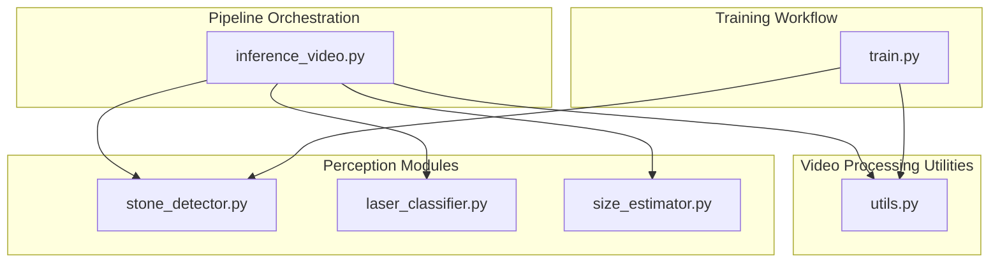
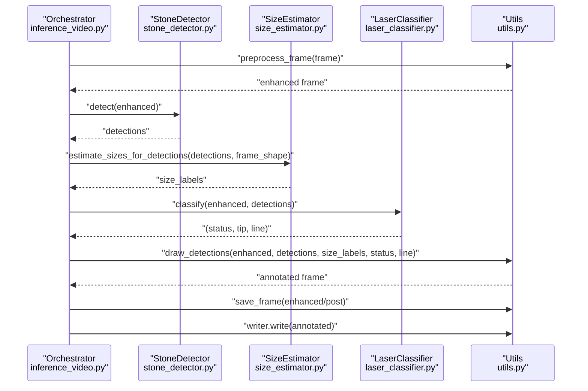
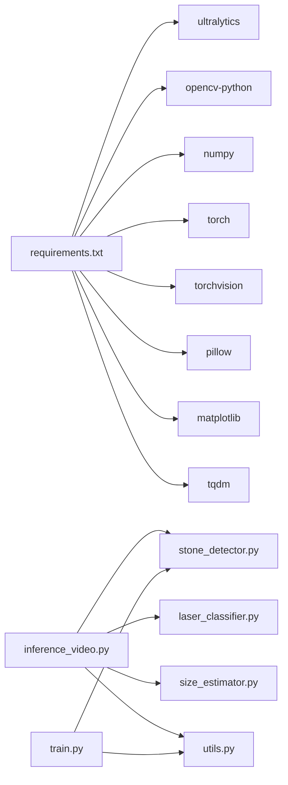

# Inference Pipeline

<cite>
**Referenced Files in This Document**
- [inference_video.py](file://src/inference_video.py)
- [utils.py](file://src/utils.py)
- [stone_detector.py](file://src/stone_detector.py)
- [laser_classifier.py](file://src/laser_classifier.py)
- [size_estimator.py](file://src/size_estimator.py)
- [train.py](file://src/train.py)
- [requirements.txt](file://requirements.txt)
</cite>

## Table of Contents
1. [Introduction](#introduction)
2. [Project Structure](#project-structure)
3. [Core Components](#core-components)
4. [Architecture Overview](#architecture-overview)
5. [Detailed Component Analysis](#detailed-component-analysis)
6. [Dependency Analysis](#dependency-analysis)
7. [Performance Considerations](#performance-considerations)
8. [Troubleshooting Guide](#troubleshooting-guide)
9. [Conclusion](#conclusion)
10. [Appendices](#appendices)

## Introduction
This document describes the RIRS inference pipeline module that orchestrates end-to-end video processing for kidney stone detection and laser alignment assessment during rigid or flexible ureteroscopy (RIRS). It explains the pipeline’s orchestration, multi-video batch processing, output generation, and statistics collection. It also documents configuration options, processing stages, integration patterns with underlying modules, and practical guidance for performance optimization, error handling, and batch execution.

## Project Structure
The pipeline is implemented primarily in Python under the src/ directory. Key modules include:
- inference_video.py: Orchestration and batch processing of videos
- utils.py: Preprocessing, annotation drawing, saving frames, and video writing
- stone_detector.py: YOLOv8-based stone detection with domain-adaptive heuristics
- laser_classifier.py: Laser alignment classification using bright-region and Hough line detection
- size_estimator.py: Size estimation from bounding boxes using calibrated field-of-view assumptions
- train.py: Pseudo-label generation and YOLOv8 fine-tuning workflow
- requirements.txt: External dependencies

**Diagram sources**
- [inference_video.py:1-250](file://src/inference_video.py#L1-L250)
- [utils.py:1-175](file://src/utils.py#L1-L175)
- [stone_detector.py:1-161](file://src/stone_detector.py#L1-L161)
- [laser_classifier.py:1-224](file://src/laser_classifier.py#L1-L224)
- [size_estimator.py:1-110](file://src/size_estimator.py#L1-L110)
- [train.py:1-225](file://src/train.py#L1-L225)

**Section sources**
- [inference_video.py:1-250](file://src/inference_video.py#L1-L250)
- [requirements.txt:1-9](file://requirements.txt#L1-L9)

## Core Components
- Inference Orchestrator (inference_video.py): Loads models once, discovers test videos, iterates frames, runs the pipeline stages, writes annotated video, saves sampled frames, and aggregates statistics.
- Stone Detector (stone_detector.py): YOLOv8 inference with a custom stone likelihood heuristic to filter detections.
- Laser Classifier (laser_classifier.py): Two-stage detection (bright-region HSV threshold + Hough lines) plus alignment checks against stone bounding boxes.
- Size Estimator (size_estimator.py): Converts pixel bounding boxes to approximate millimetre diameters using a calibrated field-of-view assumption.
- Utilities (utils.py): CLAHE preprocessing, drawing annotations, saving frames, and creating video writers.

**Section sources**
- [inference_video.py:59-201](file://src/inference_video.py#L59-L201)
- [stone_detector.py:77-161](file://src/stone_detector.py#L77-L161)
- [laser_classifier.py:160-224](file://src/laser_classifier.py#L160-L224)
- [size_estimator.py:32-110](file://src/size_estimator.py#L32-L110)
- [utils.py:20-175](file://src/utils.py#L20-L175)

## Architecture Overview
The pipeline processes each video frame through a deterministic sequence of steps, producing both visual and statistical outputs. The orchestration module initializes shared models, iterates frames, and aggregates metrics. The perception modules encapsulate detection and classification logic, while utilities handle preprocessing and rendering.

**Diagram sources**
- [inference_video.py:119-141](file://src/inference_video.py#L119-L141)
- [utils.py:20-175](file://src/utils.py#L20-L175)
- [stone_detector.py:111-156](file://src/stone_detector.py#L111-L156)
- [size_estimator.py:95-110](file://src/size_estimator.py#L95-L110)
- [laser_classifier.py:181-223](file://src/laser_classifier.py#L181-L223)

## Detailed Component Analysis

### Inference Orchestrator
Responsibilities:
- Discovers test videos and validates presence
- Initializes shared models (detector and classifier)
- Iterates frames, applies preprocessing, runs detection/classification/estimation, draws annotations, and writes outputs
- Aggregates per-frame and global statistics and persists a summary JSON

Key configuration:
- Input/output directories for videos and frames
- Sampling interval for saving frames
- Detection thresholds for confidence and stone likelihood

Processing stages:
1. Preprocess frame (CLAHE)
2. Detect stones
3. Estimate sizes
4. Classify laser alignment
5. Draw annotations
6. Write annotated frame to video
7. Optionally save pre/post frames
8. Update statistics and periodically log per-frame entries

Outputs:
- Annotated MP4 video
- Sampled JPEG frames (pre and post)
- Summary JSON with counts and per-frame logs

**Section sources**
- [inference_video.py:47-57](file://src/inference_video.py#L47-L57)
- [inference_video.py:59-201](file://src/inference_video.py#L59-L201)
- [inference_video.py:204-249](file://src/inference_video.py#L204-L249)

### Stone Detector
Responsibilities:
- Load either fine-tuned or pre-trained YOLOv8 weights
- Run inference with configurable confidence threshold
- Filter detections using a custom stone likelihood heuristic based on brightness, compactness, and texture
- Return detections sorted by confidence

Integration:
- Called by the orchestrator with CLAHE-enhanced frames
- Provides bounding boxes and scores for downstream size estimation and laser alignment checks

**Section sources**
- [stone_detector.py:77-161](file://src/stone_detector.py#L77-L161)
- [stone_detector.py:38-75](file://src/stone_detector.py#L38-L75)

### Laser Classifier
Responsibilities:
- Detect laser tip via HSV thresholding on CLAHE-enhanced frames
- Detect laser line via Hough probabilistic line transform on edges
- Determine alignment status by checking whether the tip is inside a stone or within proximity to a stone centroid
- Return status, tip coordinates, and line segment

Integration:
- Receives detections from the stone detector
- Uses geometric proximity thresholds to decide safety

**Section sources**
- [laser_classifier.py:160-224](file://src/laser_classifier.py#L160-L224)
- [laser_classifier.py:60-134](file://src/laser_classifier.py#L60-L134)

### Size Estimator
Responsibilities:
- Convert pixel bounding boxes to approximate millimetre diameter and area using a calibrated field-of-view assumption
- Categorize sizes into small/medium/large for clinical interpretation

Integration:
- Consumes detections and frame dimensions
- Produces human-readable labels for annotations and statistics

**Section sources**
- [size_estimator.py:32-110](file://src/size_estimator.py#L32-L110)

### Utilities
Responsibilities:
- CLAHE preprocessing to enhance visibility in endoscopic imagery
- Drawing bounding boxes, labels, and badges for laser status and stone count
- Saving individual frames and creating video writers for MP4 output

Integration:
- Used by the orchestrator to prepare frames, render annotations, and persist outputs

**Section sources**
- [utils.py:20-175](file://src/utils.py#L20-L175)

## Dependency Analysis
External dependencies are declared in requirements.txt and include:
- Ultralytics YOLOv8 for object detection
- OpenCV for computer vision primitives
- NumPy for numerical operations
- PyTorch and TorchVision for deep learning
- Matplotlib and Pillow for plotting and image handling
- TQDM for progress bars

Internal dependencies:
- inference_video.py depends on utils, stone_detector, size_estimator, and laser_classifier
- train.py depends on utils and stone_detector for pseudo-label generation and uses YOLO for training

**Diagram sources**
- [requirements.txt:1-9](file://requirements.txt#L1-L9)
- [inference_video.py:38-41](file://src/inference_video.py#L38-L41)
- [train.py:36-46](file://src/train.py#L36-L46)

**Section sources**
- [requirements.txt:1-9](file://requirements.txt#L1-L9)

## Performance Considerations
- Model initialization cost: Models are initialized once and reused across videos to minimize overhead.
- Frame sampling: Only every N-th frame is saved as JPEG to reduce disk I/O and storage usage; adjust the sampling interval to balance inspection coverage and output volume.
- GPU acceleration: YOLOv8 inference benefits greatly from GPU; ensure CUDA-capable hardware for efficient training and inference.
- Preprocessing: CLAHE enhances visibility but adds computational cost; consider skipping if lighting conditions are adequate.
- Video writing: Writing annotated frames to MP4 is I/O bound; ensure sufficient disk throughput.
- Batch inference: The stone detector supports batch detection; the orchestrator currently processes frames sequentially. Parallelizing frame processing could improve throughput, subject to memory constraints.

[No sources needed since this section provides general guidance]

## Troubleshooting Guide
Common issues and resolutions:
- Missing video directory or no MP4 files: The orchestrator validates the test video directory and exits with an error if not found or empty.
- Cannot open video: Video capture failure is handled gracefully; the function logs an error and skips the video.
- No detections: The pipeline continues processing; statistics reflect zero detections for that frame.
- No laser detected: Classification returns an uncertain status; ensure adequate lighting and consider adjusting HSV thresholds if visibility is poor.
- Out of memory: Reduce batch sizes, lower resolution, or disable frame sampling to decrease memory pressure.
- Missing fine-tuned weights: The detector falls back to pre-trained weights automatically; ensure the expected file exists if fine-tuning was performed.

**Section sources**
- [inference_video.py:80-82](file://src/inference_video.py#L80-L82)
- [inference_video.py:210-217](file://src/inference_video.py#L210-L217)
- [stone_detector.py:102-107](file://src/stone_detector.py#L102-L107)
- [laser_classifier.py:208-209](file://src/laser_classifier.py#L208-L209)

## Conclusion
The RIRS inference pipeline integrates domain-aware detection and classification to support intraoperative decision-making. Its modular design enables clear separation of concerns, robust batch processing, and comprehensive output generation. By tuning configuration parameters and leveraging GPU acceleration, users can achieve reliable, real-time performance suitable for clinical environments.

[No sources needed since this section summarizes without analyzing specific files]

## Appendices

### Configuration Options
- Video discovery and output paths
- Frame sampling interval
- Detection thresholds (confidence and stone likelihood)
- Laser classifier tunables (HSV thresholds, proximity factor, Hough parameters)

**Section sources**
- [inference_video.py:47-57](file://src/inference_video.py#L47-L57)
- [laser_classifier.py:46-58](file://src/laser_classifier.py#L46-L58)
- [stone_detector.py:92-97](file://src/stone_detector.py#L92-L97)

### Example Execution
- Train the detector: python src/train.py [--epochs N] [--batch B] [--imgsz S]
- Run inference: python src/inference_video.py

Outputs:
- Annotated MP4 video per input video
- Sampled JPEG frames (pre and post)
- Summary JSON with aggregated statistics

**Section sources**
- [train.py:17-25](file://src/train.py#L17-L25)
- [inference_video.py:6-20](file://src/inference_video.py#L6-L20)
- [inference_video.py:248-249](file://src/inference_video.py#L248-L249)

### Processing Stage Details
- Preprocessing: CLAHE in LAB colorspace
- Detection: YOLOv8 inference with confidence threshold and stone likelihood filtering
- Estimation: Pixel-based size conversion using calibrated FOV
- Classification: Bright-region HSV threshold + Hough line alignment checks
- Rendering: Bounding boxes, labels, badges, and overlays
- Persistence: MP4 video and sampled JPEG frames; per-frame logs and summary JSON

**Section sources**
- [utils.py:20-44](file://src/utils.py#L20-L44)
- [stone_detector.py:111-156](file://src/stone_detector.py#L111-L156)
- [size_estimator.py:32-92](file://src/size_estimator.py#L32-L92)
- [laser_classifier.py:181-223](file://src/laser_classifier.py#L181-L223)
- [utils.py:79-161](file://src/utils.py#L79-L161)