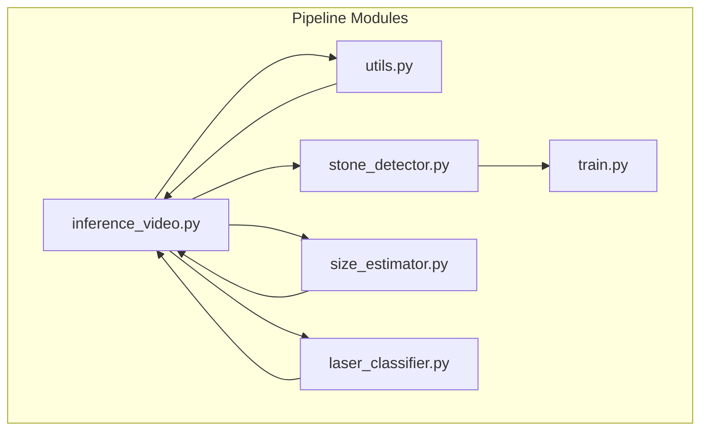
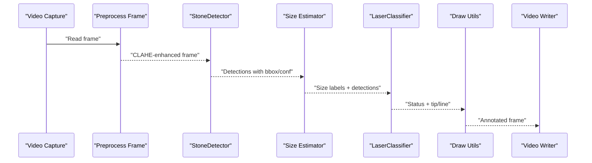
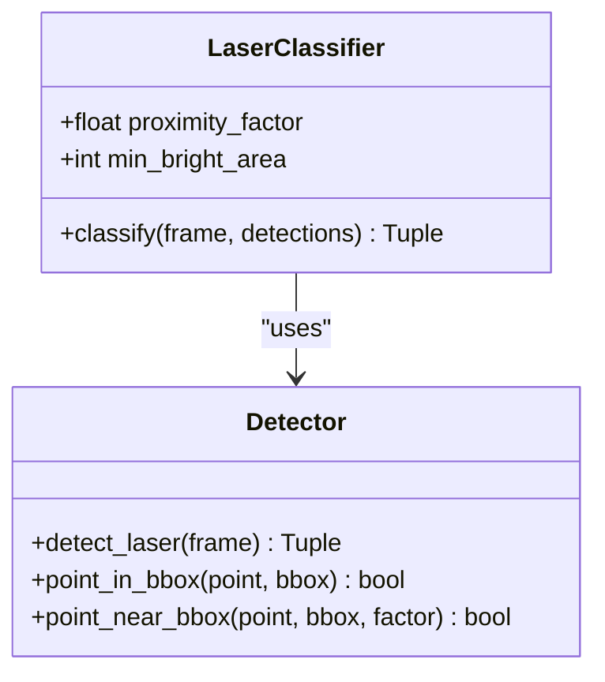
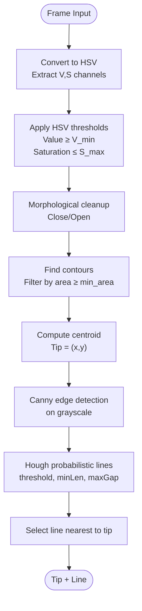
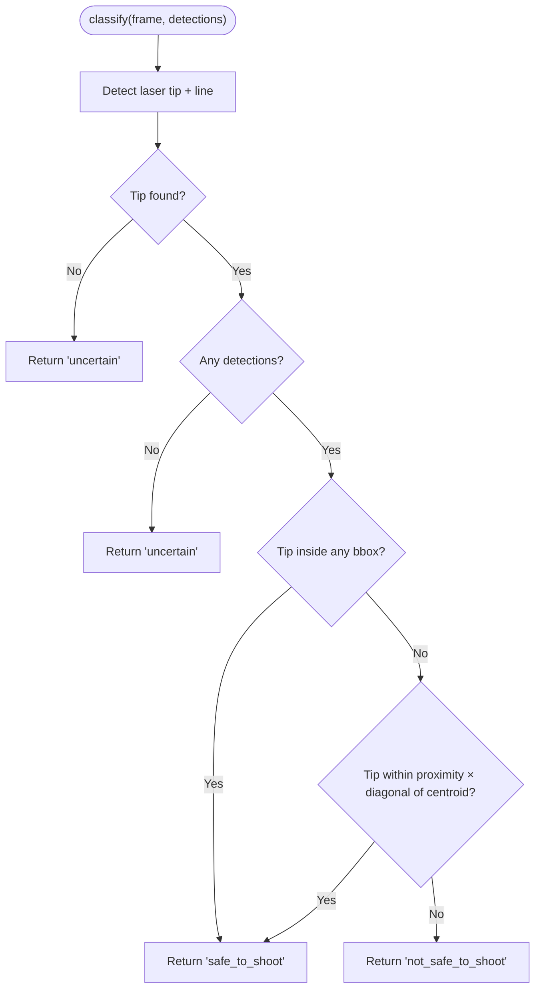
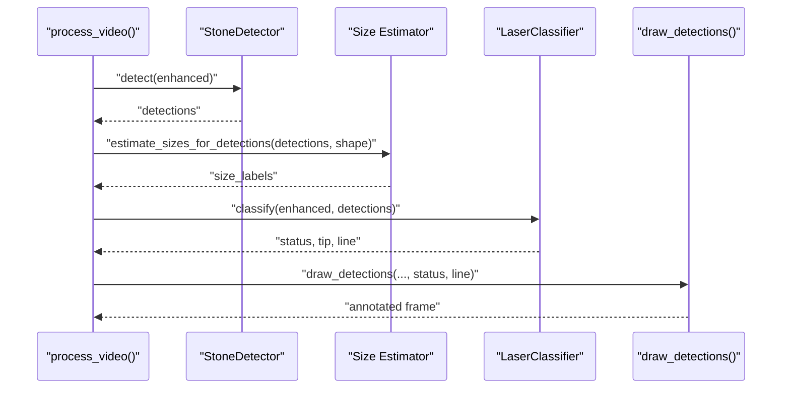
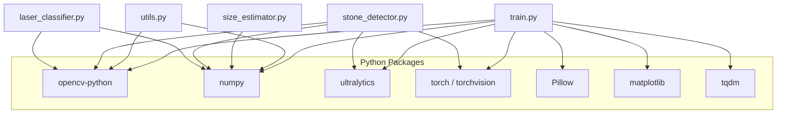

# Laser Classification Module

<cite>
**Referenced Files in This Document**
- [laser_classifier.py](file://src/laser_classifier.py)
- [inference_video.py](file://src/inference_video.py)
- [utils.py](file://src/utils.py)
- [stone_detector.py](file://src/stone_detector.py)
- [size_estimator.py](file://src/size_estimator.py)
- [train.py](file://src/train.py)
- [requirements.txt](file://requirements.txt)
</cite>

## Table of Contents
1. [Introduction](#introduction)
2. [Project Structure](#project-structure)
3. [Core Components](#core-components)
4. [Architecture Overview](#architecture-overview)
5. [Detailed Component Analysis](#detailed-component-analysis)
6. [Dependency Analysis](#dependency-analysis)
7. [Performance Considerations](#performance-considerations)
8. [Troubleshooting Guide](#troubleshooting-guide)
9. [Conclusion](#conclusion)
10. [Appendices](#appendices)

## Introduction
This document describes the laser classification module responsible for real-time safety assessment of laser fiber alignment during RIRS (Rigid or Flexible Internal Renal Surgery) procedures. The module integrates a dual-detector approach—HSV thresholding for detecting bright laser tips and Hough transform line detection for identifying the fiber line—to compute a three-class safety classification: safe to shoot, not safe to shoot, and uncertain. It also includes proximity-based alignment checks against detected kidney stones and integrates seamlessly into the end-to-end inference pipeline.

## Project Structure
The laser classification module resides within the RIRS AI pipeline and collaborates with stone detection, size estimation, preprocessing, and visualization utilities. The primary files involved are:
- Laser classifier implementation
- Inference pipeline orchestrating the full workflow
- Utilities for preprocessing, drawing, and saving outputs
- Stone detection and size estimation modules
- Training utilities for pseudo-labeled fine-tuning

**Diagram sources**
- [inference_video.py:1-250](file://src/inference_video.py#L1-L250)
- [stone_detector.py:1-161](file://src/stone_detector.py#L1-L161)
- [size_estimator.py:1-110](file://src/size_estimator.py#L1-L110)
- [utils.py:1-175](file://src/utils.py#L1-L175)
- [laser_classifier.py:1-224](file://src/laser_classifier.py#L1-L224)
- [train.py:1-225](file://src/train.py#L1-L225)

**Section sources**
- [inference_video.py:1-250](file://src/inference_video.py#L1-L250)
- [laser_classifier.py:1-224](file://src/laser_classifier.py#L1-L224)

## Core Components
- LaserClassifier: encapsulates detection and classification logic, configurable via proximity factor and minimum bright area thresholds.
- Dual-detector pipeline: HSV thresholding for bright tip detection and Hough line detection for fiber orientation.
- Safety assessment: three-class classification based on tip position relative to stones and line orientation.
- Integration: invoked within the inference pipeline after stone detection and size estimation.

Key implementation references:
- [LaserClassifier class:160-224](file://src/laser_classifier.py#L160-L224)
- [Dual-detector detection:60-134](file://src/laser_classifier.py#L60-L134)
- [Safety classification logic:181-224](file://src/laser_classifier.py#L181-L224)

**Section sources**
- [laser_classifier.py:160-224](file://src/laser_classifier.py#L160-L224)
- [laser_classifier.py:60-134](file://src/laser_classifier.py#L60-L134)

## Architecture Overview
The inference pipeline processes each frame through a series of steps, culminating in laser classification and annotation.

**Diagram sources**
- [inference_video.py:119-141](file://src/inference_video.py#L119-L141)
- [utils.py:79-161](file://src/utils.py#L79-L161)
- [laser_classifier.py:181-224](file://src/laser_classifier.py#L181-L224)

## Detailed Component Analysis

### LaserClassifier: Dual-Detector and Safety Assessment
The classifier combines:
- Bright-region detection in HSV space to locate the laser tip
- Hough probabilistic line detection to identify the fiber line
- Proximity-based alignment checks against detected stones

**Diagram sources**
- [laser_classifier.py:160-224](file://src/laser_classifier.py#L160-L224)
- [laser_classifier.py:60-134](file://src/laser_classifier.py#L60-L134)

Implementation highlights:
- HSV thresholding masks near-white/high-brightness regions and cleans artifacts via morphological operations.
- Largest valid contour yields the tip centroid; Hough lines are filtered by proximity to the tip.
- Safety classification:
  - Safe to shoot if tip is inside a stone bbox or within proximity to the stone centroid.
  - Not safe to shoot if a line is detected but not aimed at any stone.
  - Uncertain if no laser is detected or if no stones are present.

Thresholds and tunables:
- HSV: minimum Value and maximum Saturation thresholds, minimum bright area.
- Hough: threshold, minimum line length, and maximum line gap.
- Proximity factor: fraction of bbox diagonal defining “on-stone” proximity.

References:
- [Threshold configuration:46-58](file://src/laser_classifier.py#L46-L58)
- [Bright-region detection:75-101](file://src/laser_classifier.py#L75-L101)
- [Hough line detection:103-133](file://src/laser_classifier.py#L103-L133)
- [Proximity checks:136-158](file://src/laser_classifier.py#L136-L158)
- [Safety classification:181-224](file://src/laser_classifier.py#L181-L224)

**Section sources**
- [laser_classifier.py:46-58](file://src/laser_classifier.py#L46-L58)
- [laser_classifier.py:60-134](file://src/laser_classifier.py#L60-L134)
- [laser_classifier.py:136-158](file://src/laser_classifier.py#L136-L158)
- [laser_classifier.py:181-224](file://src/laser_classifier.py#L181-L224)

### Dual-Detector Algorithm Flow
The detection pipeline proceeds as follows:

**Diagram sources**
- [laser_classifier.py:71-133](file://src/laser_classifier.py#L71-L133)

**Section sources**
- [laser_classifier.py:71-133](file://src/laser_classifier.py#L71-L133)

### Safety Assessment Logic
The classification logic evaluates the relationship between the detected tip/line and stone detections:

**Diagram sources**
- [laser_classifier.py:205-224](file://src/laser_classifier.py#L205-L224)

**Section sources**
- [laser_classifier.py:205-224](file://src/laser_classifier.py#L205-L224)

### Integration with Detection Pipeline
The laser classifier is integrated into the inference pipeline after stone detection and size estimation. It annotates frames with status badges and optional line/tip indicators.

**Diagram sources**
- [inference_video.py:122-138](file://src/inference_video.py#L122-L138)
- [utils.py:79-161](file://src/utils.py#L79-L161)

**Section sources**
- [inference_video.py:122-138](file://src/inference_video.py#L122-L138)
- [utils.py:79-161](file://src/utils.py#L79-L161)

## Dependency Analysis
External dependencies include OpenCV for computer vision primitives, NumPy for numerical operations, and Ultralytics YOLO for stone detection. The pipeline is designed to run on CPU with acceptable performance for real-time video processing.

**Diagram sources**
- [requirements.txt:1-9](file://requirements.txt#L1-L9)
- [laser_classifier.py:38-40](file://src/laser_classifier.py#L38-L40)
- [stone_detector.py:24](file://src/stone_detector.py#L24)
- [utils.py:5-7](file://src/utils.py#L5-L7)
- [train.py:36](file://src/train.py#L36)

**Section sources**
- [requirements.txt:1-9](file://requirements.txt#L1-L9)
- [laser_classifier.py:38-40](file://src/laser_classifier.py#L38-L40)
- [stone_detector.py:24](file://src/stone_detector.py#L24)
- [utils.py:5-7](file://src/utils.py#L5-L7)
- [train.py:36](file://src/train.py#L36)

## Performance Considerations
- Real-time capability: The pipeline processes video frames sequentially and writes annotated outputs. The inference_video.py loop demonstrates frame-by-frame processing with progress tracking.
- Computational cost drivers:
  - Stone detection via YOLO inference
  - CLAHE preprocessing
  - Laser detection using HSV masking and Hough transform
- Tuning thresholds can balance sensitivity and speed:
  - Adjust HSV thresholds and minimum bright area to reduce false positives/negatives.
  - Tune Hough parameters to trade off robustness vs. computational load.
  - Proximity factor controls how close the tip must be to a stone to qualify as safe.

[No sources needed since this section provides general guidance]

## Troubleshooting Guide
Common issues and remedies:
- No laser detected:
  - Verify HSV thresholds and minimum bright area are appropriate for lighting conditions.
  - Ensure CLAHE preprocessing enhances visibility sufficiently.
- False positive lines:
  - Increase Hough threshold or minimum line length; decrease maximum line gap.
- Missed detections:
  - Lower minimum bright area or adjust HSV thresholds slightly.
- Misclassification:
  - Adjust proximity factor to be more or less permissive.
- Missing annotations:
  - Confirm draw_detections receives status and line parameters and that the annotated frame is written to the video writer.

Operational references:
- [Preprocessing and drawing utilities:20-175](file://src/utils.py#L20-L175)
- [Laser detection and classification:60-224](file://src/laser_classifier.py#L60-L224)
- [Pipeline integration:119-141](file://src/inference_video.py#L119-L141)

**Section sources**
- [utils.py:20-175](file://src/utils.py#L20-L175)
- [laser_classifier.py:60-224](file://src/laser_classifier.py#L60-L224)
- [inference_video.py:119-141](file://src/inference_video.py#L119-L141)

## Conclusion
The laser classification module provides a robust, real-time safety assessment for laser fiber alignment in RIRS. Its dual-detector approach reliably identifies laser tips and lines, while proximity-based checks ensure accurate alignment decisions relative to detected stones. The module integrates cleanly into the broader inference pipeline, enabling automated annotation and reporting of safety statuses alongside stone detection and sizing.

[No sources needed since this section summarizes without analyzing specific files]

## Appendices

### Parameter Tuning Guidelines
- HSV thresholds:
  - Increase minimum Value to reduce noise under low-light conditions.
  - Decrease maximum Saturation to focus on near-white/blue-white glows.
- Minimum bright area:
  - Raise to filter out small artifacts; lower to capture faint tips.
- Hough parameters:
  - Increase threshold to require stronger edges.
  - Increase minimum line length to avoid short segments.
  - Decrease maximum line gap to enforce continuity.
- Proximity factor:
  - Increase for more permissive alignment; decrease for stricter safety margins.

References:
- [Threshold configuration:46-58](file://src/laser_classifier.py#L46-L58)
- [Safety classification logic:181-224](file://src/laser_classifier.py#L181-L224)

**Section sources**
- [laser_classifier.py:46-58](file://src/laser_classifier.py#L46-L58)
- [laser_classifier.py:181-224](file://src/laser_classifier.py#L181-L224)

### Safety Evaluation Criteria
- Safe to shoot:
  - Tip is inside a stone bounding box, OR
  - Tip is within proximity factor × bbox diagonal of a stone centroid.
- Not safe to shoot:
  - A line is detected but does not align with any stone.
- Uncertain:
  - No laser tip detected, or no stones present to evaluate alignment.

References:
- [Proximity calculation:143-158](file://src/laser_classifier.py#L143-L158)
- [Classification logic:211-224](file://src/laser_classifier.py#L211-L224)

**Section sources**
- [laser_classifier.py:143-158](file://src/laser_classifier.py#L143-L158)
- [laser_classifier.py:211-224](file://src/laser_classifier.py#L211-L224)

### Integration Notes
- The inference pipeline loads models, runs CLAHE preprocessing, detects stones, estimates sizes, classifies laser safety, and draws annotations.
- Ensure CLAHE-enhanced frames are passed to the laser classifier and that detections include bounding boxes.

References:
- [Pipeline orchestration:119-141](file://src/inference_video.py#L119-L141)
- [Drawing annotations:79-161](file://src/utils.py#L79-161)

**Section sources**
- [inference_video.py:119-141](file://src/inference_video.py#L119-L141)
- [utils.py:79-161](file://src/utils.py#L79-L161)