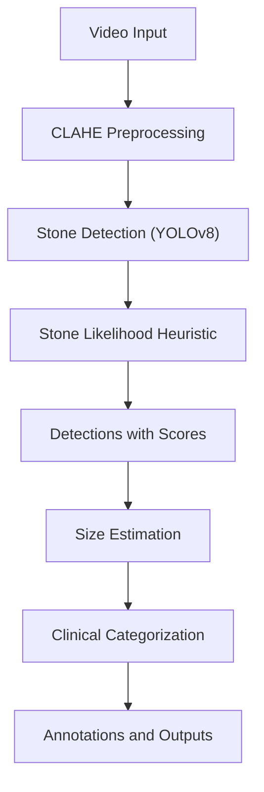
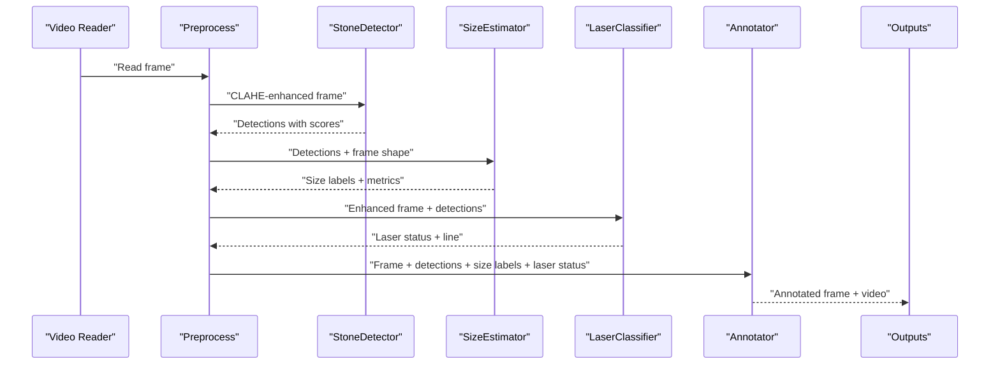
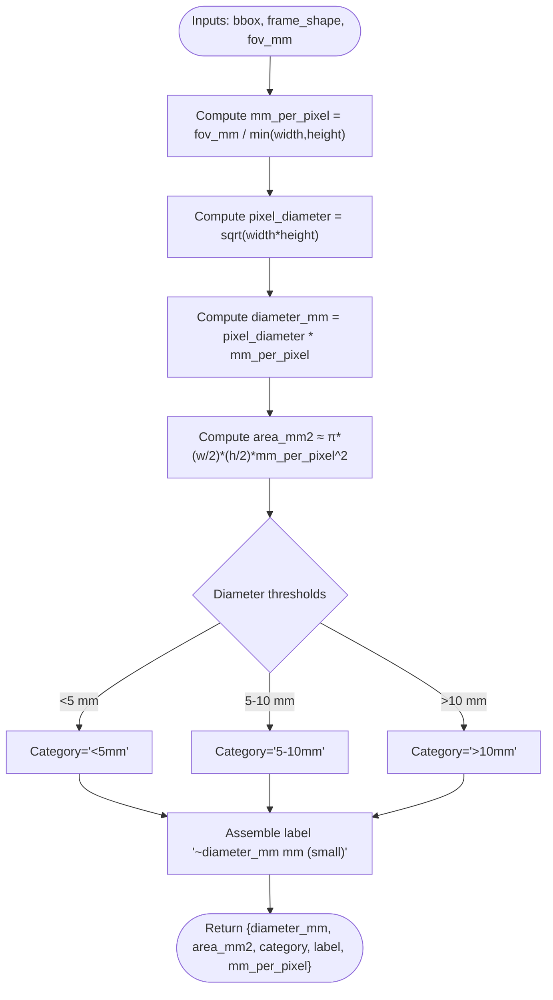
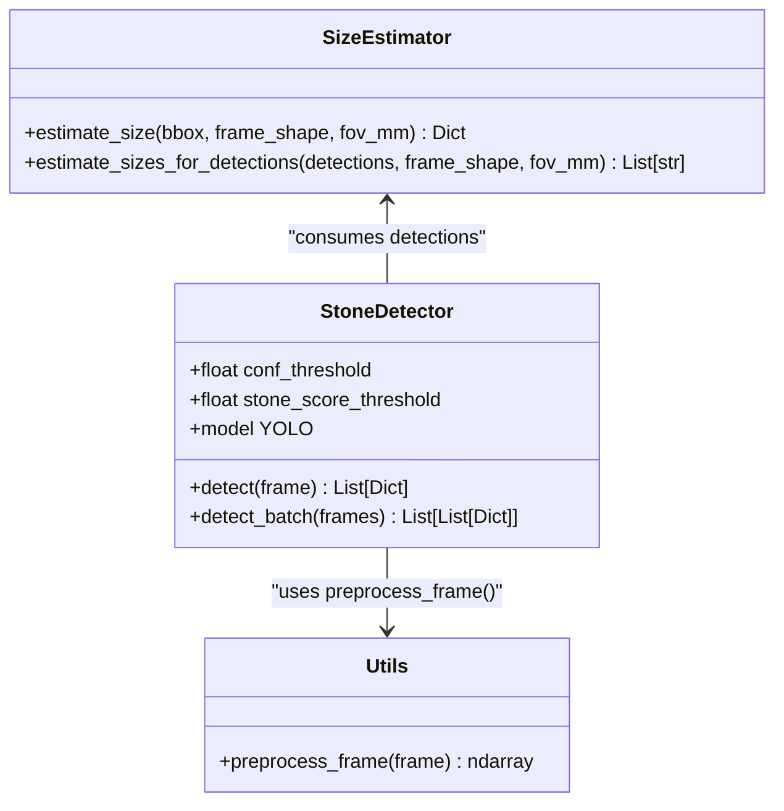
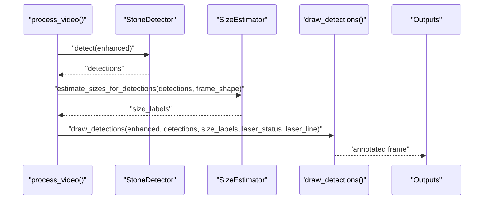
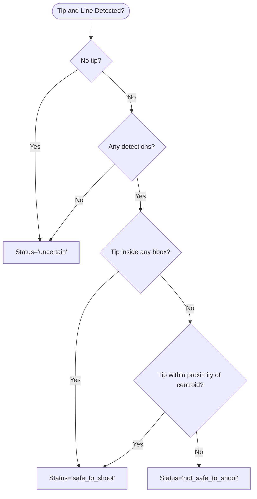
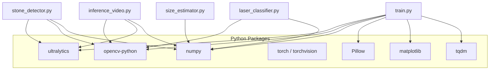

# Size Estimation Module

<cite>
**Referenced Files in This Document**
- [size_estimator.py](file://src/size_estimator.py)
- [stone_detector.py](file://src/stone_detector.py)
- [inference_video.py](file://src/inference_video.py)
- [utils.py](file://src/utils.py)
- [laser_classifier.py](file://src/laser_classifier.py)
- [train.py](file://src/train.py)
- [requirements.txt](file://requirements.txt)
</cite>

## Table of Contents
1. [Introduction](#introduction)
2. [Project Structure](#project-structure)
3. [Core Components](#core-components)
4. [Architecture Overview](#architecture-overview)
5. [Detailed Component Analysis](#detailed-component-analysis)
6. [Dependency Analysis](#dependency-analysis)
7. [Performance Considerations](#performance-considerations)
8. [Troubleshooting Guide](#troubleshooting-guide)
9. [Conclusion](#conclusion)
10. [Appendices](#appendices)

## Introduction
This document describes the size estimation module responsible for calculating kidney stone dimensions and performing clinical categorization from detection results in RIRS (Rigid or Flexible Ureteroscopy) endoscopic videos. It explains the geometric mean calculation methodology, RIRS scope calibration constants, size measurement algorithms, and the clinical size categorization system used by urologists for treatment planning. It also documents measurement precision, calibration procedures, size classification thresholds, and integration with detection results. Practical examples of size calculation workflows, calibration verification, and measurement accuracy validation are included.

## Project Structure
The size estimation module is part of a broader RIRS AI pipeline that includes:
- Stone detection using a YOLOv8-based detector with a custom likelihood heuristic
- CLAHE preprocessing to enhance visibility in endoscopic frames
- Size estimation from detection bounding boxes
- Laser alignment classification for safety assessment
- Video inference pipeline orchestrating the full workflow

**Diagram sources**
- [inference_video.py:13-19](file://src/inference_video.py#L13-L19)
- [utils.py:20-44](file://src/utils.py#L20-L44)
- [stone_detector.py:111-156](file://src/stone_detector.py#L111-L156)
- [size_estimator.py:32-92](file://src/size_estimator.py#L32-L92)

**Section sources**
- [inference_video.py:13-19](file://src/inference_video.py#L13-L19)
- [utils.py:20-44](file://src/utils.py#L20-L44)
- [stone_detector.py:111-156](file://src/stone_detector.py#L111-L156)
- [size_estimator.py:32-92](file://src/size_estimator.py#L32-L92)

## Core Components
- Size Estimator: Computes diameter and area estimates from detection bounding boxes, applies clinical categorization, and returns human-readable labels.
- Stone Detector: Runs YOLOv8 inference on CLAHE-enhanced frames and filters detections using a custom stone likelihood heuristic.
- Inference Pipeline: Orchestrates preprocessing, detection, size estimation, laser classification, annotation, and output writing.
- Utilities: Provides CLAHE preprocessing, drawing helpers, and video writer creation.
- Laser Classifier: Detects laser fiber and line artifacts and classifies alignment safety relative to detected stones.

Key integration points:
- The inference pipeline calls the detector, then passes detections to the size estimator.
- Annotations combine detection boxes, size labels, and laser safety status.

**Section sources**
- [size_estimator.py:32-92](file://src/size_estimator.py#L32-L92)
- [stone_detector.py:111-156](file://src/stone_detector.py#L111-L156)
- [inference_video.py:119-138](file://src/inference_video.py#L119-L138)
- [utils.py:20-44](file://src/utils.py#L20-L44)
- [laser_classifier.py:181-224](file://src/laser_classifier.py#L181-L224)

## Architecture Overview
The size estimation module sits downstream of detection and integrates with the annotation pipeline. The end-to-end workflow is:

**Diagram sources**
- [inference_video.py:119-138](file://src/inference_video.py#L119-L138)
- [size_estimator.py:95-109](file://src/size_estimator.py#L95-L109)
- [utils.py:79-161](file://src/utils.py#L79-L161)
- [laser_classifier.py:181-224](file://src/laser_classifier.py#L181-L224)

## Detailed Component Analysis

### Size Estimation Algorithm
The size estimation algorithm converts pixel-based detection dimensions into physical millimeters using a calibrated field-of-view (FOV) assumption and applies clinical categorization thresholds.

- Geometric Mean Diameter Calculation:
  - The pixel diameter is computed as the geometric mean of the bounding box width and height.
  - This accounts for the stone’s projected elliptical shape in the image plane.

- Calibration Constant:
  - The FOV diameter is assumed to be 15 mm at a typical working distance for RIRS scopes.
  - The calibration factor (mm per pixel) equals FOV diameter divided by the shorter frame dimension.

- Physical Size Metrics:
  - Diameter in mm is derived by multiplying the pixel diameter by mm per pixel.
  - Stone area is approximated as an ellipse using half-axis lengths scaled by mm per pixel.

- Clinical Categorization:
  - Categories are defined as:
    - Small: less than 5 mm
    - Medium: 5 to 10 mm
    - Large: greater than 10 mm
  - Human-readable labels include the estimated diameter and category.

Precision and rounding:
- Diameter and area are rounded to two decimal places.
- mm per pixel is rounded to five decimal places for reporting.

Integration with detection results:
- The estimator accepts detection dictionaries containing bounding boxes and frame shapes.
- A convenience function generates human-readable labels for multiple detections.

**Diagram sources**
- [size_estimator.py:32-92](file://src/size_estimator.py#L32-L92)

**Section sources**
- [size_estimator.py:10-18](file://src/size_estimator.py#L10-L18)
- [size_estimator.py:32-92](file://src/size_estimator.py#L32-L92)

### Stone Detection and Likelihood Heuristic
The detector runs YOLOv8 inference on CLAHE-enhanced frames and applies a custom likelihood heuristic to filter detections. This ensures that only visually stone-like regions are retained for downstream size estimation.

- Model Selection:
  - Uses pre-trained YOLOv8n weights by default.
  - Optionally loads fine-tuned weights if present.

- Heuristic Scoring:
  - Brightness: stones appear brighter than surrounding tissue.
  - Compactness: preference for near-square aspect ratios.
  - Texture: higher local standard deviation indicates granular surfaces.
  - A weighted combination produces a normalized score.

- Output:
  - Detections include bounding boxes, confidence, class ID, and stone likelihood score.
  - Results are sorted by confidence.

**Diagram sources**
- [stone_detector.py:77-161](file://src/stone_detector.py#L77-L161)
- [utils.py:20-44](file://src/utils.py#L20-L44)
- [size_estimator.py:95-109](file://src/size_estimator.py#L95-L109)

**Section sources**
- [stone_detector.py:38-75](file://src/stone_detector.py#L38-L75)
- [stone_detector.py:111-156](file://src/stone_detector.py#L111-L156)
- [utils.py:20-44](file://src/utils.py#L20-L44)

### Inference Pipeline Integration
The inference pipeline orchestrates the full workflow, including size estimation and annotation.

- Steps:
  - Read frame, apply CLAHE preprocessing.
  - Detect stones and filter using likelihood heuristic.
  - Estimate sizes for detections and produce labels.
  - Classify laser alignment safety.
  - Draw annotations and write outputs.

- Statistics:
  - Tracks frames with stones, total detections, laser safety distribution, and size category counts.
  - Saves per-frame logs periodically.

**Diagram sources**
- [inference_video.py:119-138](file://src/inference_video.py#L119-L138)
- [size_estimator.py:95-109](file://src/size_estimator.py#L95-L109)
- [utils.py:79-161](file://src/utils.py#L79-L161)

**Section sources**
- [inference_video.py:59-201](file://src/inference_video.py#L59-L201)

### Laser Alignment Classification (Context)
While not part of size estimation, laser classification informs safety decisions and complements size labels during annotation.

- Detection:
  - Brightness-based HSV threshold identifies potential laser tips.
  - Hough line transform detects fiber lines; the closest endpoint defines the line.

- Safety Classification:
  - Safe if tip is inside a stone bbox or within a proximity threshold of the centroid.
  - Not safe if a line is detected but aimed elsewhere.
  - Uncertain if no laser detected or no stones visible.

**Diagram sources**
- [laser_classifier.py:60-133](file://src/laser_classifier.py#L60-L133)
- [laser_classifier.py:181-224](file://src/laser_classifier.py#L181-L224)

**Section sources**
- [laser_classifier.py:60-133](file://src/laser_classifier.py#L60-L133)
- [laser_classifier.py:181-224](file://src/laser_classifier.py#L181-L224)

## Dependency Analysis
External dependencies include:
- Ultralytics YOLO for detection
- OpenCV for image processing and video I/O
- NumPy for numerical operations
- Torch/TorchVision for model execution
- Matplotlib, Pillow, tqdm for auxiliary tasks

**Diagram sources**
- [requirements.txt:1-9](file://requirements.txt#L1-L9)
- [size_estimator.py:21-22](file://src/size_estimator.py#L21-L22)
- [stone_detector.py:24](file://src/stone_detector.py#L24)
- [inference_video.py:38-41](file://src/inference_video.py#L38-L41)
- [laser_classifier.py:38-40](file://src/laser_classifier.py#L38-L40)
- [train.py:36](file://src/train.py#L36)

**Section sources**
- [requirements.txt:1-9](file://requirements.txt#L1-L9)

## Performance Considerations
- Size estimation is computationally lightweight, dominated by simple arithmetic and basic geometry.
- Detection performance depends on YOLOv8 inference speed and the stone likelihood filter.
- CLAHE preprocessing improves detection robustness in low-contrast endoscopic conditions.
- Video pipeline throughput is influenced by frame resolution, detection count, and annotation rendering.

[No sources needed since this section provides general guidance]

## Troubleshooting Guide
Common issues and resolutions:
- Incorrect FOV assumptions:
  - Verify that the FOV diameter aligns with the actual scope and working distance used during acquisition.
  - Adjust the FOV constant if necessary and re-run size estimation.

- Poor detection quality:
  - Ensure CLAHE preprocessing is applied consistently before detection.
  - Tune detection thresholds (confidence and stone likelihood) to balance recall and precision.

- Misclassification of size categories:
  - Confirm that detections are valid bounding boxes and that frame dimensions are correct.
  - Validate that the geometric mean is computed from width and height of the detection.

- Annotation artifacts:
  - Check that size labels are generated and drawn correctly alongside detection boxes.
  - Confirm that laser classification does not interfere with size labeling.

Validation steps:
- Cross-check diameter estimates against known standards or phantom measurements when available.
- Compare size distributions across frames to identify outliers or misclassifications.
- Re-run inference with adjusted thresholds to improve accuracy.

**Section sources**
- [size_estimator.py:32-92](file://src/size_estimator.py#L32-L92)
- [inference_video.py:119-138](file://src/inference_video.py#L119-L138)
- [utils.py:79-161](file://src/utils.py#L79-L161)

## Conclusion
The size estimation module provides a practical and clinically meaningful approach to kidney stone sizing from RIRS endoscopic frames. By combining a calibrated FOV assumption with geometric mean diameter computation and ellipse-based area estimation, it delivers reliable size labels and clinical categories. Integration with detection, preprocessing, and annotation ensures a seamless pipeline for real-time or offline analysis. Proper calibration and threshold tuning are essential for maintaining measurement accuracy and clinical relevance.

[No sources needed since this section summarizes without analyzing specific files]

## Appendices

### Measurement Precision and Reporting
- Diameter and area are reported to two decimal places.
- mm per pixel is reported to five decimal places.
- Labels include the estimated diameter and category for quick interpretation.

**Section sources**
- [size_estimator.py:86-92](file://src/size_estimator.py#L86-L92)

### Calibration Procedures
- FOV diameter: 15 mm at ~10 mm working distance for typical RIRS scopes.
- mm per pixel: FOV diameter divided by the shorter frame dimension.
- Verification:
  - Use a known-size reference in the video scene to validate mm per pixel.
  - Recompute and adjust FOV if necessary to minimize systematic bias.

**Section sources**
- [size_estimator.py:10-18](file://src/size_estimator.py#L10-L18)
- [size_estimator.py:63-64](file://src/size_estimator.py#L63-L64)

### Size Classification Thresholds
- Small: < 5 mm
- Medium: 5–10 mm
- Large: > 10 mm

These thresholds align with standard urological treatment planning categories.

**Section sources**
- [size_estimator.py:15-18](file://src/size_estimator.py#L15-L18)
- [size_estimator.py:74-82](file://src/size_estimator.py#L74-L82)

### Integration with Detection Results
- The estimator consumes detection dictionaries with bounding boxes and frame shapes.
- A convenience function generates human-readable labels for multiple detections.
- The inference pipeline integrates size labels into annotations and statistics.

**Section sources**
- [size_estimator.py:32-57](file://src/size_estimator.py#L32-L57)
- [size_estimator.py:95-109](file://src/size_estimator.py#L95-L109)
- [inference_video.py:125-126](file://src/inference_video.py#L125-L126)

### Example Workflows
- Single-detection size calculation:
  - Input: detection bbox and frame shape
  - Output: diameter, area, category, label, mm per pixel

- Batch size labeling:
  - Input: list of detections and frame shape
  - Output: list of human-readable labels

- Calibration verification:
  - Use a known reference to compute expected mm per pixel
  - Compare with the estimator’s computed value and adjust FOV if needed

- Measurement accuracy validation:
  - Cross-validate with external standards or phantom measurements
  - Analyze size distributions across frames to identify anomalies

**Section sources**
- [size_estimator.py:32-92](file://src/size_estimator.py#L32-L92)
- [size_estimator.py:95-109](file://src/size_estimator.py#L95-L109)