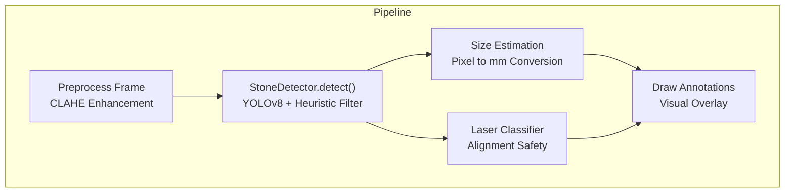
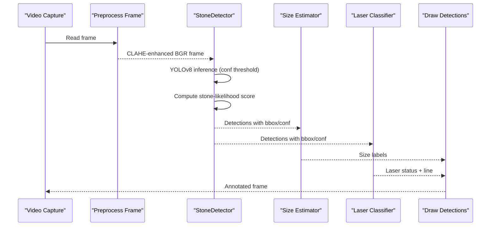
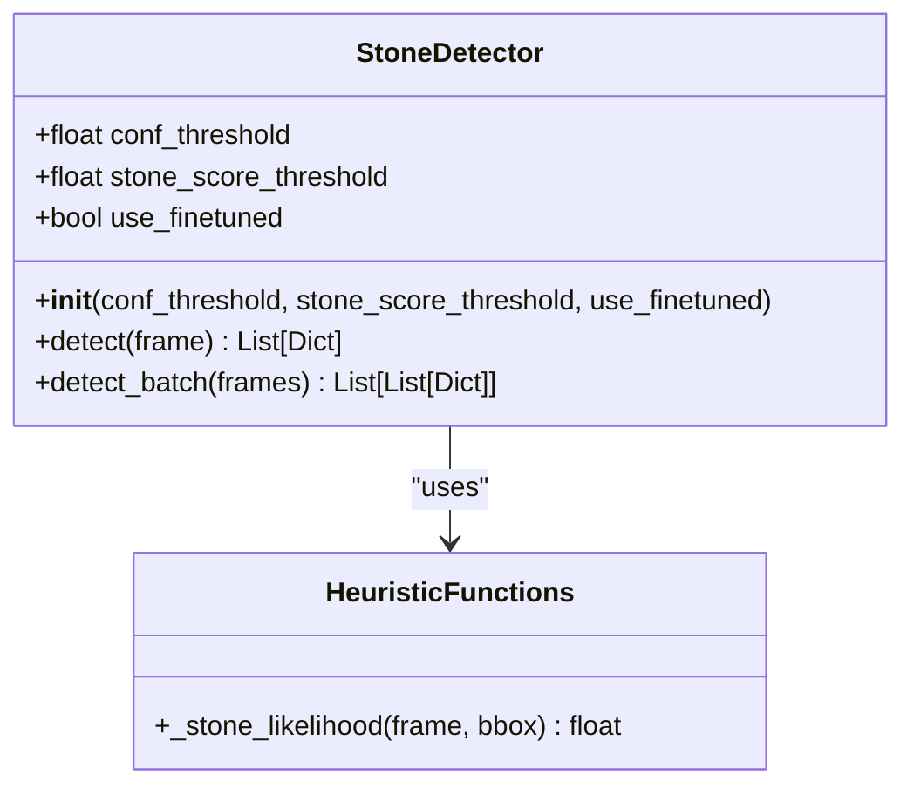
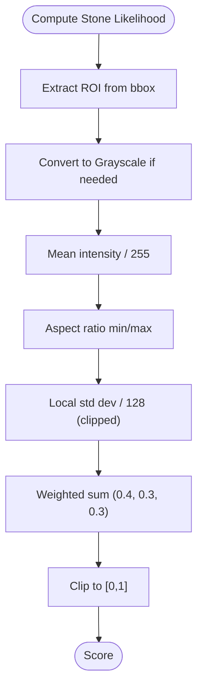
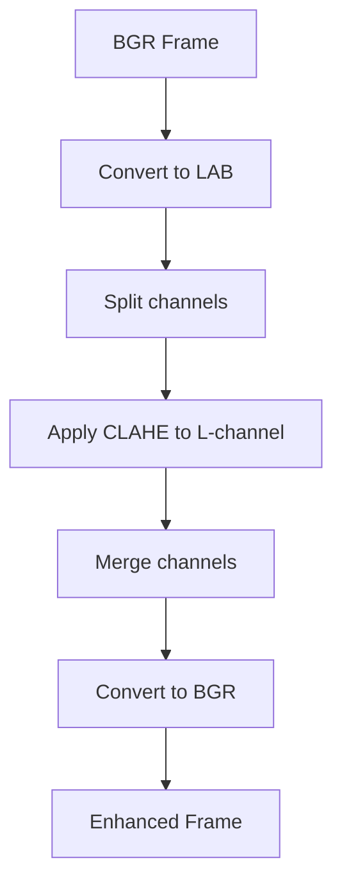
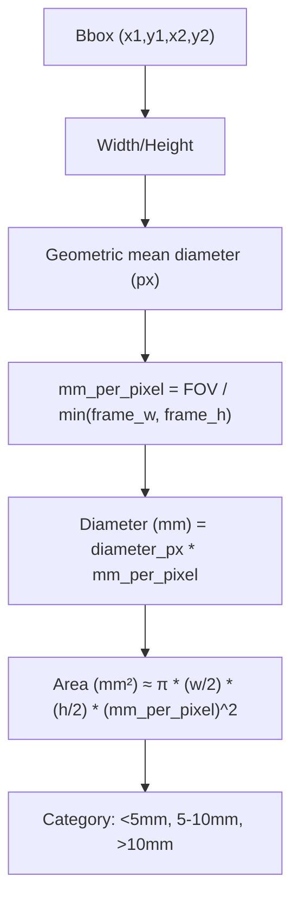
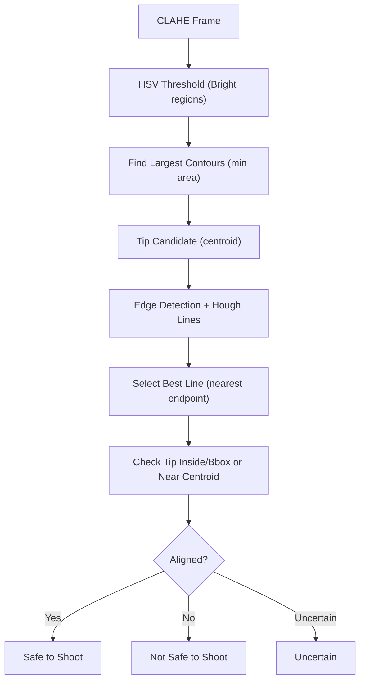
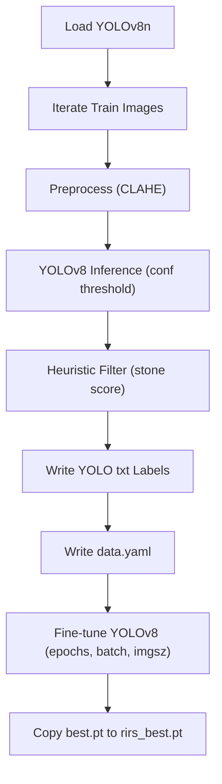
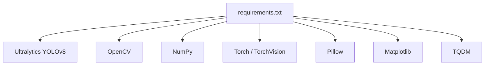

# Stone Detection Module

<cite>
**Referenced Files in This Document**
- [stone_detector.py](file://src/stone_detector.py)
- [inference_video.py](file://src/inference_video.py)
- [utils.py](file://src/utils.py)
- [laser_classifier.py](file://src/laser_classifier.py)
- [size_estimator.py](file://src/size_estimator.py)
- [train.py](file://src/train.py)
- [requirements.txt](file://requirements.txt)
</cite>

## Table of Contents
1. [Introduction](#introduction)
2. [Project Structure](#project-structure)
3. [Core Components](#core-components)
4. [Architecture Overview](#architecture-overview)
5. [Detailed Component Analysis](#detailed-component-analysis)
6. [Dependency Analysis](#dependency-analysis)
7. [Performance Considerations](#performance-considerations)
8. [Troubleshooting Guide](#troubleshooting-guide)
9. [Conclusion](#conclusion)
10. [Appendices](#appendices)

## Introduction
This document describes the stone detection module that implements YOLOv8-based kidney stone detection for rigid or flexible ureteroscopy (RIRS) endoscopic videos. The module performs domain adaptation by combining:
- YOLOv8 inference on CLAHE-enhanced frames
- A custom stone-likelihood scoring function that evaluates brightness, shape compactness, and texture
- Optional fine-tuned weights for improved accuracy in the RIRS domain

The pipeline integrates with preprocessing, size estimation, and laser alignment classification to produce annotated outputs suitable for clinical decision support during ureteroscopy procedures.

## Project Structure
The stone detection module is part of a broader RIRS AI pipeline with the following relevant components:
- StoneDetector: YOLOv8 wrapper with domain-adaptive post-processing
- Preprocessing utilities: CLAHE enhancement for endoscopic imaging
- Size estimation: converts pixel detections to clinical size categories
- Laser classifier: determines safe-to-shoot status based on laser alignment
- Training script: pseudo-label fine-tuning using unlabeled training images

**Diagram sources**
- [inference_video.py:119-138](file://src/inference_video.py#L119-L138)
- [utils.py:20-43](file://src/utils.py#L20-L43)
- [stone_detector.py:111-156](file://src/stone_detector.py#L111-L156)
- [size_estimator.py:95-109](file://src/size_estimator.py#L95-L109)
- [laser_classifier.py:181-223](file://src/laser_classifier.py#L181-L223)

**Section sources**
- [inference_video.py:1-250](file://src/inference_video.py#L1-L250)
- [utils.py:1-175](file://src/utils.py#L1-L175)
- [stone_detector.py:1-161](file://src/stone_detector.py#L1-L161)
- [size_estimator.py:1-110](file://src/size_estimator.py#L1-L110)
- [laser_classifier.py:1-224](file://src/laser_classifier.py#L1-L224)
- [train.py:1-225](file://src/train.py#L1-L225)

## Core Components
- StoneDetector: Loads either fine-tuned or pre-trained YOLOv8 weights, runs inference with a confidence threshold, computes a stone-likelihood score per detection, filters by a second threshold, and returns detections sorted by confidence.
- Preprocessing: Applies CLAHE to the L-channel in LAB colorspace to enhance visibility in dark, murky endoscopic frames.
- Size Estimator: Converts pixel bounding boxes to approximate diameter and area using a fixed field-of-view calibration.
- Laser Classifier: Detects laser fiber tip and line candidates and classifies whether the laser is safe to shoot relative to detected stones.
- Training Pipeline: Generates pseudo-labels from YOLOv8 predictions and fine-tunes the model for the RIRS domain.

Key configuration parameters:
- Confidence threshold for YOLOv8 detection
- Stone-likelihood threshold for post-filtering
- Use of fine-tuned weights when available

**Section sources**
- [stone_detector.py:77-161](file://src/stone_detector.py#L77-L161)
- [utils.py:20-43](file://src/utils.py#L20-L43)
- [size_estimator.py:32-92](file://src/size_estimator.py#L32-L92)
- [laser_classifier.py:160-223](file://src/laser_classifier.py#L160-L223)
- [train.py:61-181](file://src/train.py#L61-L181)
- [inference_video.py:54-56](file://src/inference_video.py#L54-L56)

## Architecture Overview
The end-to-end pipeline processes each video frame through preprocessing, detection, size estimation, laser classification, and annotation.

**Diagram sources**
- [inference_video.py:119-138](file://src/inference_video.py#L119-L138)
- [stone_detector.py:111-156](file://src/stone_detector.py#L111-L156)
- [size_estimator.py:95-109](file://src/size_estimator.py#L95-L109)
- [laser_classifier.py:181-223](file://src/laser_classifier.py#L181-L223)
- [utils.py:20-43](file://src/utils.py#L20-L43)

## Detailed Component Analysis

### StoneDetector: YOLOv8 Wrapper and Heuristic Filtering
- Model loading: Chooses fine-tuned weights if present; otherwise uses the pre-trained YOLOv8n model automatically downloaded by Ultralytics.
- Inference: Runs YOLOv8 with a configurable confidence threshold and extracts bounding boxes, confidence scores, and class IDs.
- Post-processing: Computes a stone-likelihood score using three cues—brightness, aspect ratio, and texture—and filters detections below a configurable threshold.
- Output: Returns detections sorted by confidence.

**Diagram sources**
- [stone_detector.py:77-161](file://src/stone_detector.py#L77-L161)
- [stone_detector.py:38-74](file://src/stone_detector.py#L38-L74)

**Section sources**
- [stone_detector.py:77-161](file://src/stone_detector.py#L77-L161)
- [stone_detector.py:38-74](file://src/stone_detector.py#L38-L74)

### Stone Likelihood Scoring Mechanism
The scoring function evaluates:
- Brightness: Mean grayscale intensity normalized by 255
- Compactness: Ratio of min(width,height)/max(width,height)
- Texture: Local standard deviation normalized and clipped

A weighted sum produces a final score in [0,1].

**Diagram sources**
- [stone_detector.py:38-74](file://src/stone_detector.py#L38-L74)

**Section sources**
- [stone_detector.py:38-74](file://src/stone_detector.py#L38-L74)

### Preprocessing: CLAHE Enhancement
CLAHE is applied to the L-channel in LAB colorspace to improve visibility in low-light endoscopic conditions.

**Diagram sources**
- [utils.py:20-43](file://src/utils.py#L20-L43)

**Section sources**
- [utils.py:20-43](file://src/utils.py#L20-L43)

### Size Estimation: Pixel-to-Millimeter Conversion
Estimates stone diameter and area using a geometric mean of bbox dimensions and a fixed field-of-view calibration. Outputs category labels for clinical interpretation.

**Diagram sources**
- [size_estimator.py:32-92](file://src/size_estimator.py#L32-L92)

**Section sources**
- [size_estimator.py:32-92](file://src/size_estimator.py#L32-L92)

### Laser Classifier: Alignment Safety
Detects laser tip and line candidates using HSV thresholding and Hough transform, then classifies safety based on proximity to detected stones.

**Diagram sources**
- [laser_classifier.py:60-133](file://src/laser_classifier.py#L60-L133)
- [laser_classifier.py:181-223](file://src/laser_classifier.py#L181-L223)

**Section sources**
- [laser_classifier.py:160-223](file://src/laser_classifier.py#L160-L223)

### Training Pipeline: Pseudo-Label Fine-Tuning
Generates pseudo-labels from YOLOv8 predictions on unlabeled training images, applies the same heuristic filter, writes a data.yaml, and fine-tunes the model.

**Diagram sources**
- [train.py:61-181](file://src/train.py#L61-L181)

**Section sources**
- [train.py:61-181](file://src/train.py#L61-L181)

## Dependency Analysis
External libraries and their roles:
- Ultralytics YOLOv8: Object detection backbone
- OpenCV: Image preprocessing, drawing, and computer vision primitives
- NumPy: Numerical operations for arrays and math
- Torch/Torchvision: Underlying deep learning framework and utilities
- Pillow/Matplotlib: Additional image and plotting support
- TQDM: Progress bars for long-running tasks

**Diagram sources**
- [requirements.txt:1-9](file://requirements.txt#L1-L9)

**Section sources**
- [requirements.txt:1-9](file://requirements.txt#L1-L9)

## Performance Considerations
- Confidence threshold tuning: Lower thresholds increase recall but may raise false positives; higher thresholds reduce noise but risk missing small or faint stones.
- Stone-likelihood threshold: Adjusting this balance improves precision by removing implausible detections.
- Preprocessing: CLAHE enhances detection robustness in low-light conditions; ensure consistent parameters across datasets.
- Model selection: Prefer fine-tuned weights when available; fallback to pre-trained YOLOv8n if fine-tuned weights are absent.
- Batch processing: The detector supports batch inference for throughput improvements.
- GPU acceleration: Training and heavy inference benefit significantly from GPU; CPU inference is feasible but slower.

[No sources needed since this section provides general guidance]

## Troubleshooting Guide
Common issues and resolutions:
- Missing fine-tuned weights: The detector falls back to the pre-trained model if fine-tuned weights are not found.
- Low detection quality: Tune confidence and stone-likelihood thresholds; verify CLAHE preprocessing consistency.
- Slow inference: Use GPU acceleration; reduce input resolution or batch size; consider disabling non-essential post-processing steps.
- Incorrect size estimates: Verify frame dimensions and ensure consistent field-of-view assumptions.
- Laser misclassification: Adjust HSV thresholds and proximity factor; ensure adequate lighting for reliable detection.

**Section sources**
- [stone_detector.py:101-107](file://src/stone_detector.py#L101-L107)
- [inference_video.py:224-231](file://src/inference_video.py#L224-L231)
- [size_estimator.py:28-29](file://src/size_estimator.py#L28-L29)

## Conclusion
The stone detection module combines YOLOv8 with domain-adapted post-processing to reliably detect kidney stones in RIRS endoscopic videos. By leveraging CLAHE preprocessing, a custom stone-likelihood scoring function, and optional fine-tuning, the system achieves robust performance suitable for real-time clinical assistance. Integrating size estimation and laser alignment further enhances the pipeline’s practical value.

[No sources needed since this section summarizes without analyzing specific files]

## Appendices

### Detection Configuration Examples
- Confidence threshold: Controls YOLOv8 detection sensitivity
- Stone-likelihood threshold: Filters detections by heuristic score
- Use fine-tuned weights: Enables domain-specific adaptation

**Section sources**
- [inference_video.py:54-56](file://src/inference_video.py#L54-L56)
- [stone_detector.py:92-97](file://src/stone_detector.py#L92-L97)

### Model Weight Management
- Fine-tuned weights path: models/rirs_best.pt
- Pre-trained weights: yolov8n.pt (automatically downloaded)
- Training pipeline: Generates pseudo-labels and fine-tunes the model

**Section sources**
- [stone_detector.py:30-32](file://src/stone_detector.py#L30-L32)
- [stone_detector.py:101-107](file://src/stone_detector.py#L101-L107)
- [train.py:172-177](file://src/train.py#L172-L177)

### Domain Adaptation and Accuracy Optimization
- Pseudo-label fine-tuning: Uses unlabeled training images to adapt YOLOv8 to the RIRS domain
- Heuristic filtering: Improves precision by rejecting unlikely detections
- Clinical calibration: Size estimation relies on a fixed field-of-view assumption

**Section sources**
- [train.py:6-15](file://src/train.py#L6-L15)
- [stone_detector.py:4-12](file://src/stone_detector.py#L4-L12)
- [size_estimator.py:6-8](file://src/size_estimator.py#L6-L8)