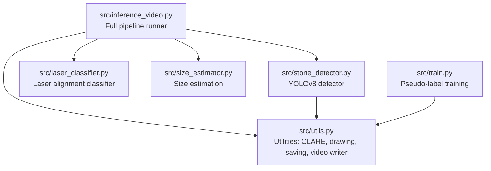
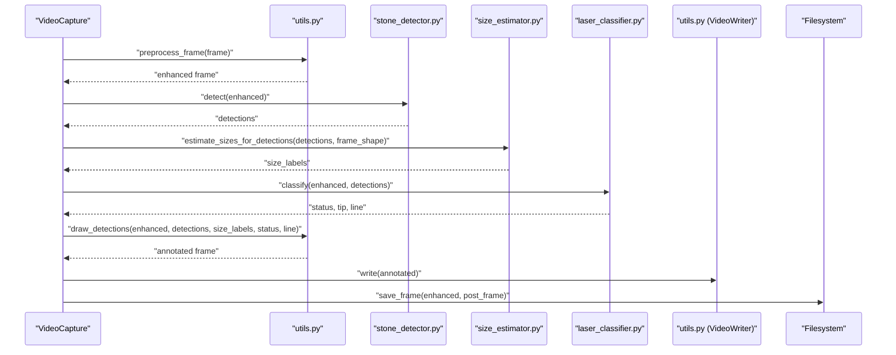
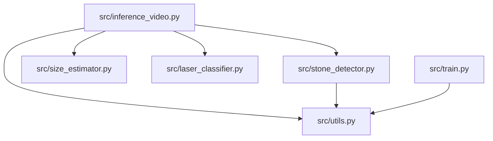

# Utility Functions

<cite>
**Referenced Files in This Document**
- [utils.py](file://src/utils.py)
- [inference_video.py](file://src/inference_video.py)
- [laser_classifier.py](file://src/laser_classifier.py)
- [stone_detector.py](file://src/stone_detector.py)
- [size_estimator.py](file://src/size_estimator.py)
- [train.py](file://src/train.py)
</cite>

## Table of Contents
1. [Introduction](#introduction)
2. [Project Structure](#project-structure)
3. [Core Components](#core-components)
4. [Architecture Overview](#architecture-overview)
5. [Detailed Component Analysis](#detailed-component-analysis)
6. [Dependency Analysis](#dependency-analysis)
7. [Performance Considerations](#performance-considerations)
8. [Troubleshooting Guide](#troubleshooting-guide)
9. [Conclusion](#conclusion)
10. [Appendices](#appendices)

## Introduction
This document describes the utility functions module that powers shared computer vision operations and helper functions for the RIRS AI pipeline. It focuses on:
- CLAHE preprocessing for endoscopic video enhancement
- Drawing and annotation functions for detections, laser alignment, and badges
- Video writing capabilities for saving annotated outputs
- Common image processing utilities for saving frames and constructing video writers
- Preprocessing pipeline, visualization functions, output formatting, and performance optimization techniques
- Usage examples, parameter configuration, and integration patterns with other modules
- Memory management, processing efficiency, and reusable component design

## Project Structure
The utility functions reside primarily in a single module and are consumed by the inference pipeline and training scripts. The key integration points are:
- Utilities module: preprocessing, drawing, saving, and video writing
- Inference pipeline: orchestrates the full pipeline and uses utilities for saving frames and writing videos
- Stone detector: uses utilities for preprocessing before detection
- Laser classifier: consumes CLAHE-enhanced frames for laser detection
- Size estimator: computes size labels from detections and frame geometry

**Diagram sources**
- [utils.py](file://src/utils.py)
- [inference_video.py](file://src/inference_video.py)
- [stone_detector.py](file://src/stone_detector.py)
- [laser_classifier.py](file://src/laser_classifier.py)
- [size_estimator.py](file://src/size_estimator.py)
- [train.py](file://src/train.py)

**Section sources**
- [utils.py](file://src/utils.py)
- [inference_video.py](file://src/inference_video.py)

## Core Components
- CLAHE preprocessing: Enhances visibility in dark/murky endoscopic frames by applying adaptive histogram equalization on the L-channel in LAB colorspace.
- Drawing and annotation: Draws bounding boxes, confidence and size labels, laser line and tip, and status/count badges.
- Video writing: Creates an OpenCV VideoWriter configured for MP4 output with specified FPS and resolution.
- Frame saving: Saves individual frames as JPEG with controlled quality.
- Color palette: Centralized BGR color constants for consistent visualization.

Key responsibilities:
- Provide reusable, pure-image-processing helpers used across the pipeline
- Maintain consistent visualization semantics (colors, fonts, layout)
- Offer efficient, memory-conscious operations suitable for real-time video processing

**Section sources**
- [utils.py](file://src/utils.py)

## Architecture Overview
The utilities module acts as a shared foundation for the RIRS pipeline. The inference pipeline demonstrates the end-to-end flow: read frame → preprocess → detect → estimate → classify → annotate → write video → save frames. The training pipeline reuses preprocessing and likelihood scoring during pseudo-label generation.

**Diagram sources**
- [inference_video.py](file://src/inference_video.py)
- [utils.py](file://src/utils.py)
- [stone_detector.py](file://src/stone_detector.py)
- [size_estimator.py](file://src/size_estimator.py)
- [laser_classifier.py](file://src/laser_classifier.py)

## Detailed Component Analysis

### CLAHE Preprocessing
Purpose:
- Improve visibility in dark/murky endoscopic video frames by enhancing the L-channel in LAB colorspace using CLAHE with configurable clip limit and tile grid size.

Implementation highlights:
- Converts BGR to LAB, splits channels, applies CLAHE to L-channel, merges channels, converts back to BGR
- Returns a contrast-enhanced BGR image ready for downstream detection/classification

Parameters and tuning:
- Clip limit and tile grid size are exposed in the CLAHE creation call
- Used consistently across inference and training pipelines

Integration:
- Called before detection and classification steps
- Also used during pseudo-label generation for training

Memory and performance:
- Single-pass LAB conversion and merge
- Minimal overhead; beneficial for detection robustness

**Section sources**
- [utils.py](file://src/utils.py)
- [inference_video.py](file://src/inference_video.py)
- [train.py](file://src/train.py)

### Drawing and Annotation Functions
Purpose:
- Render visual annotations on frames for debugging, review, and reporting.

Functions:
- _get_laser_color: Maps status string to BGR color
- _draw_label: Renders a text label with a filled background rectangle
- draw_detections: Draws bounding boxes, confidence and size labels, laser line and tip, and status/count badges

Layout and semantics:
- Bounding boxes adopt box color based on laser status
- Confidence and size labels placed above each box
- Laser line drawn with a distinctive color and tip highlighted
- Status badge in top-right corner reflects current laser alignment
- Stone count badge in top-left corner
- Text background uses a dark grey fill for readability

Parameters:
- draw_detections accepts detections, size labels, laser status, and optional laser line
- Font scale and thickness are tuned for legibility

Integration:
- Consumed by the inference pipeline to produce annotated frames
- Used for saving both pre- and post-processing frames

**Section sources**
- [utils.py](file://src/utils.py)
- [inference_video.py](file://src/inference_video.py)

### Video Writing Capabilities
Purpose:
- Provide a standardized way to create and write annotated video streams.

Functions:
- create_video_writer: Initializes an OpenCV VideoWriter configured for MP4 output with specified FPS and resolution

Usage:
- Called once per video to construct the writer
- Repeatedly invoked to write annotated frames
- Released after processing completes

Integration:
- Used by the inference pipeline to write annotated MP4 videos
- Ensures consistent codec and container selection

**Section sources**
- [utils.py](file://src/utils.py)
- [inference_video.py](file://src/inference_video.py)

### Common Image Processing Utilities
Purpose:
- Provide lightweight, reusable helpers for saving frames and managing video output.

Functions:
- save_frame: Writes a single frame as JPEG with controlled quality
- create_video_writer: Constructs a VideoWriter for MP4 output

Usage patterns:
- save_frame used to export sample frames at intervals
- create_video_writer used to initialize video output with correct dimensions and FPS

Integration:
- Both functions are imported and used by the inference pipeline
- Reused in training for pseudo-labeled frames

**Section sources**
- [utils.py](file://src/utils.py)
- [inference_video.py](file://src/inference_video.py)
- [train.py](file://src/train.py)

### Preprocessing Pipeline
End-to-end flow:
- Read frame from video capture
- Apply CLAHE preprocessing
- Run stone detection
- Estimate sizes for detections
- Classify laser alignment
- Draw annotations
- Write to video and optionally save frames

Efficiency considerations:
- Preprocessing is performed once per frame before detection/classification
- Annotations are computed on the enhanced frame to preserve visual fidelity
- Video writing and frame saving are batched to reduce I/O overhead

**Section sources**
- [inference_video.py](file://src/inference_video.py)

### Visualization Functions
Visualization design:
- Consistent color palette for safe/not safe/uncertain and stone boxes
- Clear, readable labels with background fills
- Status and count badges positioned for minimal occlusion
- Laser line and tip clearly marked for spatial awareness

Layout decisions:
- Top-right status badge for quick assessment
- Top-left stone count for scene statistics
- Labels above boxes to avoid overlap with annotations

**Section sources**
- [utils.py](file://src/utils.py)

### Output Formatting
Frame saving:
- JPEG format with controlled quality for disk footprint
- Sampled frame saving at intervals to manage storage

Video output:
- MP4 container with chosen codec
- Matches original frame rate and resolution

Statistics and logs:
- Per-frame summaries captured periodically
- Aggregated statistics exported to JSON for analysis

**Section sources**
- [inference_video.py](file://src/inference_video.py)

### Performance Optimization Techniques
- Efficient preprocessing: CLAHE applied only once per frame
- Minimal copies: draw_detections creates a copy of the frame for visualization
- Batched I/O: Video writing and frame saving occur at intervals
- Early exits: Detection and classification short-circuit when no detections are present
- Memory management: Explicit deletion of model instances after pseudo-label generation to free GPU/CPU memory

**Section sources**
- [inference_video.py](file://src/inference_video.py)
- [train.py](file://src/train.py)

## Dependency Analysis
The utilities module is a foundational component consumed by multiple modules. The primary dependency relationships are:

**Diagram sources**
- [utils.py](file://src/utils.py)
- [inference_video.py](file://src/inference_video.py)
- [stone_detector.py](file://src/stone_detector.py)
- [size_estimator.py](file://src/size_estimator.py)
- [laser_classifier.py](file://src/laser_classifier.py)
- [train.py](file://src/train.py)

**Section sources**
- [utils.py](file://src/utils.py)
- [inference_video.py](file://src/inference_video.py)
- [stone_detector.py](file://src/stone_detector.py)
- [size_estimator.py](file://src/size_estimator.py)
- [laser_classifier.py](file://src/laser_classifier.py)
- [train.py](file://src/train.py)

## Performance Considerations
- Preprocessing cost: CLAHE adds modest computational overhead but improves detection reliability
- Drawing cost: Rendering labels and badges is lightweight; batching reduces overhead
- Video writing cost: Writing frames to disk is I/O bound; sampling reduces disk usage
- Memory management: Delete heavy model objects after pseudo-label generation to free memory
- Frame sampling: Using FRAME_SAVE_EVERY reduces I/O and storage requirements without losing insight

[No sources needed since this section provides general guidance]

## Troubleshooting Guide
Common issues and resolutions:
- Video cannot be opened: Verify video path and file format; ensure the video capture opens successfully
- No detections: Lower confidence thresholds or adjust CLAHE parameters; confirm detector initialization
- Incorrect annotations: Check coordinate conversions and ensure annotations are drawn on the enhanced frame
- Video artifacts: Confirm FPS and resolution match the input; ensure VideoWriter is released after writing
- Out of memory: Reduce batch sizes, lower image dimensions, or delete model instances after use

**Section sources**
- [inference_video.py](file://src/inference_video.py)
- [train.py](file://src/train.py)

## Conclusion
The utilities module provides a focused set of computer vision helpers that enable consistent preprocessing, visualization, and output management across the RIRS pipeline. By centralizing these operations, the module promotes reuse, simplifies integration, and improves maintainability. The design emphasizes performance, memory efficiency, and clear visual semantics, making it suitable for real-time video processing and training workflows.

[No sources needed since this section summarizes without analyzing specific files]

## Appendices

### Parameter Configuration Reference
- CLAHE parameters: clip limit and tile grid size are defined in the preprocessing function
- Drawing parameters: font scale, thickness, and label positioning are encapsulated in helper functions
- Video writer parameters: codec, FPS, and resolution are configured in the video writer factory
- Frame saving parameters: JPEG quality is set in the save function

**Section sources**
- [utils.py](file://src/utils.py)

### Integration Patterns
- Inference pipeline: Import and use preprocessing, drawing, saving, and video writer functions
- Stone detector: Apply preprocessing before detection; use enhanced frame for downstream tasks
- Laser classifier: Consume CLAHE-enhanced frames for robust laser detection
- Size estimator: Use detections and frame shape to compute size labels
- Training pipeline: Reuse preprocessing and likelihood scoring for pseudo-label generation

**Section sources**
- [inference_video.py](file://src/inference_video.py)
- [stone_detector.py](file://src/stone_detector.py)
- [laser_classifier.py](file://src/laser_classifier.py)
- [size_estimator.py](file://src/size_estimator.py)
- [train.py](file://src/train.py)