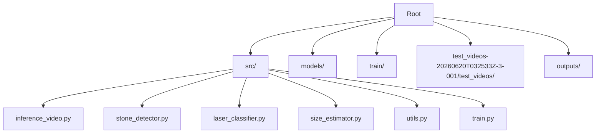
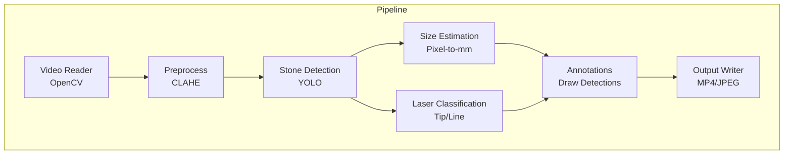
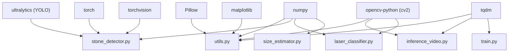

# Installation and Setup

<cite>
**Referenced Files in This Document**
- [requirements.txt](file://requirements.txt)
- [inference_video.py](file://src/inference_video.py)
- [stone_detector.py](file://src/stone_detector.py)
- [laser_classifier.py](file://src/laser_classifier.py)
- [utils.py](file://src/utils.py)
- [size_estimator.py](file://src/size_estimator.py)
- [train.py](file://src/train.py)
</cite>

## Table of Contents
1. [Introduction](#introduction)
2. [Project Structure](#project-structure)
3. [Core Components](#core-components)
4. [Architecture Overview](#architecture-overview)
5. [Detailed Component Analysis](#detailed-component-analysis)
6. [Dependency Analysis](#dependency-analysis)
7. [Performance Considerations](#performance-considerations)
8. [Troubleshooting Guide](#troubleshooting-guide)
9. [Conclusion](#conclusion)
10. [Appendices](#appendices)

## Introduction
This guide provides end-to-end installation and setup instructions for the RIRS system across Windows, Linux, and macOS. It covers Python environment requirements, dependency installation using the provided requirements file, virtual environment setup, GPU acceleration configuration for PyTorch, and OpenCV compilation requirements. It also includes platform-specific steps, verification commands, troubleshooting tips, and version compatibility notes derived from the repository’s dependencies and code.

## Project Structure
The repository is organized around a Python package layout with source modules under src/, model assets under models/, training assets under train/, and test assets under test_videos-20260620T032533Z-3-001/test_videos/. Outputs generated during inference are stored under outputs/.

**Diagram sources**
- [inference_video.py](file://src/inference_video.py)
- [stone_detector.py](file://src/stone_detector.py)
- [laser_classifier.py](file://src/laser_classifier.py)
- [size_estimator.py](file://src/size_estimator.py)
- [utils.py](file://src/utils.py)
- [train.py](file://src/train.py)

**Section sources**
- [inference_video.py](file://src/inference_video.py)
- [stone_detector.py](file://src/stone_detector.py)
- [laser_classifier.py](file://src/laser_classifier.py)
- [size_estimator.py](file://src/size_estimator.py)
- [utils.py](file://src/utils.py)
- [train.py](file://src/train.py)

## Core Components
- Python interpreter and virtual environment: Recommended to isolate dependencies.
- Dependencies pinned in requirements.txt: Ultralytics YOLO, OpenCV, NumPy, PyTorch, TorchVision, Pillow, Matplotlib, and TQDM.
- OpenCV: Required for video I/O, image processing, and drawing utilities.
- PyTorch/TorchVision: Required for YOLO inference and optional training.
- Optional training pipeline: Uses pseudo-labelling and YOLO training routines.

Key runtime assumptions:
- The inference pipeline expects a test video directory and writes outputs to outputs/.
- The stone detector optionally loads fine-tuned weights if present at models/rirs_best.pt.
- The laser classifier and size estimator operate on preprocessed frames.

**Section sources**
- [requirements.txt](file://requirements.txt)
- [inference_video.py](file://src/inference_video.py)
- [stone_detector.py](file://src/stone_detector.py)
- [laser_classifier.py](file://src/laser_classifier.py)
- [utils.py](file://src/utils.py)
- [size_estimator.py](file://src/size_estimator.py)
- [train.py](file://src/train.py)

## Architecture Overview
The RIRS system comprises three primary stages during inference:
1. Preprocess frames using CLAHE.
2. Detect stones using a YOLO-based detector.
3. Estimate sizes and classify laser alignment status.
4. Render annotations and write outputs.

**Diagram sources**
- [inference_video.py](file://src/inference_video.py)
- [utils.py](file://src/utils.py)
- [stone_detector.py](file://src/stone_detector.py)
- [laser_classifier.py](file://src/laser_classifier.py)
- [size_estimator.py](file://src/size_estimator.py)

## Detailed Component Analysis

### Python Environment and Virtual Environment
- Create a dedicated virtual environment to avoid conflicts with system packages.
- Activate the environment before installing dependencies.
- Use a modern Python version compatible with the pinned dependencies.

Verification command:
- python --version

**Section sources**
- [requirements.txt](file://requirements.txt)

### Dependency Installation Using requirements.txt
- Install pinned dependencies from requirements.txt.
- Ensure pip is up to date before installation.
- On some systems, you may need to install build dependencies for OpenCV and PyTorch.

Verification command:
- pip list | grep -E "(ultralytics|opencv-python|torch|torchvision|numpy|pillow|matplotlib|tqdm)"

**Section sources**
- [requirements.txt](file://requirements.txt)

### GPU Acceleration Configuration for PyTorch
- Confirm CUDA availability and driver compatibility.
- Verify device availability in Python using torch.cuda.is_available().
- For training, a CUDA-capable GPU is strongly recommended.

Verification commands:
- python -c "import torch; print(torch.__version__); print('CUDA available:', torch.cuda.is_available())"

Notes:
- The training script explicitly recommends a CUDA GPU for efficient training.
- The inference script runs on CPU, but GPU acceleration improves throughput.

**Section sources**
- [train.py](file://src/train.py)
- [inference_video.py](file://src/inference_video.py)

### OpenCV Compilation Requirements
- The system imports cv2 and uses cv2.VideoCapture, cv2.VideoWriter, and various image processing functions.
- On Linux/macOS, ensure system-level libraries for video codecs and GUI support are installed if you encounter codec-related errors.
- On Windows, prebuilt opencv-python wheels are typically sufficient.

Verification commands:
- python -c "import cv2; print('OpenCV version:', cv2.__version__); cap = cv2.VideoCapture('nonexistent'); print('OpenCV OK')"
- For codec issues, try opening a sample MP4 file with cv2.VideoCapture.

**Section sources**
- [utils.py](file://src/utils.py)
- [inference_video.py](file://src/inference_video.py)

### Platform-Specific Installation Steps

#### Windows
- Install Python from python.org or use a package manager.
- Create and activate a virtual environment.
- Install dependencies from requirements.txt.
- If encountering DLL or codec issues, install Microsoft Visual C++ Redistributable and update graphics drivers.
- For GPU acceleration, install the matching PyTorch version with CUDA support.

Verification commands:
- python --version
- pip list | findstr /i opencv
- python -c "import torch; print('CUDA available:', torch.cuda.is_available())"

#### Linux
- Install Python and pip via your distribution’s package manager.
- Create and activate a virtual environment.
- Install system build tools and OpenCV dependencies (e.g., libsm6, libxext6, libxrender-dev, libglib2.0-0).
- Install dependencies from requirements.txt.
- For GPU acceleration, install PyTorch with the appropriate CUDA toolkit and matching NVIDIA drivers.

Verification commands:
- python --version
- pip list | grep -E "(opencv|torch)"
- python -c "import torch; print('CUDA available:', torch.cuda.is_available())"

#### macOS
- Install Python via python.org or Homebrew.
- Create and activate a virtual environment.
- Install dependencies from requirements.txt.
- For GPU acceleration, Apple Silicon Macs benefit from optimized builds; Intel Macs require compatible CUDA/ROCm configurations.

Verification commands:
- python --version
- pip list | grep -E "(opencv|torch)"
- python -c "import torch; print('CUDA available:', torch.cuda.is_available())"

### Model and Data Preparation
- Place fine-tuned weights at models/rirs_best.pt to enable the detector to load them automatically.
- Prepare training data under train/ and run the training pipeline to generate pseudo-labels and best weights.
- Ensure the test video directory exists and contains MP4 files for inference.

Verification commands:
- ls -la models/rirs_best.pt
- ls -la train/*.jpg train/*.png
- ls -la test_videos-20260620T032533Z-3-001/test_videos/*.mp4

**Section sources**
- [stone_detector.py](file://src/stone_detector.py)
- [train.py](file://src/train.py)
- [inference_video.py](file://src/inference_video.py)

## Dependency Analysis
The system relies on a tight set of scientific and ML libraries. The following diagram maps module-level dependencies inferred from imports and usage.

**Diagram sources**
- [requirements.txt](file://requirements.txt)
- [stone_detector.py](file://src/stone_detector.py)
- [laser_classifier.py](file://src/laser_classifier.py)
- [utils.py](file://src/utils.py)
- [size_estimator.py](file://src/size_estimator.py)
- [inference_video.py](file://src/inference_video.py)
- [train.py](file://src/train.py)

**Section sources**
- [requirements.txt](file://requirements.txt)
- [stone_detector.py](file://src/stone_detector.py)
- [laser_classifier.py](file://src/laser_classifier.py)
- [utils.py](file://src/utils.py)
- [size_estimator.py](file://src/size_estimator.py)
- [inference_video.py](file://src/inference_video.py)
- [train.py](file://src/train.py)

## Performance Considerations
- GPU acceleration: Use CUDA-enabled PyTorch builds for both inference and training to maximize throughput.
- Image preprocessing: CLAHE enhances detection robustness; ensure it runs efficiently on your hardware.
- Video I/O: Choose appropriate codec and container formats supported by your OpenCV build.
- Batch processing: The training pipeline supports configurable batch size; tune for your GPU memory.

[No sources needed since this section provides general guidance]

## Troubleshooting Guide

Common issues and resolutions:
- ImportError: ultralytics or cv2
  - Cause: Missing or incompatible wheel.
  - Resolution: Reinstall from requirements.txt; verify Python interpreter path.
- ModuleNotFoundError for src modules
  - Cause: Working directory not on sys.path when running scripts directly.
  - Resolution: Run scripts from the repository root or ensure src is on PYTHONPATH.
- OpenCV codec errors
  - Cause: Missing codecs or incompatible build.
  - Resolution: Install additional codec packages (Linux/macOS) or use prebuilt wheels (Windows).
- CUDA not detected
  - Cause: Mismatched PyTorch/CUDA versions.
  - Resolution: Match PyTorch installation to your CUDA toolkit version.
- No detections or low-quality outputs
  - Cause: Incorrect model weights or thresholds.
  - Resolution: Verify models/rirs_best.pt exists; adjust detection thresholds in inference_video.py if needed.

Verification commands:
- python -c "from ultralytics import YOLO; print('Ultralytics import OK')"
- python -c "import cv2; cap = cv2.VideoCapture('test_videos-20260620T032533Z-3-001/test_videos/sample.mp4'); print('OpenCV video OK')" 2>/dev/null || echo "Codec issue on Windows"
- python -c "import torch; import torchvision; print('Torch/TorchVision OK')"

**Section sources**
- [requirements.txt](file://requirements.txt)
- [inference_video.py](file://src/inference_video.py)
- [stone_detector.py](file://src/stone_detector.py)
- [laser_classifier.py](file://src/laser_classifier.py)
- [utils.py](file://src/utils.py)
- [size_estimator.py](file://src/size_estimator.py)
- [train.py](file://src/train.py)

## Conclusion
By following this guide, you can install and configure the RIRS system on Windows, Linux, or macOS. Pinpoint dependencies, set up a virtual environment, enable GPU acceleration where applicable, and validate installations with the provided verification commands. Ensure model and data directories are correctly placed to run inference and training seamlessly.

[No sources needed since this section summarizes without analyzing specific files]

## Appendices

### Verification Checklist
- Python interpreter and virtual environment ready.
- Dependencies installed from requirements.txt.
- OpenCV functional with test video file.
- PyTorch detects CUDA if available.
- Model weights present at models/rirs_best.pt.
- Test videos present in test_videos-20260620T032533Z-3-001/test_videos/.
- Outputs directory writable.

**Section sources**
- [requirements.txt](file://requirements.txt)
- [inference_video.py](file://src/inference_video.py)
- [stone_detector.py](file://src/stone_detector.py)
- [laser_classifier.py](file://src/laser_classifier.py)
- [utils.py](file://src/utils.py)
- [size_estimator.py](file://src/size_estimator.py)
- [train.py](file://src/train.py)