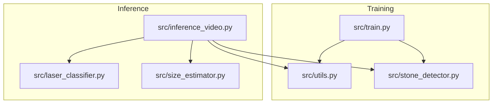
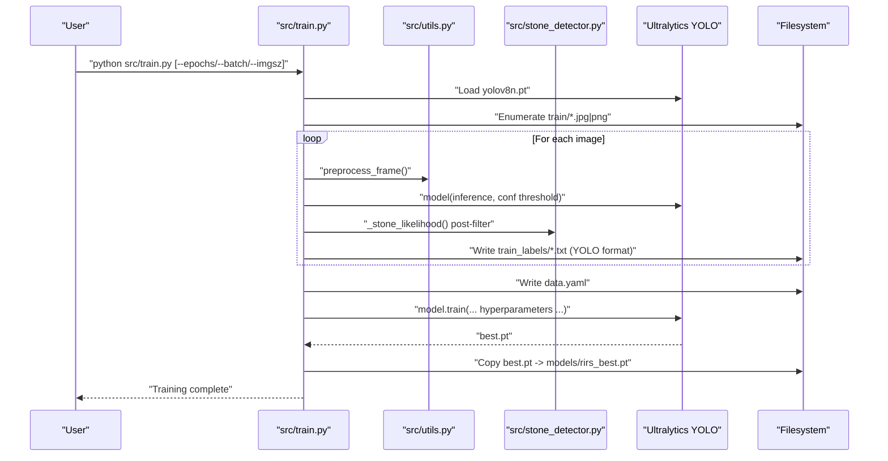
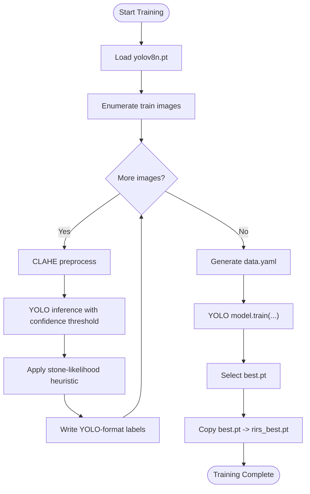
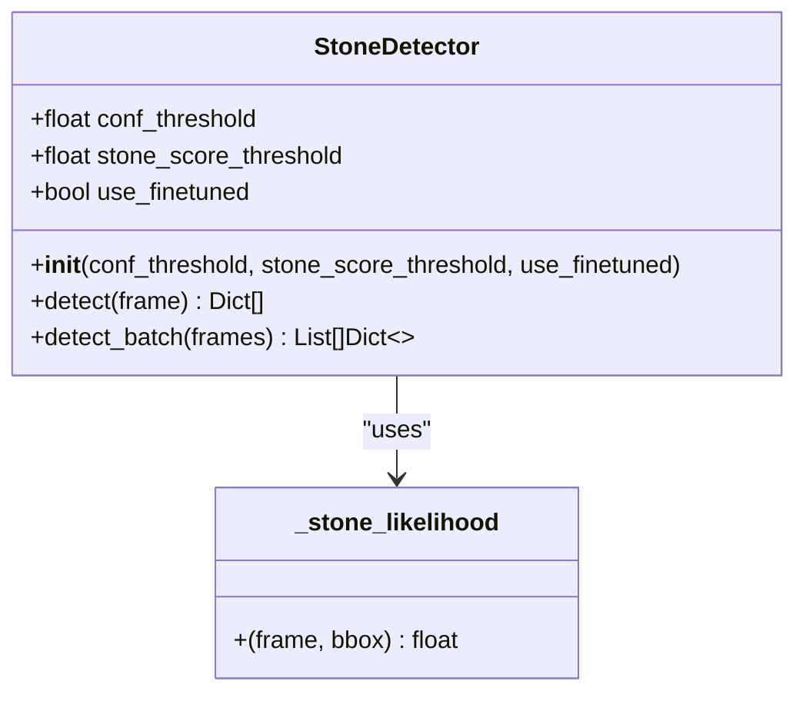
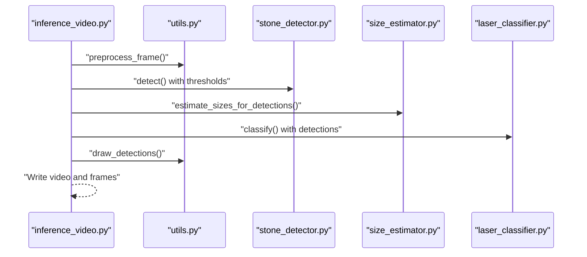
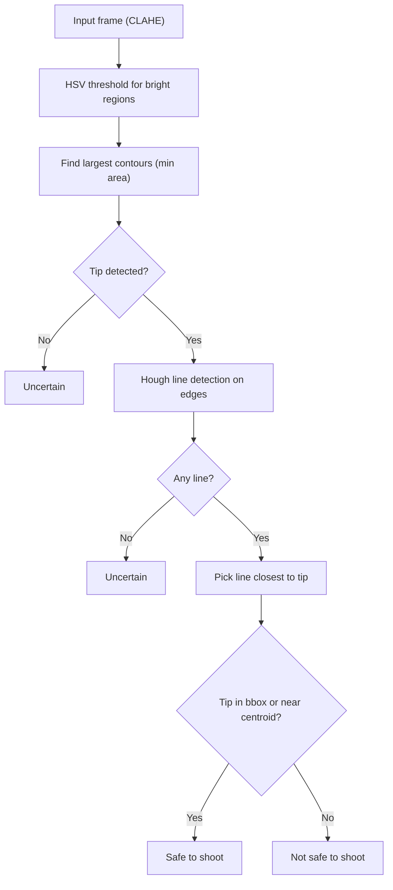
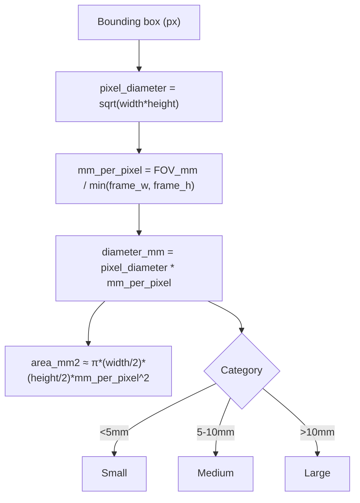
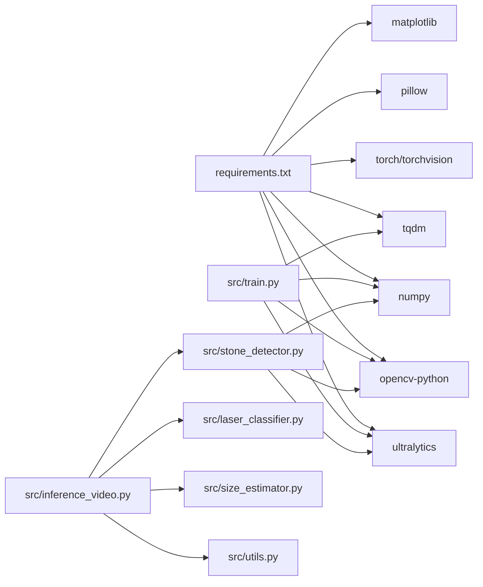

# Model Training and Fine-tuning

<cite>
**Referenced Files in This Document**
- [train.py](file://src/train.py)
- [stone_detector.py](file://src/stone_detector.py)
- [utils.py](file://src/utils.py)
- [inference_video.py](file://src/inference_video.py)
- [laser_classifier.py](file://src/laser_classifier.py)
- [size_estimator.py](file://src/size_estimator.py)
- [requirements.txt](file://requirements.txt)
</cite>

## Table of Contents
1. [Introduction](#introduction)
2. [Project Structure](#project-structure)
3. [Core Components](#core-components)
4. [Architecture Overview](#architecture-overview)
5. [Detailed Component Analysis](#detailed-component-analysis)
6. [Dependency Analysis](#dependency-analysis)
7. [Performance Considerations](#performance-considerations)
8. [Troubleshooting Guide](#troubleshooting-guide)
9. [Conclusion](#conclusion)
10. [Appendices](#appendices)

## Introduction
This document explains the model training and fine-tuning capabilities of RIRS with a focus on pseudo-label generation for unsupervised learning, YOLOv8 training configuration, and dataset preparation requirements. It documents the training pipeline, hyperparameter tuning, validation metrics, and model weight optimization. Guidance is included for preparing custom training datasets, configuring training parameters, evaluating model performance, and performing transfer learning from pre-trained weights with domain adaptation techniques.

## Project Structure
The training and inference pipeline is organized around a small set of focused modules:
- Training module: pseudo-label generation and fine-tuning
- Detection module: YOLOv8-based stone detector with domain adaptation
- Utilities: preprocessing, drawing, and video I/O helpers
- Inference pipeline: end-to-end processing of test videos
- Supporting modules: laser alignment classification and size estimation

**Diagram sources**
- [train.py:1-225](file://src/train.py#L1-L225)
- [stone_detector.py:1-161](file://src/stone_detector.py#L1-L161)
- [utils.py:1-175](file://src/utils.py#L1-L175)
- [inference_video.py:1-250](file://src/inference_video.py#L1-L250)
- [laser_classifier.py:1-224](file://src/laser_classifier.py#L1-L224)
- [size_estimator.py:1-110](file://src/size_estimator.py#L1-L110)

**Section sources**
- [train.py:1-225](file://src/train.py#L1-L225)
- [inference_video.py:1-250](file://src/inference_video.py#L1-L250)

## Core Components
- Pseudo-label generator and trainer: orchestrates unsupervised pseudo-label creation, dataset YAML generation, and YOLOv8 fine-tuning.
- Stone detector: YOLOv8 wrapper with domain-adaptive post-filtering using a custom stone likelihood heuristic.
- Utilities: CLAHE preprocessing, drawing helpers, and video I/O.
- Inference pipeline: end-to-end processing of test videos with detection, size estimation, and laser alignment classification.
- Laser classifier: detects laser tip and line, and classifies safety based on spatial relationships to detected stones.
- Size estimator: converts pixel bounding boxes to clinical size categories.

**Section sources**
- [train.py:1-225](file://src/train.py#L1-L225)
- [stone_detector.py:1-161](file://src/stone_detector.py#L1-L161)
- [utils.py:1-175](file://src/utils.py#L1-L175)
- [inference_video.py:1-250](file://src/inference_video.py#L1-L250)
- [laser_classifier.py:1-224](file://src/laser_classifier.py#L1-L224)
- [size_estimator.py:1-110](file://src/size_estimator.py#L1-L110)

## Architecture Overview
The training pipeline transforms unlabeled images into pseudo-labeled datasets and fine-tunes a YOLOv8 model. The inference pipeline applies the trained model to test videos, estimates sizes, classifies laser alignment, and annotates frames.

**Diagram sources**
- [train.py:61-181](file://src/train.py#L61-L181)
- [utils.py:20-44](file://src/utils.py#L20-L44)
- [stone_detector.py:38-75](file://src/stone_detector.py#L38-L75)

## Detailed Component Analysis

### Pseudo-Label Generation and Fine-Tuning
- Strategy:
  - Run YOLOv8n (COCO pre-trained) over all images in the training folder.
  - Apply CLAHE preprocessing to enhance visibility.
  - Keep detections passing a stone-likelihood heuristic (brightness, compactness, texture).
  - Save pseudo-labeled YOLO-format .txt files in a dedicated labels directory.
  - Generate a data.yaml file for YOLO training.
  - Fine-tune YOLOv8n for a fixed number of epochs using configured hyperparameters.
  - Copy the best weights to a shared location for the inference pipeline.

- Dataset preparation:
  - Place unlabeled training images under a specific training directory.
  - The generator writes pseudo-labels to a corresponding labels directory in YOLO format.
  - A data.yaml file is generated with path, train, val, number of classes, and class names.

- Hyperparameters and training configuration:
  - Optimizer: AdamW
  - Learning rate schedule: initial and final rate scaling
  - Weight decay: L2 regularization
  - Warmup epochs: ramp up learning rate
  - Early stopping: patience-based stopping
  - Augmentations: mosaic, horizontal/vertical flips, rotation, and HSV jitter
  - Batch size, image size, and epochs are configurable via CLI arguments

- Validation and metrics:
  - YOLO training logs and validation metrics are produced during training.
  - The best checkpoint is selected automatically and copied for downstream use.

- Transfer learning and domain adaptation:
  - Uses a pre-trained YOLOv8n model.
  - Applies CLAHE preprocessing to adapt to endoscopic imaging conditions.
  - Employs a custom stone likelihood heuristic to filter detections and improve domain fit.

**Diagram sources**
- [train.py:61-181](file://src/train.py#L61-L181)
- [utils.py:20-44](file://src/utils.py#L20-L44)
- [stone_detector.py:38-75](file://src/stone_detector.py#L38-L75)

**Section sources**
- [train.py:1-225](file://src/train.py#L1-L225)
- [utils.py:20-44](file://src/utils.py#L20-L44)
- [stone_detector.py:38-75](file://src/stone_detector.py#L38-L75)

### Stone Detector with Domain Adaptation
- Purpose: Detect kidney stones using YOLOv8 with a domain-adaptive post-filtering step.
- Behavior:
  - Loads either fine-tuned weights (if present) or the pre-trained base model.
  - Runs inference on CLAHE-enhanced frames.
  - Filters detections using a custom stone likelihood score combining brightness, compactness, and texture.
  - Returns detections sorted by confidence.

- Heuristic scoring:
  - Brightness: mean grayscale intensity normalized to [0,1].
  - Compactness: aspect ratio normalized to [0,1].
  - Texture: local standard deviation normalized to [0,1].
  - Weighted combination produces a final score in [0,1].

**Diagram sources**
- [stone_detector.py:77-161](file://src/stone_detector.py#L77-L161)
- [stone_detector.py:38-75](file://src/stone_detector.py#L38-L75)

**Section sources**
- [stone_detector.py:1-161](file://src/stone_detector.py#L1-L161)

### Inference Pipeline and Evaluation
- Pipeline stages per frame:
  - Read frame.
  - CLAHE preprocessing.
  - Stone detection with confidence thresholding and heuristic filtering.
  - Size estimation for each detection.
  - Laser alignment classification (safe/not safe/uncertain).
  - Draw annotations and write output video and sampled frames.
- Outputs:
  - Annotated frames and videos.
  - Summary JSON with frame counts, detection totals, and size distributions.

**Diagram sources**
- [inference_video.py:59-202](file://src/inference_video.py#L59-L202)
- [utils.py:79-161](file://src/utils.py#L79-L161)
- [stone_detector.py:111-161](file://src/stone_detector.py#L111-L161)
- [size_estimator.py:95-110](file://src/size_estimator.py#L95-L110)
- [laser_classifier.py:181-224](file://src/laser_classifier.py#L181-L224)

**Section sources**
- [inference_video.py:1-250](file://src/inference_video.py#L1-L250)
- [utils.py:79-161](file://src/utils.py#L79-L161)
- [size_estimator.py:32-92](file://src/size_estimator.py#L32-L92)
- [laser_classifier.py:160-224](file://src/laser_classifier.py#L160-L224)

### Laser Alignment Classification
- Detection strategy:
  - Bright-region detection in HSV colorspace to locate the laser tip.
  - Hough probabilistic line detection to find the dominant laser line.
- Safety classification:
  - Safe if the tip is inside a stone bbox or within a proximity threshold of the stone centroid.
  - Not safe if a line is detected but aimed elsewhere.
  - Uncertain if no laser is detected or if no stones are visible.

**Diagram sources**
- [laser_classifier.py:60-134](file://src/laser_classifier.py#L60-L134)
- [laser_classifier.py:181-224](file://src/laser_classifier.py#L181-L224)

**Section sources**
- [laser_classifier.py:1-224](file://src/laser_classifier.py#L1-L224)

### Size Estimation
- Method:
  - Estimate diameter from geometric mean of bbox width and height.
  - Calibrate using a known field-of-view diameter at a typical working distance.
  - Compute area assuming an elliptical approximation.
  - Assign clinical categories for treatment planning.

**Diagram sources**
- [size_estimator.py:32-92](file://src/size_estimator.py#L32-L92)

**Section sources**
- [size_estimator.py:1-110](file://src/size_estimator.py#L1-L110)

## Dependency Analysis
- External libraries:
  - Ultralytics YOLO for object detection and training.
  - OpenCV for image processing and video I/O.
  - NumPy for numerical computations.
  - Torch/TorchVision for deep learning backend.
  - Matplotlib and Pillow for plotting and image handling.
  - TQDM for progress bars.

- Internal dependencies:
  - Training module depends on utilities for preprocessing and on the stone detector’s heuristic for filtering.
  - Inference pipeline composes utilities, detector, size estimator, and laser classifier.

**Diagram sources**
- [requirements.txt:1-9](file://requirements.txt#L1-L9)
- [train.py:36-36](file://src/train.py#L36-L36)
- [stone_detector.py:24-24](file://src/stone_detector.py#L24-L24)
- [inference_video.py:39-41](file://src/inference_video.py#L39-L41)

**Section sources**
- [requirements.txt:1-9](file://requirements.txt#L1-L9)
- [train.py:36-36](file://src/train.py#L36-L36)
- [stone_detector.py:24-24](file://src/stone_detector.py#L24-L24)
- [inference_video.py:39-41](file://src/inference_video.py#L39-L41)

## Performance Considerations
- Hardware:
  - Training is significantly faster with a CUDA GPU; CPU-only training is possible but slow.
- Preprocessing:
  - CLAHE enhances visibility in dark/murky endoscopic frames, improving detection quality.
- Training configuration:
  - Early stopping prevents overfitting.
  - Augmentations increase robustness to scope angle variations and lighting.
  - Warmup and scheduler improve convergence stability.
- Inference:
  - Confidence and heuristic thresholds control false positives and runtime.
  - Saving every Nth frame reduces output volume while preserving diagnostics.

[No sources needed since this section provides general guidance]

## Troubleshooting Guide
- No images found in training directory:
  - Ensure training images are placed in the expected directory and are readable.
- Pseudo-label generation skipped:
  - Use the skip flag only when existing pseudo-labels are ready.
- data.yaml missing:
  - The training script generates it automatically; verify filesystem permissions.
- Best weights not found:
  - Confirm training completed successfully and best.pt was produced.
- Inference errors:
  - Verify model weights exist and are loadable.
  - Check video directory paths and file availability.

**Section sources**
- [train.py:73-76](file://src/train.py#L73-L76)
- [train.py:178-180](file://src/train.py#L178-L180)
- [inference_video.py:210-218](file://src/inference_video.py#L210-L218)

## Conclusion
RIRS implements a robust unsupervised training pipeline leveraging pseudo-labels and domain adaptation to fine-tune YOLOv8 for kidney stone detection in RIRS endoscopic videos. The approach combines CLAHE preprocessing, a custom stone likelihood heuristic, and careful hyperparameter tuning to produce reliable models suitable for real-time inference. The inference pipeline integrates detection, size estimation, and laser alignment classification to support clinical decision-making.

[No sources needed since this section summarizes without analyzing specific files]

## Appendices

### Dataset Preparation Checklist
- Prepare unlabeled training images in the designated training directory.
- Ensure images are in JPG or PNG format.
- Optionally, prepare existing pseudo-labels if skipping generation.
- Confirm sufficient GPU memory for training; otherwise reduce batch size or image size.

**Section sources**
- [train.py:49-51](file://src/train.py#L49-L51)
- [train.py:70-71](file://src/train.py#L70-L71)

### Training Parameters Reference
- CLI arguments:
  - Epochs, batch size, image size, and skip pseudo-label generation flag.
- Hyperparameters:
  - Optimizer, learning rate schedule, weight decay, warmup epochs, early stopping patience.
  - Augmentations: mosaic, flips, rotation, HSV jitter.
- Data configuration:
  - Path, train and validation sets, number of classes, and class names.

**Section sources**
- [train.py:183-193](file://src/train.py#L183-L193)
- [train.py:148-170](file://src/train.py#L148-L170)
- [train.py:125-136](file://src/train.py#L125-L136)

### Evaluation Metrics and Outputs
- Training:
  - Automatic validation metrics and best checkpoint selection.
- Inference:
  - Summary JSON with frame counts, detection totals, size distribution, and laser status counts.
- Outputs:
  - Annotated videos and sampled frames for review.

**Section sources**
- [train.py:172-180](file://src/train.py#L172-L180)
- [inference_video.py:98-108](file://src/inference_video.py#L98-L108)
- [inference_video.py:189-199](file://src/inference_video.py#L189-L199)