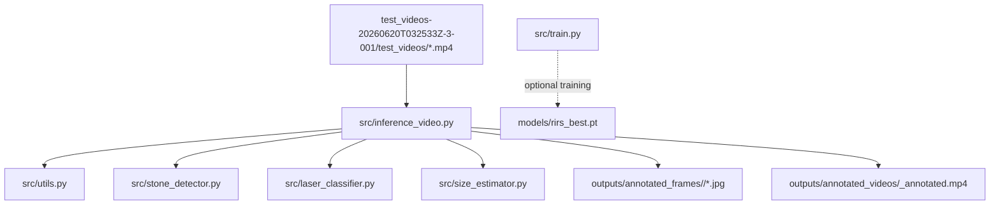
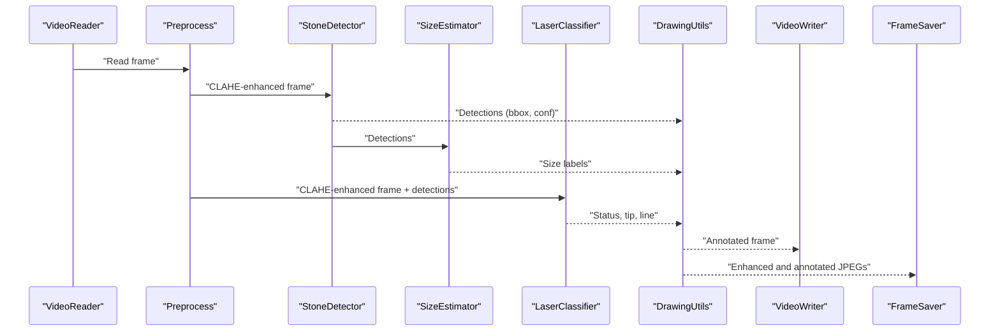
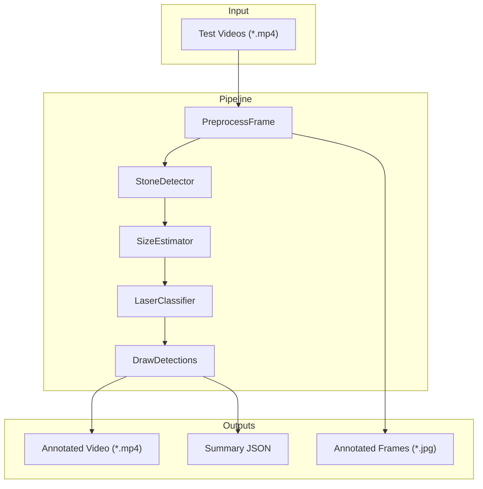
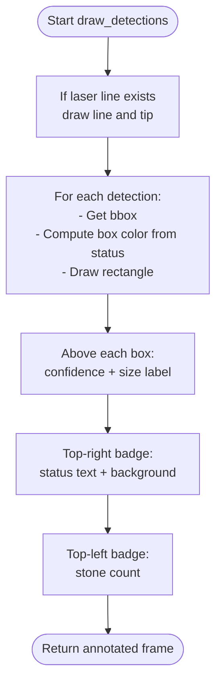
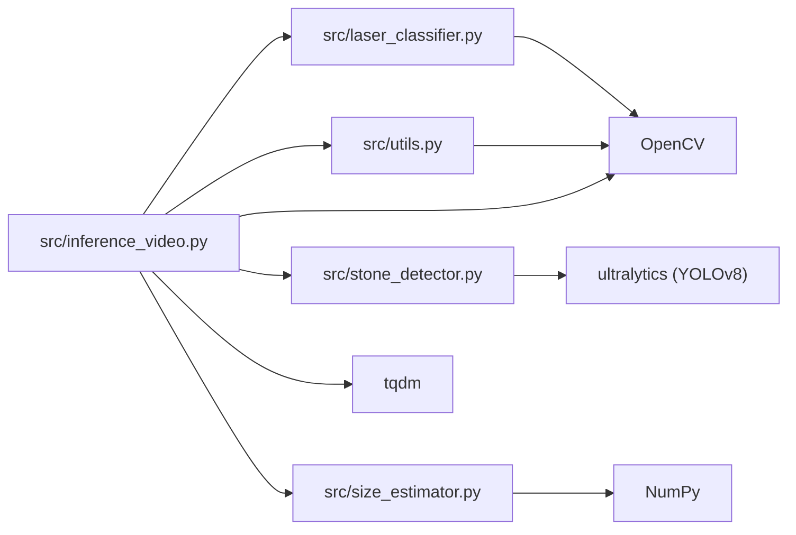

# Output and Visualization

<cite>
**Referenced Files in This Document**
- [inference_video.py](file://src/inference_video.py)
- [utils.py](file://src/utils.py)
- [stone_detector.py](file://src/stone_detector.py)
- [laser_classifier.py](file://src/laser_classifier.py)
- [size_estimator.py](file://src/size_estimator.py)
- [train.py](file://src/train.py)
- [requirements.txt](file://requirements.txt)
</cite>

## Table of Contents
1. [Introduction](#introduction)
2. [Project Structure](#project-structure)
3. [Core Components](#core-components)
4. [Architecture Overview](#architecture-overview)
5. [Detailed Component Analysis](#detailed-component-analysis)
6. [Dependency Analysis](#dependency-analysis)
7. [Performance Considerations](#performance-considerations)
8. [Troubleshooting Guide](#troubleshooting-guide)
9. [Conclusion](#conclusion)
10. [Appendices](#appendices)

## Introduction
This document explains the RIRS output generation and visualization system. It covers how annotated frames and videos are produced, how detection overlays are drawn, how safety status indicators are rendered, and how statistical summaries are generated. It also documents the supported output formats, interpretation guidelines for safety classifications, size measurements, and detection confidence scores, and provides customization options for annotation styles and visualization parameters.

## Project Structure
The output and visualization pipeline centers around a single end-to-end script that processes test videos, runs detection and classification, draws overlays, and writes outputs. Supporting modules encapsulate preprocessing, drawing, detection, classification, and sizing.

**Diagram sources**
- [inference_video.py:1-250](file://src/inference_video.py#L1-L250)
- [utils.py:1-175](file://src/utils.py#L1-L175)
- [stone_detector.py:1-161](file://src/stone_detector.py#L1-L161)
- [laser_classifier.py:1-224](file://src/laser_classifier.py#L1-L224)
- [size_estimator.py:1-110](file://src/size_estimator.py#L1-L110)
- [train.py:1-225](file://src/train.py#L1-L225)

**Section sources**
- [inference_video.py:1-250](file://src/inference_video.py#L1-L250)
- [utils.py:1-175](file://src/utils.py#L1-L175)
- [stone_detector.py:1-161](file://src/stone_detector.py#L1-L161)
- [laser_classifier.py:1-224](file://src/laser_classifier.py#L1-L224)
- [size_estimator.py:1-110](file://src/size_estimator.py#L1-L110)
- [train.py:1-225](file://src/train.py#L1-L225)

## Core Components
- Inference orchestrator: reads videos, manages per-frame pipeline, writes annotated outputs, and aggregates statistics.
- Drawing utilities: CLAHE preprocessing, bounding box and label rendering, badge overlays, and video writer creation.
- Detection module: YOLOv8-based stone detection with a custom likelihood filter.
- Classification module: laser alignment classifier returning safe/not safe/uncertain with optional line/tip visualization.
- Sizing module: converts pixel bounding boxes to millimetre estimates and categories.

Key outputs:
- Annotated frames: JPEGs saved periodically during processing.
- Annotated videos: MP4 video streams with overlays.
- Statistical summaries: JSON containing counts and logs.

**Section sources**
- [inference_video.py:59-201](file://src/inference_video.py#L59-L201)
- [utils.py:20-175](file://src/utils.py#L20-L175)
- [stone_detector.py:77-161](file://src/stone_detector.py#L77-L161)
- [laser_classifier.py:160-224](file://src/laser_classifier.py#L160-L224)
- [size_estimator.py:32-110](file://src/size_estimator.py#L32-L110)

## Architecture Overview
The pipeline processes each frame through a deterministic sequence of steps, producing overlays and outputs.

**Diagram sources**
- [inference_video.py:113-141](file://src/inference_video.py#L113-L141)
- [utils.py:20-175](file://src/utils.py#L20-L175)
- [stone_detector.py:111-156](file://src/stone_detector.py#L111-L156)
- [size_estimator.py:95-110](file://src/size_estimator.py#L95-L110)
- [laser_classifier.py:181-223](file://src/laser_classifier.py#L181-L223)

## Detailed Component Analysis

### Inference Orchestrator
Responsibilities:
- Discovers test videos and ensures output directories exist.
- Initializes shared models and iterates frames with progress tracking.
- Executes the full pipeline per frame: preprocessing, detection, sizing, classification, overlay drawing, and writing outputs.
- Aggregates statistics per video and writes a JSON summary.

Outputs:
- Periodic annotated JPEGs (pre- and post-processing).
- Annotated MP4 video.
- JSON summary with counts and logs.

Customization hooks:
- Frame sampling interval for JPEGs.
- Detection thresholds for stone and confidence.
- Output directories and video codec.

**Section sources**
- [inference_video.py:47-57](file://src/inference_video.py#L47-L57)
- [inference_video.py:59-201](file://src/inference_video.py#L59-L201)
- [inference_video.py:204-249](file://src/inference_video.py#L204-L249)

### Drawing Utilities
Responsibilities:
- CLAHE preprocessing to enhance visibility.
- Overlay drawing: bounding boxes, confidence and size labels, laser line/tip, top badges for laser status and stone count.
- Saving individual frames and creating video writers.

Annotation overlay techniques:
- Bounding boxes adopt the laser status color when available; otherwise default cyan.
- Text labels include detection confidence and size category.
- Laser line drawn as a line plus a circle at the tip; status badge placed in the top-right; stone count badge in the top-left.

Visualization parameters:
- Font scale, thickness, and background color for labels.
- Badge placement and padding.

**Section sources**
- [utils.py:20-44](file://src/utils.py#L20-L44)
- [utils.py:79-162](file://src/utils.py#L79-L162)
- [utils.py:164-175](file://src/utils.py#L164-L175)

### Stone Detection
Responsibilities:
- Runs YOLOv8 inference on CLAHE-enhanced frames.
- Applies a custom stone likelihood heuristic combining brightness, compactness, and texture.
- Filters detections below a configurable threshold and sorts by confidence.

Output:
- List of detections with bounding boxes, confidence, class ID, and heuristic score.

Customization:
- Confidence threshold and stone likelihood threshold.
- Choice of pretrained or finetuned weights.

**Section sources**
- [stone_detector.py:77-161](file://src/stone_detector.py#L77-L161)
- [stone_detector.py:38-75](file://src/stone_detector.py#L38-L75)

### Laser Alignment Classification
Responsibilities:
- Detects laser tip via HSV thresholding and morphological cleaning.
- Detects laser line via Canny edge and Hough probabilistic transform.
- Determines safety status by checking whether the tip is inside a stone or within proximity to any stone centroid; if no laser detected, returns uncertain.

Output:
- Status string, optional tip coordinates, optional line segment.

Customization:
- HSV thresholds, minimum bright area, Hough parameters, proximity factor.

Interpretation:
- safe_to_shoot: laser tip is on or near a stone.
- not_safe_to_shoot: laser visible but not aimed at a stone.
- uncertain: no laser detected or insufficient cues.

**Section sources**
- [laser_classifier.py:60-134](file://src/laser_classifier.py#L60-L134)
- [laser_classifier.py:181-224](file://src/laser_classifier.py#L181-L224)

### Size Estimation
Responsibilities:
- Estimates stone diameter and area from pixel bounding boxes using a calibrated field-of-view assumption.
- Assigns clinical size categories.

Output:
- Diameter in mm, area in mm², category, human-readable label, and calibration factor.

Interpretation:
- Categories align with treatment planning: small (<5 mm), medium (5–10 mm), large (>10 mm).

**Section sources**
- [size_estimator.py:32-93](file://src/size_estimator.py#L32-L93)
- [size_estimator.py:95-110](file://src/size_estimator.py#L95-L110)

### Training Integration (Optional)
While not part of the inference output pipeline, training can produce improved weights used by the inference stage.

Highlights:
- Pseudo-label generation using YOLOv8 on training images with CLAHE preprocessing and a stone likelihood gate.
- Writes a data.yaml for training.
- Fine-tunes YOLOv8n and copies best weights for inference.

**Section sources**
- [train.py:61-123](file://src/train.py#L61-L123)
- [train.py:125-137](file://src/train.py#L125-L137)
- [train.py:139-181](file://src/train.py#L139-L181)

## Architecture Overview

**Diagram sources**
- [inference_video.py:113-141](file://src/inference_video.py#L113-L141)
- [utils.py:20-175](file://src/utils.py#L20-L175)
- [stone_detector.py:111-156](file://src/stone_detector.py#L111-L156)
- [size_estimator.py:95-110](file://src/size_estimator.py#L95-L110)
- [laser_classifier.py:181-223](file://src/laser_classifier.py#L181-L223)

## Detailed Component Analysis

### Annotation Overlay Techniques
Overlay drawing combines:
- Bounding boxes colored by laser status.
- Confidence and size labels above each box.
- Optional laser line and tip marker.
- Top-right status badge and top-left stone count badge.

**Diagram sources**
- [utils.py:79-162](file://src/utils.py#L79-L162)

**Section sources**
- [utils.py:79-162](file://src/utils.py#L79-L162)

### Bounding Box Drawing Functions
- Rectangle drawing with dynamic color based on laser status.
- Text background rectangles for readability.
- Consistent font scaling and anti-aliased text.

Parameters:
- Thickness, font scale, and background color are centralized for consistency.

**Section sources**
- [utils.py:107-161](file://src/utils.py#L107-L161)

### Safety Status Indicators
- Laser status mapped to colors: safe, not safe, uncertain.
- Badge overlays positioned for visibility without occluding detections.
- Tip and line overlays provide spatial context for alignment.

Interpretation:
- safe_to_shoot: proceed with lithotripsy.
- not_safe_to_shoot: reposition laser.
- uncertain: insufficient evidence to decide.

**Section sources**
- [utils.py:46-54](file://src/utils.py#L46-L54)
- [laser_classifier.py:181-224](file://src/laser_classifier.py#L181-L224)

### Video Output Generation
- Annotated frames written to a VideoWriter configured with MP4 codec and target resolution/FPS.
- Codec and quality controlled centrally.

**Section sources**
- [inference_video.py:94-95](file://src/inference_video.py#L94-L95)
- [inference_video.py](file://src/inference_video.py#L141)
- [utils.py:169-175](file://src/utils.py#L169-L175)

### Statistical Reports
Aggregated metrics include:
- Total frames, frames with detections, total detections.
- Laser safety tallies (safe, not safe, uncertain).
- Size distribution across categories.
- Per-frame log entries (sampled) for downstream analysis.

JSON structure:
- Fields for video metadata, counts, distributions, and sampled per-frame records.

**Section sources**
- [inference_video.py:98-108](file://src/inference_video.py#L98-L108)
- [inference_video.py:150-178](file://src/inference_video.py#L150-L178)
- [inference_video.py:190-193](file://src/inference_video.py#L190-L193)

### Interpretation Guidelines
Safety classifications:
- safe_to_shoot: laser tip is inside or within proximity of a stone.
- not_safe_to_shoot: laser visible but not aligned with any detected stone.
- uncertain: no laser detected or insufficient cues.

Size measurements:
- Diameter and area derived from pixel bounding boxes using calibrated FOV.
- Categories:
  - Small (<5 mm)
  - Medium (5–10 mm)
  - Large (>10 mm)

Confidence scores:
- Detection confidence from YOLOv8; combined with heuristic score for filtering.

**Section sources**
- [laser_classifier.py:181-224](file://src/laser_classifier.py#L181-L224)
- [size_estimator.py:32-93](file://src/size_estimator.py#L32-L93)
- [stone_detector.py:111-156](file://src/stone_detector.py#L111-L156)

### Customization Options
Annotation styles and visualization parameters:
- Colors for statuses and overlays.
- Text font scale and thickness.
- Badge placement and padding.
- Frame saving interval.

Detection thresholds:
- YOLO confidence threshold.
- Stone likelihood threshold.

Classification thresholds:
- HSV thresholds, minimum bright area, Hough parameters, proximity factor.

Weights selection:
- Pretrained vs. finetuned YOLOv8 weights.

Training-driven improvements:
- Pseudo-labeled dataset generation and fine-tuning.

**Section sources**
- [utils.py:13-17](file://src/utils.py#L13-L17)
- [utils.py:64-77](file://src/utils.py#L64-L77)
- [inference_video.py:55-56](file://src/inference_video.py#L55-L56)
- [stone_detector.py:92-108](file://src/stone_detector.py#L92-L108)
- [laser_classifier.py:46-58](file://src/laser_classifier.py#L46-L58)
- [laser_classifier.py:173-179](file://src/laser_classifier.py#L173-L179)
- [train.py:55-58](file://src/train.py#L55-L58)

## Dependency Analysis

**Diagram sources**
- [requirements.txt:1-9](file://requirements.txt#L1-L9)
- [inference_video.py:38-41](file://src/inference_video.py#L38-L41)
- [stone_detector.py:24-24](file://src/stone_detector.py#L24-L24)
- [laser_classifier.py:39-40](file://src/laser_classifier.py#L39-L40)
- [size_estimator.py:22-22](file://src/size_estimator.py#L22-L22)
- [utils.py:5-7](file://src/utils.py#L5-L7)

**Section sources**
- [requirements.txt:1-9](file://requirements.txt#L1-L9)
- [inference_video.py:38-41](file://src/inference_video.py#L38-L41)
- [stone_detector.py:24-24](file://src/stone_detector.py#L24-L24)
- [laser_classifier.py:39-40](file://src/laser_classifier.py#L39-L40)
- [size_estimator.py:22-22](file://src/size_estimator.py#L22-L22)
- [utils.py:5-7](file://src/utils.py#L5-L7)

## Performance Considerations
- Video I/O and codec choice impact throughput; MP4V is selected for compatibility.
- CLAHE preprocessing improves detection robustness but adds compute overhead.
- Sampling frames for JPEG outputs reduces storage and speeds up inspection.
- Using GPU-accelerated YOLOv8 and OpenCV builds is recommended for training and inference.

[No sources needed since this section provides general guidance]

## Troubleshooting Guide
Common issues and resolutions:
- Cannot open video: verify path and file integrity.
- No detections: lower confidence or stone likelihood thresholds; ensure CLAHE preprocessing is applied.
- Misaligned safety status: adjust proximity factor and Hough parameters; confirm detections are present.
- Missing outputs: check output directories exist and permissions; ensure codec support.
- Slow inference: enable GPU acceleration; reduce frame sampling rate.

**Section sources**
- [inference_video.py:80-82](file://src/inference_video.py#L80-L82)
- [inference_video.py:55-56](file://src/inference_video.py#L55-L56)
- [laser_classifier.py:46-58](file://src/laser_classifier.py#L46-L58)
- [utils.py:169-175](file://src/utils.py#L169-L175)

## Conclusion
The RIRS output and visualization system integrates preprocessing, detection, sizing, and classification into a cohesive pipeline that generates annotated frames, videos, and statistical summaries. Its modular design enables straightforward customization of thresholds, colors, and visualization parameters, supporting reliable interpretation of safety classifications, size measurements, and detection confidence.

[No sources needed since this section summarizes without analyzing specific files]

## Appendices

### Output Formats and Locations
- Annotated frames: JPEGs saved under outputs/annotated_frames/<video_stem>/ with pre_frame and post_frame prefixes.
- Annotated videos: MP4 files under outputs/annotated_videos/<video_stem>_annotated.mp4.
- Statistical reports: JSON summary under outputs/annotated_frames/<video_stem>/summary.json.

**Section sources**
- [inference_video.py:9-11](file://src/inference_video.py#L9-L11)
- [inference_video.py:144-148](file://src/inference_video.py#L144-L148)
- [inference_video.py:190-193](file://src/inference_video.py#L190-L193)