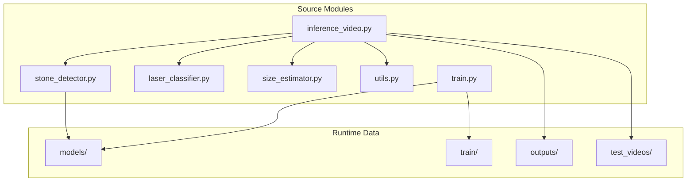
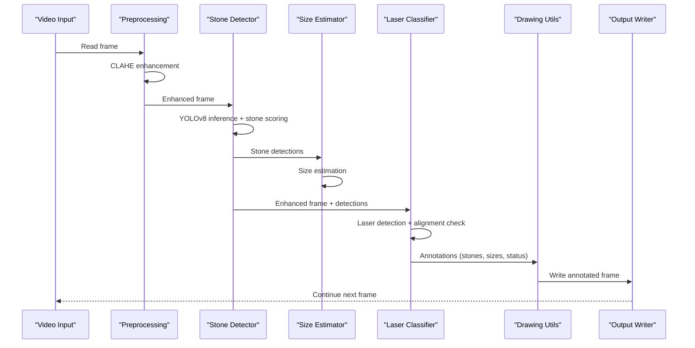
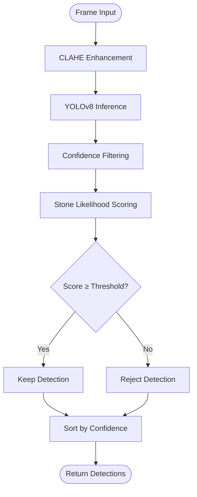
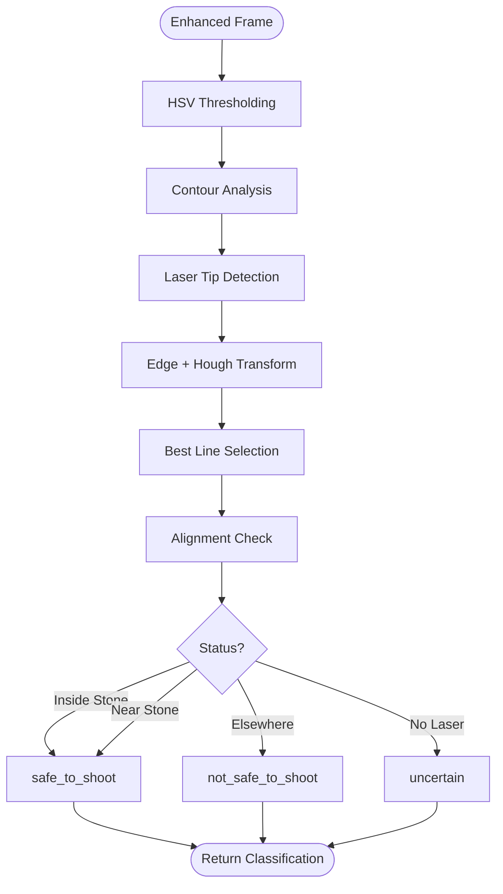
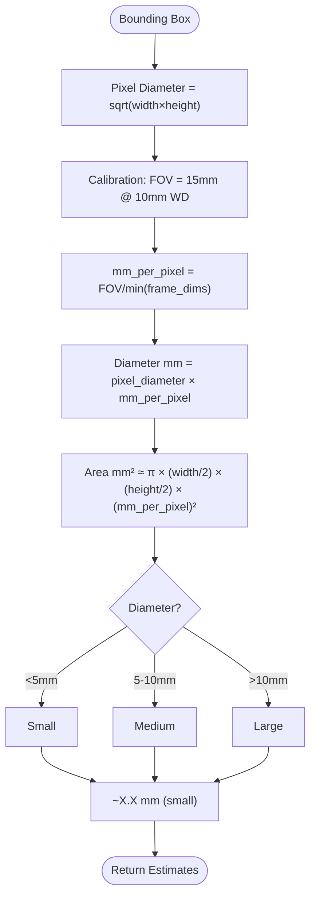
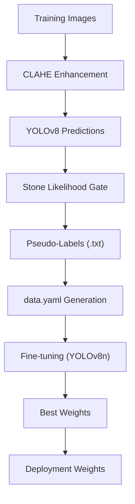
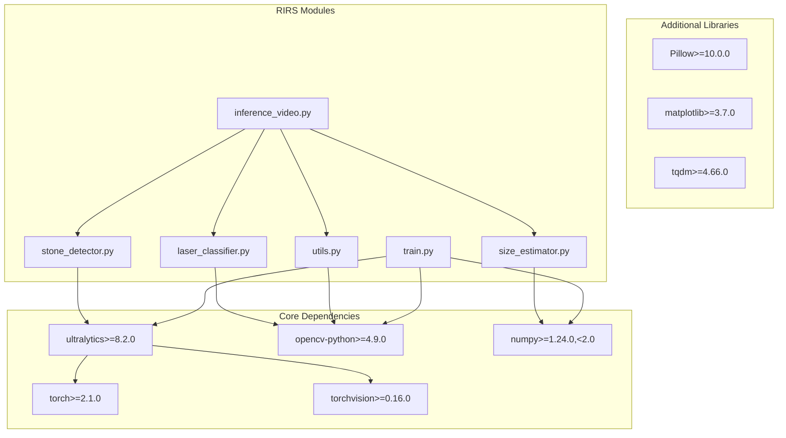

# Project Overview

<cite>
**Referenced Files in This Document**
- [inference_video.py](file://src/inference_video.py)
- [stone_detector.py](file://src/stone_detector.py)
- [laser_classifier.py](file://src/laser_classifier.py)
- [size_estimator.py](file://src/size_estimator.py)
- [utils.py](file://src/utils.py)
- [train.py](file://src/train.py)
- [requirements.txt](file://requirements.txt)
</cite>

## Table of Contents
1. [Introduction](#introduction)
2. [Project Structure](#project-structure)
3. [Core Components](#core-components)
4. [Architecture Overview](#architecture-overview)
5. [Detailed Component Analysis](#detailed-component-analysis)
6. [Dependency Analysis](#dependency-analysis)
7. [Performance Considerations](#performance-considerations)
8. [Troubleshooting Guide](#troubleshooting-guide)
9. [Conclusion](#conclusion)

## Introduction
RIRS (Robotic Lithotripsy Intelligent Assistant) is an AI-powered computer vision system designed to assist urologists during robotic lithotripsy procedures. The system operates in real-time on endoscopic video streams to support precision and safety in laser lithotripsy, a minimally invasive technique used to fragment kidney stones using focused laser energy.

Key clinical goals:
- Detect kidney stones in real-time to guide laser targeting
- Assess laser fiber alignment safety to prevent unintended tissue damage
- Provide automated video annotation for procedural review and education
- Estimate stone sizes to inform treatment planning

The system combines YOLOv8 object detection with domain-adapted heuristics and specialized laser classification algorithms to operate effectively under the challenging conditions of endoscopic imaging (low-light, motion blur, and limited field of view).

## Project Structure
The repository is organized around a modular Python package structure with clear separation of concerns:
- src/: Core computer vision pipeline modules
- models/: Trained model weights (YOLOv8 fine-tuned)
- outputs/: Generated annotated frames and videos
- train/: Training assets and pseudo-labeled datasets
- test_videos/: Input test videos for inference
- requirements.txt: Python dependencies

**Diagram sources**
- [inference_video.py:1-250](file://src/inference_video.py#L1-L250)
- [stone_detector.py:1-161](file://src/stone_detector.py#L1-L161)
- [laser_classifier.py:1-224](file://src/laser_classifier.py#L1-L224)
- [size_estimator.py:1-110](file://src/size_estimator.py#L1-L110)
- [utils.py:1-175](file://src/utils.py#L1-L175)
- [train.py:1-225](file://src/train.py#L1-L225)

**Section sources**
- [inference_video.py:1-250](file://src/inference_video.py#L1-L250)
- [requirements.txt:1-9](file://requirements.txt#L1-L9)

## Core Components
The system comprises five primary components that collaborate to deliver real-time assistance during robotic lithotripsy:

### Stone Detection Module
Implements a YOLOv8-based detector with domain adaptation:
- Uses CLAHE preprocessing to enhance visibility in endoscopic conditions
- Applies a custom stone-likelihood scoring function considering brightness, compactness, and texture
- Supports both pre-trained and fine-tuned weights for improved accuracy

### Laser Classification Module
Performs real-time assessment of laser fiber alignment safety:
- Combines HSV thresholding for bright regions with Hough line detection
- Determines whether the laser is aimed at stones, nearby, or misaligned
- Provides three-class classification: safe, not safe, or uncertain

### Size Estimation Module
Provides clinical size categorization for detected stones:
- Calibrates using standard flexible ureteroscope field-of-view assumptions
- Computes diameter estimates and categorizes stones into small, medium, or large
- Supplies human-readable labels for procedural documentation

### Utility Functions
Supports preprocessing, visualization, and video I/O:
- CLAHE enhancement for endoscopic frame improvement
- Drawing functions for annotations and status badges
- Video writer creation and frame saving utilities

### Training Pipeline
Enables pseudo-supervised fine-tuning:
- Generates pseudo-labels from pre-trained YOLOv8 predictions
- Applies stone-likelihood heuristics to filter reliable detections
- Produces fine-tuned weights for deployment

**Section sources**
- [stone_detector.py:77-161](file://src/stone_detector.py#L77-L161)
- [laser_classifier.py:160-224](file://src/laser_classifier.py#L160-L224)
- [size_estimator.py:32-110](file://src/size_estimator.py#L32-L110)
- [utils.py:20-175](file://src/utils.py#L20-L175)
- [train.py:61-225](file://src/train.py#L61-L225)

## Architecture Overview
The RIRS pipeline processes endoscopic video in real-time through a series of coordinated stages:

**Diagram sources**
- [inference_video.py:59-202](file://src/inference_video.py#L59-L202)
- [utils.py:20-175](file://src/utils.py#L20-L175)
- [stone_detector.py:111-161](file://src/stone_detector.py#L111-L161)
- [size_estimator.py:95-110](file://src/size_estimator.py#L95-L110)
- [laser_classifier.py:181-224](file://src/laser_classifier.py#L181-L224)

The architecture emphasizes:
- Real-time processing with configurable frame sampling
- Robust detection under endoscopic constraints
- Safety-critical laser alignment assessment
- Comprehensive procedural annotation for review

**Section sources**
- [inference_video.py:13-20](file://src/inference_video.py#L13-L20)
- [inference_video.py:59-202](file://src/inference_video.py#L59-L202)

## Detailed Component Analysis

### Stone Detection Algorithm
The stone detection module implements a hybrid approach combining deep learning with domain-specific heuristics:

**Diagram sources**
- [stone_detector.py:38-156](file://src/stone_detector.py#L38-L156)

Key design decisions:
- Stone likelihood scoring considers three visual cues: brightness contrast, geometric compactness, and surface texture
- The system prioritizes sensitivity over specificity to minimize missed stones
- Fine-tuned weights are automatically selected when available

**Section sources**
- [stone_detector.py:38-156](file://src/stone_detector.py#L38-L156)

### Laser Classification Logic
The laser classifier employs complementary detection strategies:

**Diagram sources**
- [laser_classifier.py:60-224](file://src/laser_classifier.py#L60-L224)

Safety-critical features:
- Dual-modality detection (bright region + line geometry)
- Proximity-based assessment using bounding box diagonals
- Configurable thresholds for clinical adaptability

**Section sources**
- [laser_classifier.py:60-224](file://src/laser_classifier.py#L60-L224)

### Size Estimation Methodology
Size estimation relies on calibrated field-of-view assumptions:

**Diagram sources**
- [size_estimator.py:32-92](file://src/size_estimator.py#L32-L92)

Clinical relevance:
- Categories align with standard urological treatment planning
- Provides immediate feedback for procedural decision-making
- Supports quality assurance and outcome tracking

**Section sources**
- [size_estimator.py:32-92](file://src/size_estimator.py#L32-L92)

### Training Pipeline
The pseudo-supervised training approach enables model adaptation without manual annotations:

**Diagram sources**
- [train.py:61-181](file://src/train.py#L61-L181)

Methodological advantages:
- Leverages domain knowledge through heuristics
- Reduces reliance on expensive manual labeling
- Enables continuous improvement with new data

**Section sources**
- [train.py:61-181](file://src/train.py#L61-L181)

## Dependency Analysis
The system maintains minimal external dependencies while leveraging mature computer vision libraries:

**Diagram sources**
- [requirements.txt:1-9](file://requirements.txt#L1-L9)
- [inference_video.py:38-41](file://src/inference_video.py#L38-L41)
- [train.py:36-46](file://src/train.py#L36-L46)

Dependency characteristics:
- Deep learning framework (Ultralytics YOLO) provides robust object detection
- OpenCV handles all computer vision operations efficiently
- NumPy ensures numerical stability for geometric calculations
- Additional libraries support development workflow and visualization

**Section sources**
- [requirements.txt:1-9](file://requirements.txt#L1-L9)

## Performance Considerations
Real-time operation requires careful optimization across multiple domains:

### Computational Efficiency
- Frame preprocessing (CLAHE) is lightweight and GPU-friendly
- YOLOv8 inference benefits from modern hardware acceleration
- Custom heuristics are vectorized for batch processing
- Video I/O operations use efficient codecs

### Memory Management
- Model loading occurs once per pipeline run
- Intermediate results are processed sequentially
- Pseudo-label generation uses streaming I/O to handle large datasets
- Temporary arrays are minimized through in-place operations

### Accuracy vs. Speed Trade-offs
- Confidence thresholds balance detection sensitivity and false positives
- Stone likelihood scoring reduces computational load by filtering candidates
- Laser classification uses fast geometric computations
- Frame sampling allows interactive review while maintaining throughput

## Troubleshooting Guide

### Common Issues and Solutions

**Model Loading Failures**
- Verify YOLOv8 weights are accessible in the models directory
- Ensure torch and torchvision versions meet requirements
- Check CUDA availability for optimal performance

**Poor Detection Quality**
- Adjust confidence thresholds in the inference pipeline
- Verify CLAHE preprocessing is functioning correctly
- Review stone likelihood scoring parameters

**Laser Detection Problems**
- Calibrate HSV thresholds for different lighting conditions
- Adjust minimum bright area parameters
- Verify Hough transform settings match camera specifications

**Training Pipeline Errors**
- Confirm training images are properly formatted
- Check pseudo-label generation output files
- Validate data.yaml configuration

**Section sources**
- [inference_video.py:224-231](file://src/inference_video.py#L224-L231)
- [stone_detector.py:92-107](file://src/stone_detector.py#L92-L107)
- [laser_classifier.py:173-179](file://src/laser_classifier.py#L173-L179)
- [train.py:183-225](file://src/train.py#L183-L225)

## Conclusion
RIRS represents a significant advancement in AI-assisted minimally invasive surgery, specifically addressing the unique challenges of robotic lithotripsy. The system's architecture demonstrates several key strengths:

### Technical Achievements
- Seamless integration of deep learning with domain-specific heuristics
- Robust real-time performance suitable for clinical environments
- Comprehensive safety assessment through dual-mode laser detection
- Clinically meaningful size estimation aligned with treatment protocols

### Clinical Impact
- Potential to reduce procedure time and improve outcomes
- Enhanced safety through automated risk assessment
- Standardized documentation and educational resources
- Scalable platform for continuous improvement

### Future Directions
- Integration with robotic systems for automated targeting
- Expansion to other urological applications
- Multi-center validation studies
- Real-world deployment in clinical settings

The RIRS project exemplifies how computer vision can be adapted for specialized medical applications, balancing technical sophistication with practical usability for healthcare providers.