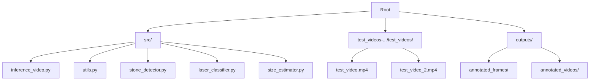
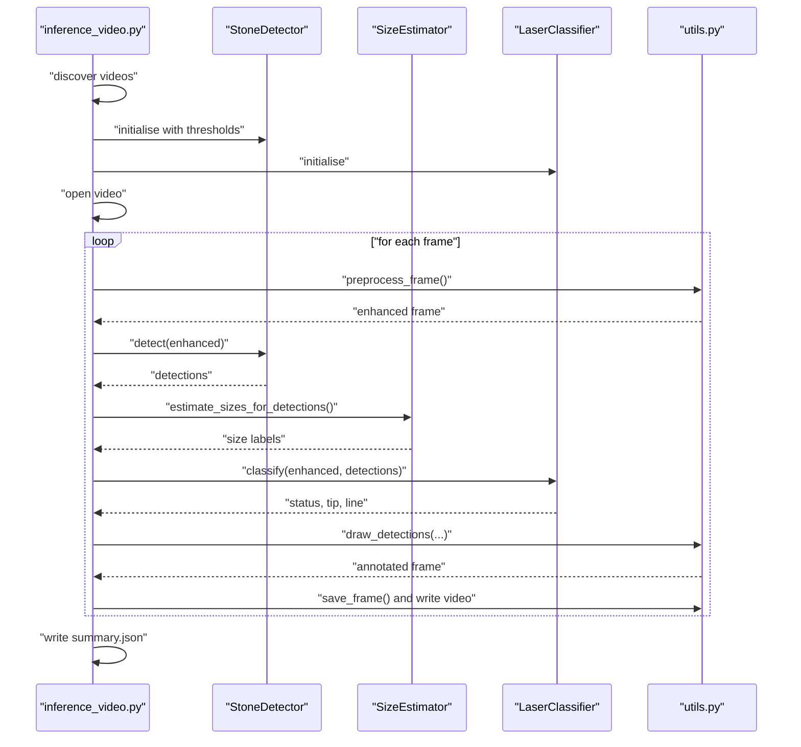
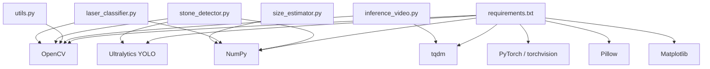

# Quick Start Guide

<cite>
**Referenced Files in This Document**
- [inference_video.py](file://src/inference_video.py)
- [utils.py](file://src/utils.py)
- [stone_detector.py](file://src/stone_detector.py)
- [laser_classifier.py](file://src/laser_classifier.py)
- [size_estimator.py](file://src/size_estimator.py)
- [requirements.txt](file://requirements.txt)
- [test_video.mp4](file://test_videos-20260620T032533Z-3-001/test_videos/test_video.mp4)
- [test_video_2.mp4](file://test_videos-20260620T032533Z-3-001/test_videos/test_video_2.mp4)
- [outputs/annotated_videos/test_video_annotated.mp4](file://outputs/annotated_videos/test_video_annotated.mp4)
</cite>

## Table of Contents
1. [Introduction](#introduction)
2. [Project Structure](#project-structure)
3. [Core Components](#core-components)
4. [Architecture Overview](#architecture-overview)
5. [Detailed Component Analysis](#detailed-component-analysis)
6. [Dependency Analysis](#dependency-analysis)
7. [Performance Considerations](#performance-considerations)
8. [Troubleshooting Guide](#troubleshooting-guide)
9. [Conclusion](#conclusion)
10. [Appendices](#appendices)

## Introduction
This quick start guide helps you run the RIRS system on test videos immediately. It covers installing prerequisites, preparing test videos, running the inference pipeline, interpreting outputs, and verifying system functionality. You will learn the essential configuration parameters, common usage patterns, and how to interpret the generated annotation files.

## Project Structure
The RIRS system organizes processing logic across several modules under src/, with test videos located under test_videos-.../test_videos/, and outputs written to outputs/.

**Diagram sources**
- [inference_video.py](file://src/inference_video.py)
- [utils.py](file://src/utils.py)
- [stone_detector.py](file://src/stone_detector.py)
- [laser_classifier.py](file://src/laser_classifier.py)
- [size_estimator.py](file://src/size_estimator.py)

**Section sources**
- [inference_video.py](file://src/inference_video.py)
- [requirements.txt](file://requirements.txt)

## Core Components
- Inference orchestrator: runs the full pipeline over all .mp4 videos found in the test videos directory and writes annotated outputs.
- Preprocessing: applies CLAHE contrast enhancement to improve visibility in endoscopic frames.
- Stone detection: YOLOv8-based detector with a custom stone likelihood filter.
- Size estimation: converts pixel bounding boxes to approximate millimetre diameters and categorizes stones.
- Laser classification: detects laser tip and line, and classifies whether it is safe to shoot based on alignment to stones.
- Drawing and saving: renders annotations and writes JPEG frames and MP4 video.

Key configuration parameters:
- Detection thresholds and saving frequency are defined in the inference module.
- Model selection switches between pretrained and finetuned weights for the stone detector.
- Laser classifier tunable parameters are embedded in its module.

**Section sources**
- [inference_video.py](file://src/inference_video.py)
- [utils.py](file://src/utils.py)
- [stone_detector.py](file://src/stone_detector.py)
- [laser_classifier.py](file://src/laser_classifier.py)
- [size_estimator.py](file://src/size_estimator.py)

## Architecture Overview
The pipeline processes each video frame through preprocessing, detection, sizing, laser classification, annotation drawing, and output writing. The orchestration script discovers videos, initializes shared models, and iterates through frames.

**Diagram sources**
- [inference_video.py](file://src/inference_video.py)
- [utils.py](file://src/utils.py)
- [stone_detector.py](file://src/stone_detector.py)
- [laser_classifier.py](file://src/laser_classifier.py)
- [size_estimator.py](file://src/size_estimator.py)

## Detailed Component Analysis

### Running the Inference Pipeline
- Command-line usage: execute the inference script from the repository root.
- Automatic discovery: scans the test videos directory for .mp4 files and processes them in sorted order.
- Shared models: loads the stone detector and laser classifier once and reuses them across videos.
- Outputs produced:
  - Annotated MP4 video per input video.
  - JPEG frames sampled periodically (pre- and post-processing).
  - A JSON summary per video with counts and statistics.

Essential steps:
1. Ensure prerequisites are installed.
2. Place one or more .mp4 test videos into the designated test videos directory.
3. Run the inference script.
4. Inspect outputs in outputs/annotated_videos/ and outputs/annotated_frames/.

Verification:
- Confirm the annotated video exists and plays.
- Verify sampled frames are saved in a folder named after the video stem.
- Review the summary JSON for counts and per-frame logs.

**Section sources**
- [inference_video.py](file://src/inference_video.py)
- [outputs/annotated_videos/test_video_annotated.mp4](file://outputs/annotated_videos/test_video_annotated.mp4)

### Preprocessing and Drawing Utilities
- Preprocessing: applies CLAHE on the L-channel of LAB colour space to enhance contrast in dark/murky frames.
- Drawing: overlays bounding boxes, size labels, laser line, and status badges; supports saving frames and creating video writers.

Usage highlights:
- The drawing function integrates laser status colouring and text backgrounds for readability.
- Saving uses JPEG compression quality tuned for a good balance of size and quality.

**Section sources**
- [utils.py](file://src/utils.py)

### Stone Detection
- Model: YOLOv8, using either pretrained weights or finetuned weights if present.
- Heuristic filtering: scores detections by shape compactness, brightness contrast, and texture to improve stone-like matches.
- Output: detection dictionaries containing bounding boxes, confidence, class ID, and a stone likelihood score.

Parameters:
- Confidence threshold controls initial detection filtering.
- Stone score threshold filters detections post-inference.
- Toggle to use finetuned weights when available.

**Section sources**
- [stone_detector.py](file://src/stone_detector.py)

### Size Estimation
- Calibration: assumes a fixed field-of-view diameter mapped to the shorter frame dimension.
- Formula: geometric mean diameter in pixels converted to millimetres using computed pixels-per-millimetre.
- Categories: <5 mm, 5–10 mm, >10 mm, with human-readable labels.

Parameters:
- Field-of-view diameter constant.
- Optional override of FOV for special cases.

**Section sources**
- [size_estimator.py](file://src/size_estimator.py)

### Laser Classification
- Detection: identifies laser tip via a bright-region mask in HSV and extracts the largest region; detects fiber line via Hough probabilistic lines on edges.
- Alignment: determines safety based on tip position relative to stone bounding boxes and proximity thresholds.
- Outputs: status string, optional tip coordinates, and optional line segment.

Parameters:
- Brightness and saturation thresholds for the tip mask.
- Minimum area for a region to qualify as a tip.
- Proximity factor controlling safe-to-shoot distance relative to stone size.

**Section sources**
- [laser_classifier.py](file://src/laser_classifier.py)

### Output Interpretation
- Annotated video: shows bounding boxes, size labels, laser line, and a top-right status badge indicating safety.
- Sample frames: pre- and post-processed JPEGs saved at intervals for inspection.
- Summary JSON: includes counts for frames with detections, total detections, laser safety outcomes, size distribution, and periodic per-frame entries.

Interpretation tips:
- Safety badge: “SAFE TO SHOOT”, “NOT SAFE”, or “UNCERTAIN”.
- Boxes: colour follows the laser status when certain; default cyan otherwise.
- Size labels: approximate diameter and category for each detected stone.
- Per-frame logs: review to track temporal trends in detections and safety.

**Section sources**
- [inference_video.py](file://src/inference_video.py)
- [utils.py](file://src/utils.py)

## Dependency Analysis
External libraries are declared in requirements.txt and used across modules:
- Computer vision and video: OpenCV.
- Neural inference: Ultralytics YOLO.
- Numerical computing: NumPy.
- Torch ecosystem: PyTorch and torchvision.
- Image processing: Pillow.
- Plotting and progress: Matplotlib and tqdm.

**Diagram sources**
- [requirements.txt](file://requirements.txt)
- [inference_video.py](file://src/inference_video.py)
- [utils.py](file://src/utils.py)
- [stone_detector.py](file://src/stone_detector.py)
- [laser_classifier.py](file://src/laser_classifier.py)
- [size_estimator.py](file://src/size_estimator.py)

**Section sources**
- [requirements.txt](file://requirements.txt)

## Performance Considerations
- Frame sampling: the pipeline saves every Nth frame to reduce output volume; adjust the sampling interval to balance inspection detail and storage.
- Detection thresholds: tuning the stone detector’s confidence and stone score thresholds affects recall and precision; start with defaults and adjust based on false positives/negatives.
- Model choice: using finetuned weights can improve accuracy when available; otherwise, pretrained YOLOv8n suffices.
- Video writer: ensure sufficient CPU/GPU resources; consider disabling frame saving during long runs to prioritise video output.

[No sources needed since this section provides general guidance]

## Troubleshooting Guide
Common issues and resolutions:
- Missing test videos directory: ensure the directory exists and contains .mp4 files; the script expects a specific path layout.
- No .mp4 files found: confirm at least one MP4 exists in the test videos directory.
- Video fails to open: verify the file is accessible and not corrupted.
- Empty outputs: check that the output directories exist or are creatable; the script creates them automatically.
- Slow processing: reduce frame sampling rate or adjust detection thresholds; consider disabling frame saving.
- Incorrect size estimates: verify the FOV assumption and frame dimensions; unusual camera setups may require calibration adjustments.

**Section sources**
- [inference_video.py](file://src/inference_video.py)

## Conclusion
You can now run the RIRS system end-to-end on test videos, inspect annotated outputs, and interpret results quickly. Use the provided parameters to tailor detection sensitivity and output verbosity, and leverage the summary JSON for statistical insights. For further customization, adjust thresholds and model weights as described in the component analyses.

[No sources needed since this section summarizes without analyzing specific files]

## Appendices

### Quick Start Checklist
- Install prerequisites from requirements.txt.
- Place .mp4 test videos into the test videos directory.
- Run the inference script from the repository root.
- Review outputs in outputs/annotated_videos/ and outputs/annotated_frames/.
- Examine summary JSON for counts and per-frame logs.

### Command-Line Usage
- Run the inference pipeline:
  - python src/inference_video.py

[No sources needed since this section provides general guidance]