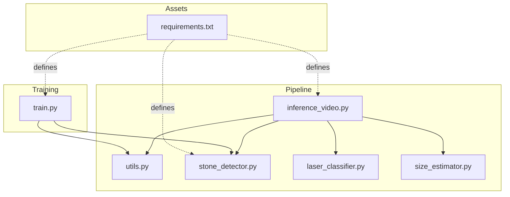
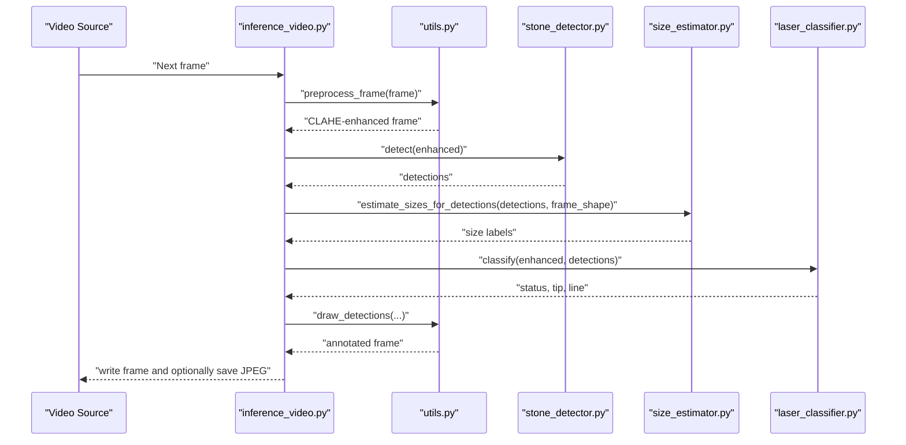
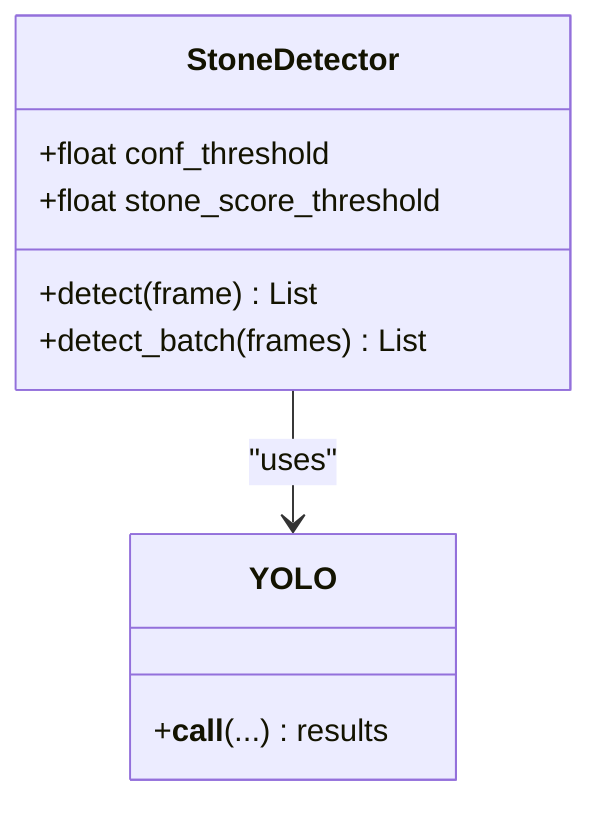
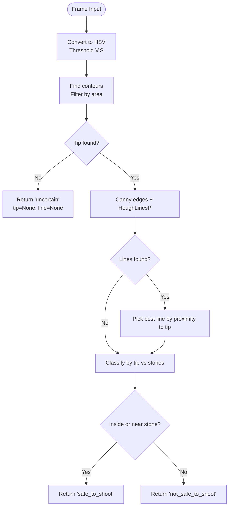
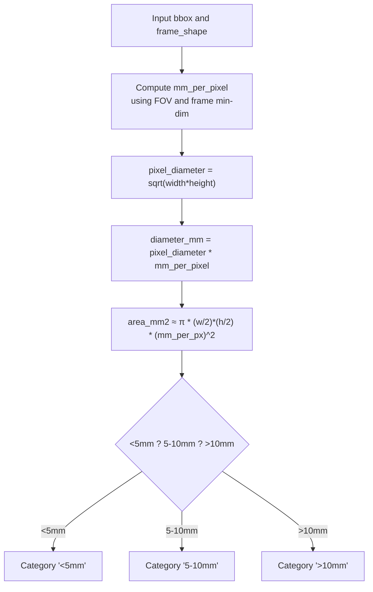
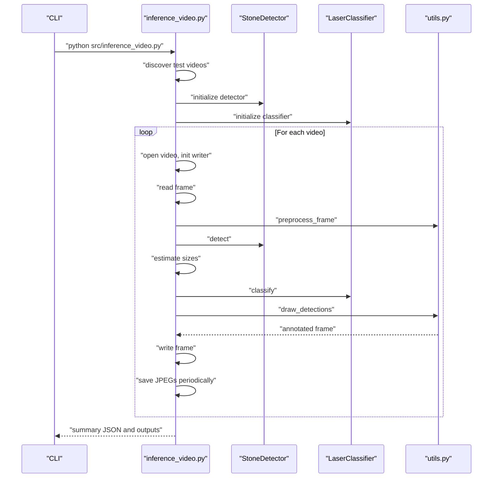
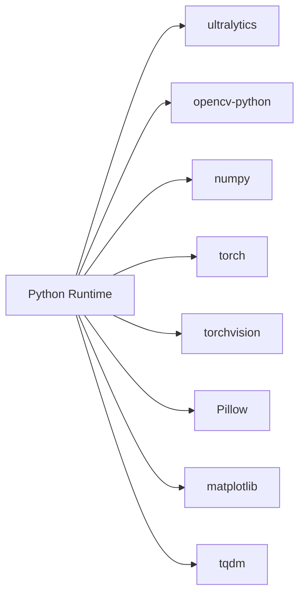

# Troubleshooting and FAQ

<cite>
**Referenced Files in This Document**
- [requirements.txt](file://requirements.txt)
- [inference_video.py](file://src/inference_video.py)
- [train.py](file://src/train.py)
- [utils.py](file://src/utils.py)
- [stone_detector.py](file://src/stone_detector.py)
- [laser_classifier.py](file://src/laser_classifier.py)
- [size_estimator.py](file://src/size_estimator.py)
</cite>

## Table of Contents
1. [Introduction](#introduction)
2. [Project Structure](#project-structure)
3. [Core Components](#core-components)
4. [Architecture Overview](#architecture-overview)
5. [Detailed Component Analysis](#detailed-component-analysis)
6. [Dependency Analysis](#dependency-analysis)
7. [Performance Considerations](#performance-considerations)
8. [Troubleshooting Guide](#troubleshooting-guide)
9. [FAQ](#faq)
10. [Conclusion](#conclusion)

## Introduction
This document provides a comprehensive troubleshooting guide and FAQ for RIRS usage. It covers installation and dependency issues, GPU memory and performance optimization, platform-specific pitfalls, version compatibility, and practical diagnostic steps. It also explains how the pipeline components interact during inference and training, and offers step-by-step resolutions for common problems.

## Project Structure
RIRS consists of:
- A training script that generates pseudo-labels and fine-tunes a YOLOv8 model
- An inference pipeline that processes videos, detects stones, estimates sizes, classifies laser alignment, and writes annotated outputs
- Utility modules for preprocessing, drawing annotations, and saving outputs
- Model and training assets under dedicated directories

**Diagram sources**
- [inference_video.py](file://src/inference_video.py)
- [train.py](file://src/train.py)
- [utils.py](file://src/utils.py)
- [stone_detector.py](file://src/stone_detector.py)
- [laser_classifier.py](file://src/laser_classifier.py)
- [size_estimator.py](file://src/size_estimator.py)
- [requirements.txt](file://requirements.txt)

**Section sources**
- [inference_video.py](file://src/inference_video.py)
- [train.py](file://src/train.py)
- [utils.py](file://src/utils.py)
- [stone_detector.py](file://src/stone_detector.py)
- [laser_classifier.py](file://src/laser_classifier.py)
- [size_estimator.py](file://src/size_estimator.py)
- [requirements.txt](file://requirements.txt)

## Core Components
- Inference pipeline: orchestrates video capture, preprocessing, detection, size estimation, laser classification, annotation, and output writing
- StoneDetector: YOLOv8-based detector with a custom likelihood filter; supports loading fine-tuned or pretrained weights
- LaserClassifier: detects laser tip and line, then classifies safety based on proximity to stones
- SizeEstimator: converts pixel bounding boxes to clinical size categories using a fixed field-of-view assumption
- Utilities: CLAHE preprocessing, drawing annotations, saving frames, and creating video writers

Key runtime behaviors:
- Preprocessing enhances low-contrast endoscopic frames
- Detection and classification are performed per frame
- Outputs include annotated frames, an annotated video, and a JSON summary

**Section sources**
- [inference_video.py](file://src/inference_video.py)
- [stone_detector.py](file://src/stone_detector.py)
- [laser_classifier.py](file://src/laser_classifier.py)
- [size_estimator.py](file://src/size_estimator.py)
- [utils.py](file://src/utils.py)

## Architecture Overview
The pipeline runs end-to-end on each video:
1. Read frame
2. Preprocess with CLAHE
3. Detect stones
4. Estimate sizes
5. Classify laser alignment
6. Draw annotations
7. Write outputs

**Diagram sources**
- [inference_video.py](file://src/inference_video.py)
- [utils.py](file://src/utils.py)
- [stone_detector.py](file://src/stone_detector.py)
- [laser_classifier.py](file://src/laser_classifier.py)
- [size_estimator.py](file://src/size_estimator.py)

## Detailed Component Analysis

### StoneDetector
- Loads either fine-tuned weights (if present) or the base YOLOv8n model
- Applies a custom likelihood heuristic to filter detections
- Returns detections sorted by confidence

**Diagram sources**
- [stone_detector.py](file://src/stone_detector.py)

**Section sources**
- [stone_detector.py](file://src/stone_detector.py)

### LaserClassifier
- Detects laser tip via HSV bright region segmentation
- Detects laser line via Canny edge and probabilistic Hough transform
- Classifies safety based on tip proximity to stone bounding boxes

**Diagram sources**
- [laser_classifier.py](file://src/laser_classifier.py)

**Section sources**
- [laser_classifier.py](file://src/laser_classifier.py)

### SizeEstimator
- Estimates diameter and area from pixel bounding boxes
- Maps to clinical categories based on preset thresholds

**Diagram sources**
- [size_estimator.py](file://src/size_estimator.py)

**Section sources**
- [size_estimator.py](file://src/size_estimator.py)

### Inference Pipeline
- Discovers test videos, initializes shared models, and processes each video
- Writes annotated frames, an MP4 video, and a JSON summary

**Diagram sources**
- [inference_video.py](file://src/inference_video.py)
- [utils.py](file://src/utils.py)
- [stone_detector.py](file://src/stone_detector.py)
- [laser_classifier.py](file://src/laser_classifier.py)

**Section sources**
- [inference_video.py](file://src/inference_video.py)

## Dependency Analysis
RIRS depends on:
- Ultralytics YOLO for object detection
- OpenCV for video I/O, image processing, and drawing
- NumPy for numerical operations
- Torch/Torchvision for model execution
- Pillow, Matplotlib, TQDM for auxiliary tasks

**Diagram sources**
- [requirements.txt](file://requirements.txt)

**Section sources**
- [requirements.txt](file://requirements.txt)

## Performance Considerations
- GPU acceleration: YOLO inference benefits greatly from CUDA GPUs; training is significantly slower on CPU
- Batch size and image size: controlled by training arguments; larger sizes increase memory usage
- Video resolution and FPS: higher resolution and FPS increase compute load
- Output sampling: the pipeline saves only every Nth frame to reduce disk I/O and storage needs
- Preprocessing cost: CLAHE adds minimal overhead compared to detection/classification
- Early stopping and patience: training script configures early stopping to avoid overfitting and unnecessary long runs

Recommendations:
- Use a modern NVIDIA GPU with sufficient VRAM for inference and training
- Reduce imgsz and batch during training if memory constrained
- Disable saving intermediate frames if storage is limited
- Monitor GPU utilization and adjust parameters accordingly

**Section sources**
- [train.py](file://src/train.py)
- [inference_video.py](file://src/inference_video.py)

## Troubleshooting Guide

### Installation and Environment Setup
Symptoms:
- Import errors for ultralytics, cv2, torch, numpy
- ModuleNotFoundError or ImportError

Diagnosis steps:
- Verify Python interpreter path and virtual environment activation
- Confirm package versions meet the minimum requirements
- Reinstall packages if corrupted or mismatched

Resolution:
- Install dependencies from the requirements file
- Ensure CUDA-compatible PyTorch is installed if using GPU
- Upgrade pip and setuptools if installation fails

Common fixes:
- Re-run pip install with --upgrade
- Clear pip cache and retry
- Use a fresh virtual environment

**Section sources**
- [requirements.txt](file://requirements.txt)

### Dependency Conflicts
Symptoms:
- Version mismatch warnings or runtime errors
- Conflicting versions of NumPy or OpenCV

Diagnosis steps:
- Check installed versions of key packages
- Compare with requirements.txt
- Look for multiple conflicting installations

Resolution:
- Uninstall conflicting versions
- Reinstall from requirements.txt
- Prefer conda-forge or official channels for binary compatibility

**Section sources**
- [requirements.txt](file://requirements.txt)

### GPU Memory Issues
Symptoms:
- CUDA out of memory errors during inference or training
- Slow inference on GPU vs CPU

Diagnosis steps:
- Monitor GPU memory usage during runs
- Check model and input sizes
- Inspect batch and image size settings

Resolution:
- Reduce imgsz and/or batch during training
- Lower resolution or FPS for inference
- Free GPU memory by restarting the Python process
- Use mixed precision if supported by your driver/runtime

**Section sources**
- [train.py](file://src/train.py)
- [inference_video.py](file://src/inference_video.py)

### Performance Optimization
Symptoms:
- Slower-than-expected processing speed
- High CPU/GPU utilization without throughput gains

Diagnosis steps:
- Measure average FPS from the summary logs
- Profile individual stages (preprocessing, detection, classification)
- Check output writing and disk I/O bottlenecks

Resolution:
- Increase batch size and imgsz gradually during training
- Adjust FRAME_SAVE_EVERY to balance inspection and performance
- Ensure video codec and fourCC settings are compatible with your system

**Section sources**
- [inference_video.py](file://src/inference_video.py)
- [utils.py](file://src/utils.py)
- [train.py](file://src/train.py)

### Platform-Specific Issues
Windows:
- Ensure OpenCV is installed from a compatible wheel
- Use appropriate video codecs; MP4V may require additional codec packs
- Antivirus or file locking may block output writes; temporarily disable or exclude output folders

Linux:
- Verify CUDA drivers match PyTorch’s expectations
- Use system package manager for OpenCV if wheels fail

macOS:
- Some wheels may not support GPU; expect CPU-only operation
- Ensure Xcode command line tools are installed for compiling optional extensions

**Section sources**
- [utils.py](file://src/utils.py)
- [requirements.txt](file://requirements.txt)

### Version Compatibility Problems
Symptoms:
- YOLO training or inference failures
- Torch-related import errors

Diagnosis steps:
- Confirm torch and torchvision versions align with ultralytics’ expectations
- Check NumPy version compatibility

Resolution:
- Pin versions per requirements.txt
- Reinstall matching versions in order: torch, torchvision, ultralytics

**Section sources**
- [requirements.txt](file://requirements.txt)

### Hardware Requirements
Minimum:
- CPU: Multi-core modern processor
- RAM: At least 8 GB; 16+ GB recommended
- Storage: Sufficient space for outputs and models
- GPU: NVIDIA with CUDA support preferred for speed

Training specifics:
- GPU with at least 6 GB VRAM recommended
- Larger VRAM allows bigger batch sizes and image sizes

Inference specifics:
- CPU inference is supported but slower
- GPU acceleration recommended for interactive use

**Section sources**
- [train.py](file://src/train.py)
- [requirements.txt](file://requirements.txt)

### Diagnostic Procedures
- Video loading failures:
  - Verify video directory exists and contains .mp4 files
  - Check file permissions and codec support
- Model loading failures:
  - Confirm model weights exist and are readable
  - Ensure YOLO weights are downloaded or cached
- Output failures:
  - Check write permissions for outputs directory
  - Validate codec availability for video writer

**Section sources**
- [inference_video.py](file://src/inference_video.py)
- [stone_detector.py](file://src/stone_detector.py)
- [utils.py](file://src/utils.py)

### Error Message Interpretations
- “Cannot open video”: Video path invalid or unsupported codec
- “No .mp4 files found”: Directory missing test videos or wrong path
- “best.pt not found”: Training did not produce a checkpoint or path changed
- “CUDA out of memory”: Reduce batch/imgsz or free GPU memory
- “ModuleNotFoundError for cv2”: Reinstall opencv-python

**Section sources**
- [inference_video.py](file://src/inference_video.py)
- [train.py](file://src/train.py)

### Step-by-Step Resolution Guides

#### Fix Missing Test Videos
1. Place .mp4 files into the expected directory
2. Re-run the inference script
3. Confirm output directories are writable

**Section sources**
- [inference_video.py](file://src/inference_video.py)

#### Resolve Model Loading Failures
1. Ensure fine-tuned weights exist or rely on pretrained weights
2. Re-download YOLO weights if missing
3. Restart the Python interpreter to clear caches

**Section sources**
- [stone_detector.py](file://src/stone_detector.py)

#### Optimize Training for Memory
1. Reduce imgsz and/or batch in training arguments
2. Enable early stopping and patience
3. Monitor GPU memory and logs

**Section sources**
- [train.py](file://src/train.py)

#### Improve Inference Speed
1. Use GPU-enabled PyTorch
2. Reduce imgsz during training to accelerate inference
3. Limit output frame sampling if needed

**Section sources**
- [inference_video.py](file://src/inference_video.py)
- [train.py](file://src/train.py)

## FAQ

Q: Why does inference run slowly on my machine?
A: On CPU-only systems, inference is expected to be slower. Use a GPU with CUDA support for significant speedups. Also consider reducing image size or disabling extra outputs.

Q: How do I interpret the size labels?
A: Sizes are derived from pixel bounding boxes using a fixed field-of-view assumption. Categories are mapped to clinical thresholds for quick triage.

Q: What do the laser classification statuses mean?
A: “Safe to shoot” indicates the laser tip is inside or near a stone. “Not safe” means the laser is visible but not aimed at a stone. “Uncertain” means insufficient evidence to decide.

Q: Can I change detection thresholds?
A: Yes, thresholds are configurable in the inference script and detector class. Adjust confidence and stone likelihood thresholds to trade off precision/recall.

Q: How do I save fewer frames to disk?
A: Modify the frame sampling interval to reduce disk usage and speed up processing.

Q: Why is training so slow on CPU?
A: Training requires substantial compute. Use a GPU with sufficient VRAM and appropriate batch/image sizes.

Q: What video formats are supported?
A: The pipeline reads .mp4 via OpenCV. Ensure codecs are available on your platform.

Q: How accurate are the size estimates?
A: Accuracy depends on calibration assumptions and image quality. They are intended for clinical triage rather than precise measurements.

Q: How often should I retrain the detector?
A: Retrain when new data improves detection on your specific scopes/cameras. Use the pseudo-labeling workflow to bootstrap improvements.

Q: What should I do if I see “CUDA out of memory”?
A: Lower batch size or image size during training. For inference, reduce resolution or use CPU mode.

Q: How do I verify successful training?
A: Check for the best weights file and copy into the expected location for inference.

Q: Are there hardware minimums?
A: A modern CPU and 8 GB RAM are a baseline. For training, prefer at least 6 GB VRAM on GPU.

Q: How do I tune the laser classifier?
A: Adjust proximity factor and minimum bright area to adapt to lighting conditions and scope angles.

Q: What if I encounter codec errors when writing videos?
A: Install or enable the appropriate codec on your platform. MP4V is used by default.

Q: How do I interpret the summary JSON?
A: It includes frame counts, detection totals, laser safety tallies, size distributions, and timing metrics.

**Section sources**
- [inference_video.py](file://src/inference_video.py)
- [stone_detector.py](file://src/stone_detector.py)
- [laser_classifier.py](file://src/laser_classifier.py)
- [size_estimator.py](file://src/size_estimator.py)
- [train.py](file://src/train.py)

## Conclusion
By aligning environment versions, leveraging GPU acceleration, and tuning parameters to your hardware, you can achieve reliable and efficient RIRS operation. Use the diagnostic steps and resolutions here to quickly address common issues and optimize performance for your workflow.